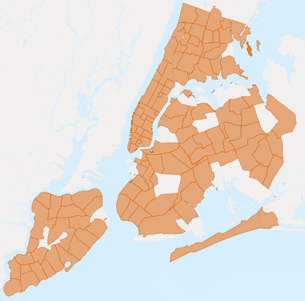
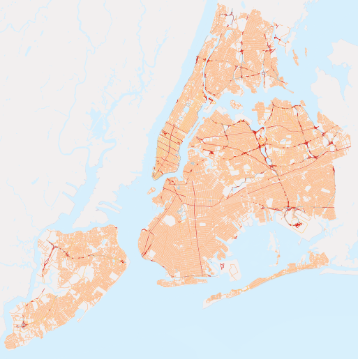
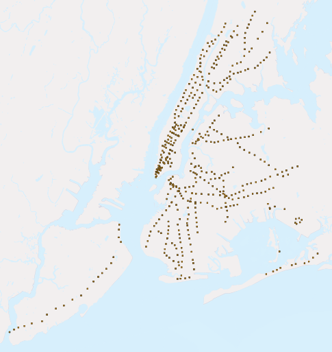

.. _about_data:

About our data
==============

The data for this workshop is four shapefiles for New York City, and one attribute table of sociodemographic variables.  We've loaded our shapefiles as PostGIS tables and will add sociodemographic data later in the workshop.

The following describes the number of records and table attributes for each of our datasets.  These attribute values and relationships are fundamental to our future analysis. 

To explore the nature of your tables in pgAdmin, right-click a highlighted table and select **Properties**.  You will find a summary of table properties, including a list of table attributes within the **Columns** tab.

.. nyc_homicides.shp is part of the data bundle, but isn't referenced here. Add here or remove there?

nyc_census_blocks
-----------------

A census block is the smallest geography for which census data is reported. All higher level census geographies (block groups, tracts, metro areas, counties, etc) can be built from unions of census blocks. We have attached some demographic data to our collection of blocks.

Number of records: 38794

.. list-table::
   :widths: 20 80 

   * - **blkid**
     - A 15-digit code that uniquely identifies every census **block**. Eg: 360050001009000
   * - **popn_total**
     - Total number of people in the census block
   * - **popn_white**
     - Number of people self-identifying as "White" in the block
   * - **popn_black**
     - Number of people self-identifying as "Black" in the block
   * - **popn_nativ**
     - Number of people self-identifying as "Native American" in the block
   * - **popn_asian**
     - Number of people self-identifying as "Asian" in the block
   * - **popn_other**
     - Number of people self-identifying with other categories in the block
   * - **boroname**
     - Name of the New York borough. Manhattan, The Bronx, Brooklyn, Staten Island, Queens
   * - **geom**
     - Polygon boundary of the block

.. figure:: ./screenshots/nyc_census_blocks.png
   
   *Black population as a percentage of Total Population* 

.. note:: 

    To get census data into GIS, you need to join two pieces of information: the actual data (text), and the boundary files (spatial).  There are many options for getting the data, including downloading data and boundaries from the Census Bureau's `American FactFinder <http://factfinder.census.gov>`_. 
    
nyc_neighborhoods
-----------------

New York has a rich history of neighborhood names and extent.  Neighborhoods are social constructs that do not follow lines laid down by the government. For example, the Brooklyn neighborhoods of Carroll Gardens, Red Hook, and Cobble Hill were once collectively known as "South Brooklyn." And now, depending on which real estate agent you talk to, the same four blocks in the-neighborhood-formerly-known-as-Red-Hook can be referred to as Columbia Heights, Carroll Gardens West, or Red Hook! 

Number of records: 129

.. list-table::
   :widths: 20 80 

   * - **name**
     - Name of the neighborhood
   * - **boroname**
     - Name of the New York borough. Manhattan, The Bronx, Brooklyn, Staten Island, Queens
   * - **geom**
     - Polygon boundary of the neighborhood
   

    *The neighborhoods of New York City* 

nyc_streets
-----------

The street centerlines form the transportation network of the city. These streets have been flagged with types in order to distinguish between such thoroughfares as back alleys, arterial streets, freeways, and smaller streets. Desirable areas to live might be on residential streets rather than next to a freeway.

Number of records: 19091

.. list-table::
   :widths: 20 80 

   * - **name**
     - Name of the street
   * - **oneway**
     - Is the street one-way? "yes" = yes, "" = no
   * - **type**
     - Road type (primary, secondary, residential, motorway)
   * - **geom**
     - Linear centerline of the street
   

     *The streets of New York City. Major roads are in red.*

   
nyc_subway_stations
-------------------

The subway stations link the upper world where people live to the invisible network of subways beneath. As portals to the public transportation system, station locations help determine how easy it is for different people to enter the subway system.

Number of records: 491

.. list-table::
   :widths: 20 80

   * - **name**
     - Name of the station
   * - **borough**
     - Name of the New York borough. Manhattan, The Bronx, Brooklyn, Staten Island, Queens
   * - **routes**
     - Subway lines that run through this station
   * - **transfers**
     - Lines you can transfer to via this station
   * - **express**
     - Stations where express trains stop, "express" = yes, "" = no
   * - **geom**
     - Point location of the station

    *Point locations for New York City subway stations*

nyc_census_sociodata
--------------------

There is a rich collection of social-economic data collected during the census process, but only at the larger geography level of census tract.  Census blocks combine to form census tracts (and block groups). We have collected some social-economic at a census tract level to answer some of these more interesting questions about New York City. 

.. note::

   The ``nyc_census_sociodata`` is a data table.  We will need to connect it to Census geographies before conducting any spatial analysis. 

.. list-table::
   :widths: 20 80

   * - **tractid**
     - An 11-digit code that uniquely identifies every census **tract**. ("36005000100")
   * - **transit_total**
     - Number of workers in the tract
   * - **transit_private**
     - Number of workers in the tract who use private automobiles / motorcycles
   * - **transit_public**
     - Number of workers in the tract who take public transit
   * - **transit_walk**
     - Number of workers in the tract who walk
   * - **transit_other**
     - Number of workers in the tract who use other forms like walking / biking
   * - **transit_none**
     - Number of workers in the tract who work from home
   * - **transit_time_mins**
     - Total number of minutes spent in transit by all workers in the tract (minutes)
   * - **family_count**
     - Number of families in the tract
   * - **family_income_median**
     - Median family income in the tract (dollars)
   * - **family_income_mean**
     - Average family income in the tract (dollars)
   * - **family_income_aggregate**
     - Total income of all families in the tract (dollars)
   * - **edu_total**
     - Number of people with educational history
   * - **edu_no_highschool_dipl**
     - Number of people with no high school diploma
   * - **edu_highschool_dipl**
     - Number of people with high school diploma and no further education
   * - **edu_college_dipl**
     - Number of people with college diploma and no further education
   * - **edu_graduate_dipl**
     - Number of people with graduate school diploma 

