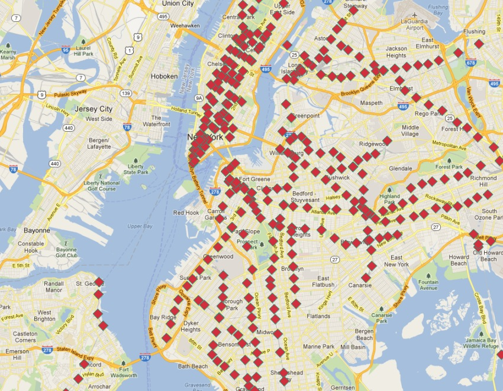
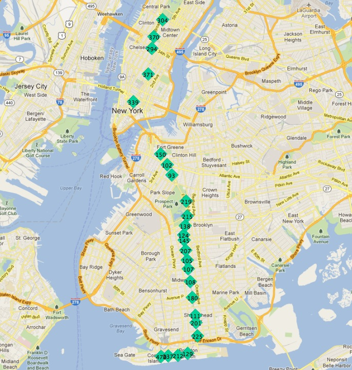
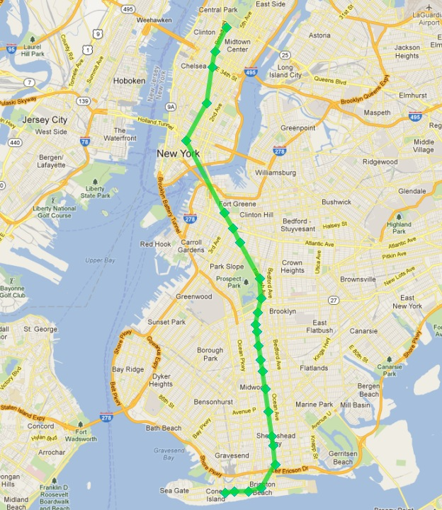
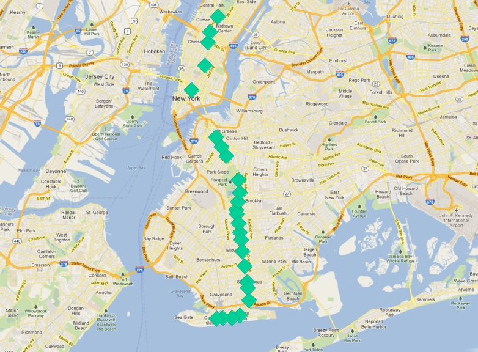
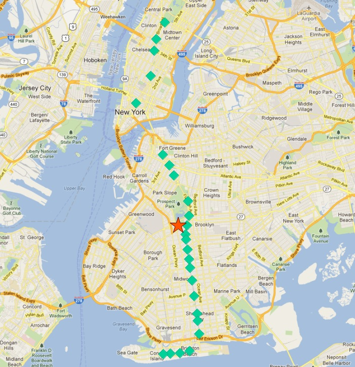
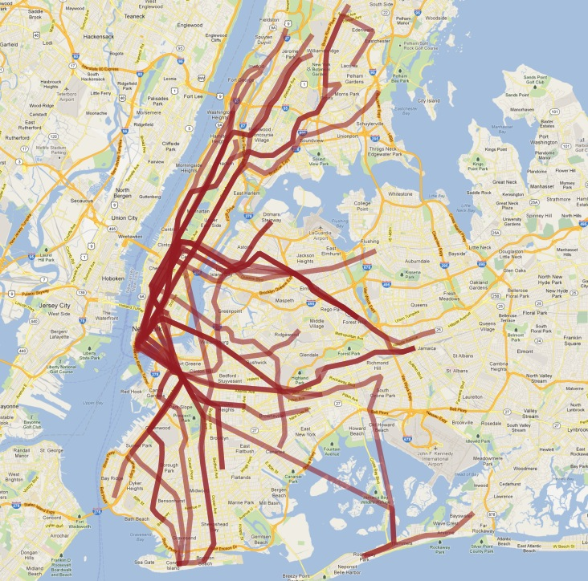

.. _advanced_geometry_construction:

Advanced Geometry Constructions
===============================

The ``nyc_subway_stations`` layer has provided us with lots of interesting examples so far, but there is something striking about it:

Although it is a database of all the stations, it doesn't allow easy visualization of routes! In this chapter we will use advanced features of PostgreSQL and PostGIS to build up a new linear routes layer from the point layer of subway stations.

Our task is made especially difficult by two issues:

* The ``routes`` column of ``nyc_subway_stations`` has multiple route identifiers in each row, so a station that might appear in multiple routes appears only once in the table.
* Related to the previous issue, there is no route ordering information in the stations table, so while it is possible to find all the stations in a particular route, it's not possible using the attributes to determine what the order in which trains travel through the stations.

The second problem is the harder one: given an unordered set of points in a route, how do we order them to match the actual route.

Here are the stops for the 'Q' train:

.. code-block:: sql

  SELECT s.gid, s.geom
  FROM nyc_subway_stations s
  WHERE (strpos(s.routes, 'Q') <> 0);

In this picture, the stops are labelled with their unique ``gid`` primary key.

If we start at one of the end stations, the next station on the line seems to always be the closest. We can repeat the process each time as long as we exclude all the previously found stations from our search.

There are two ways to run such an iterative routine in a database:

* Using a procedural language, like `PL/PgSQL <http://www.postgresql.org/docs/current/static/plpgsql.html>`_.
* Using recursive `common table expressions <http://www.postgresql.org/docs/current/static/queries-with.html>`_.

Common table expressions (CTE) have the virtue of not requiring a function definition to run. Here's the CTE to calculate the route line of the 'Q' train, starting from the northernmost stop (where ``gid`` is 304).

.. code-block:: sql

  WITH RECURSIVE next_stop(geom, idlist) AS (
      (SELECT 
        geom,
        ARRAY[gid] AS idlist
      FROM nyc_subway_stations 
      WHERE gid = 304)
      UNION ALL
      (SELECT 
        s.geom,
        array_append(n.idlist, s.gid) AS idlist
      FROM nyc_subway_stations s, next_stop n
      WHERE strpos(s.routes, 'Q') != 0
      AND NOT n.idlist @> ARRAY[s.gid]
      ORDER BY ST_Distance(n.geom, s.geom) ASC
      LIMIT 1)
  )
  SELECT geom, idlist FROM next_stop;

The CTE consists of two halves, unioned together:

* The first half establishes a start point for the expression. We get the initial geometry and initialize the array of visited identifiers, using the record of "gid" 304 (the end of the line).
* The second half iterates until it finds no further records. At each iteration it takes in the value at the previous iteration via the self-reference to "next_stop". We search every stop on the Q line (**strpos(s.routes,'Q')**) that we have not already added to our visited list (**NOT n.idlist @> ARRAY[s.gid]**) and order them by their distance from the previous point, taking just the first one (the nearest).
  
Beyond the recursive CTE itself, there are a number of advanced PostgreSQL array features being used here:

* We are using ARRAY! PostgreSQL supports arrays of any type. In this case we have an array of integers, but we could also build an array of geometries, or any other PostgreSQL type.
* We are using **array_append** to build up our array of visited identifiers.
* We are using the **@>** array operator ("array contains") to find which of the Q train stations we have already visited. The **@>** operators requires ARRAY values on both sides, so we have to turn the individual "gid" numbers into single-entry arrays using the ARRAY[] syntax.
  
When you run the query, you get each geometry in the order it is found (which is the route order), as well as the list of identifiers already visited. Wrapping the geometries into the PostGIS `ST_MakeLine <http://postgis.net/docs/ST_MakeLine.html>`_ aggregate function turns the set of geometries into a single linear output, constructed in the provided order.

.. code-block:: sql

  WITH RECURSIVE next_stop(geom, idlist) AS (
      (SELECT 
        geom,
        ARRAY[gid] AS idlist
      FROM nyc_subway_stations 
      WHERE gid = 304)
      UNION ALL
      (SELECT 
        s.geom,
        array_append(n.idlist, s.gid) AS idlist
      FROM nyc_subway_stations s, next_stop n
      WHERE strpos(s.routes, 'Q') != 0
      AND NOT n.idlist @> ARRAY[s.gid]
      ORDER BY ST_Distance(n.geom, s.geom) ASC
      LIMIT 1)
  )
  SELECT ST_MakeLine(geom) AS geom FROM next_stop;

Which looks like this:

*Success!*

Except, two problems:

* We are only calculating one subway route here, we want to calculate all the routes.
* Our query includes a piece of *a priori* knowledge, the initial station identifier that serves as the seed for the search algorithm that builds the route.

Let's tackle the hard problem first, figuring out the first station on a route without manually eyeballing the set of stations that make up the route.

Our 'Q' train stops can serve as a starting point. What characterizes the end stations of the route?

One answer is "they are the most northerly and southerly stations". However, imagine if the 'Q' train ran from east to west. Would the condition still hold?

A less directional characterization of the end stations is "they are the furthest stations from the middle of the route". With this characterization it doesn't matter if the route runs north/south or east/west, just that it run in more-or-less one direction, particularly at the ends.

Since there is no 100% heuristic to figure out the end points, let's try this second rule out.

.. note:: 

  An obvious failure mode of the "furthest from middle" rule is a circular line, like the Circle Line in London, UK. Fortunately, New York doesn't have any such lines!
  
To work out the end stations of every route, we first have to work out what routes there are! We find the distinct routes.

.. code-block:: sql

  WITH routes AS (
    SELECT DISTINCT unnest(string_to_array(routes,',')) AS route 
    FROM nyc_subway_stations ORDER BY route
  )
  SELECT * FROM routes;
    
Note the use of two advanced PostgreSQL ARRAY functions:

* **string_to_array** takes in a string and splits it into an array using a separator character. `PostgreSQL supports arrays <http://www.postgresql.org/docs/current/static/arrays.html>`_ of any type, so it's possible to build arrays of strings, as in this case, but also of geometries and geographies as we'll see later in this example.
* **unnest** takes in an array and builds a new row for each entry in the array. The effect is to take a "horizontal" array embedded in a single row and turn it into a "vertical" array with a row for each value.

The result is a list of all the unique subway route identifiers.

:: 

   route 
  -------
   1
   2
   3
   4
   5
   6
   7
   A
   B
   C
   D
   E
   F
   G
   J
   L
   M
   N
   Q
   R
   S
   V
   W
   Z
  (24 rows)
    
We can build on this result by joining it back to the ``nyc_subway_stations`` table to create a new table that has, for each route, a row for every station on that route.

.. code-block:: sql

  WITH routes AS (
    SELECT DISTINCT unnest(string_to_array(routes,',')) AS route 
    FROM nyc_subway_stations ORDER BY route
  ),
  stops AS (
    SELECT s.gid, s.geom, r.route
    FROM routes r
    JOIN nyc_subway_stations s
    ON (strpos(s.routes, r.route) <> 0)
  )
  SELECT * FROM stops;

::

   gid |                      geom                      | route 
  -----+----------------------------------------------------+-------
     2 | 010100002026690000CBE327F938CD21415EDBE1572D315141 | 1
     3 | 010100002026690000C676635D10CD2141A0ECDB6975305141 | 1
    20 | 010100002026690000AE59A3F82C132241D835BA14D1435141 | 1
    22 | 0101000020266900003495A303D615224116DA56527D445141 | 1
                              ...etc...

Now we can find the center point by collecting all the stations for each route into a single multi-point, and calculating the centroid of that multi-point.

.. code-block:: sql

  WITH routes AS (
    SELECT DISTINCT unnest(string_to_array(routes,',')) AS route 
    FROM nyc_subway_stations ORDER BY route
  ),
  stops AS (
    SELECT s.gid, s.geom, r.route
    FROM routes r
    JOIN nyc_subway_stations s
    ON (strpos(s.routes, r.route) <> 0)
  ),
  centers AS (
    SELECT ST_Centroid(ST_Collect(geom)) AS geom, route
    FROM stops
    GROUP BY route
  )
  SELECT * FROM centers;

The center point of the collection of 'Q' train stops looks like this:

So the northern most stop, the end point, appears to also be the stop furthest from the center. Let's calculate the furthest point for every route.

.. code-block:: sql

  WITH routes AS (
    SELECT DISTINCT unnest(string_to_array(routes,',')) AS route 
    FROM nyc_subway_stations ORDER BY route
  ),
  stops AS (
    SELECT s.gid, s.geom, r.route
    FROM routes r
    JOIN nyc_subway_stations s
    ON (strpos(s.routes, r.route) <> 0)
  ),
  centers AS (
    SELECT ST_Centroid(ST_Collect(geom)) AS geom, route
    FROM stops
    GROUP BY route
  ),
  stops_distance AS (
    SELECT s.*, ST_Distance(s.geom, c.geom) AS distance
    FROM stops s JOIN centers c
    ON (s.route = c.route)
    ORDER BY route, distance DESC
  ),
  first_stops AS (
    SELECT DISTINCT ON (route) stops_distance.*
    FROM stops_distance
  )
  SELECT * FROM first_stops;

We've added two sub-queries this time:

* **stops_distance** joins the centers points back to the stations table and calculates the distance between the stations and center for each route. The result is ordered such that the records come out in batches for each route, with the furthest station as the first record of the batch.
* **first_stops** filters the **stops_distance** output by only taking the first record for each distinct group. Because of the way we ordered **stops_distance** the first record is the furthest record, which means it's the station we want to use as our starting seed to build each subway route.
  
Now we know every route, and we know (approximately) what station each route starts from: we're ready to generate the route lines!

But first, we need to turn our recursive CTE expression into a function we can call with parameters.

.. code-block:: plpgsql

  CREATE OR REPLACE function walk_subway(integer, text) returns geometry AS
  $$
  WITH RECURSIVE next_stop(geom, idlist) AS (
      (SELECT 
        geom AS geom,
        ARRAY[gid] AS idlist
      FROM nyc_subway_stations 
      WHERE gid = $1)
      UNION ALL
      (SELECT 
        s.geom AS geom,
        array_append(n.idlist, s.gid) AS idlist
      FROM nyc_subway_stations s, next_stop n
      WHERE strpos(s.routes, $2) != 0
      AND NOT n.idlist @> ARRAY[s.gid]
      ORDER BY ST_Distance(n.geom, s.geom) ASC
      LIMIT 1)
  )
  SELECT ST_MakeLine(geom) AS geom
  FROM next_stop;
  $$
  language 'sql';

And now we are ready to go!

.. code-block:: sql

  CREATE TABLE nyc_subway_lines AS
  -- Distinct route identifiers!
  WITH routes AS (
    SELECT DISTINCT unnest(string_to_array(routes,',')) AS route 
    FROM nyc_subway_stations ORDER BY route
  ),
  -- Joined back to stops! Every route has all its stops!
  stops AS (
    SELECT s.gid, s.geom, r.route
    FROM routes r
    JOIN nyc_subway_stations s
    ON (strpos(s.routes, r.route) <> 0)
  ),
  -- Collects stops by routes and calculate centroid!
  centers AS (
    SELECT ST_Centroid(ST_Collect(geom)) AS geom, route
    FROM stops
    GROUP BY route
  ),
  -- Calculate stop/center distance for each stop in each route.
  stops_distance AS (
    SELECT s.*, ST_Distance(s.geom, c.geom) AS distance
    FROM stops s JOIN centers c
    ON (s.route = c.route)
    ORDER BY route, distance DESC
  ),
  -- Filter out just the furthest stop/center pairs.
  first_stops AS (
    SELECT DISTINCT ON (route) stops_distance.*
    FROM stops_distance
  )
  -- Pass the route/stop information into the linear route generation function!
  SELECT 
    ascii(route) AS gid, -- QGIS likes numeric primary keys
    route, 
    walk_subway(gid, route) AS geom 
  FROM first_stops;

  -- Do some housekeeping too 
  ALTER TABLE nyc_subway_lines ADD PRIMARY KEY (gid);

Here's what our final table looks like visualized in QGIS:

As usual, there are some problems with our simple understanding of the data:

* there are actually two 'S' (short distance "shuttle") trains, one in Manhattan and one in the Rockaways, and we join them together because they are both called 'S';
* the '4' train (and a few others) splits at the end of one line into two terminuses, so the "follow one line" assumption breaks and the result has a funny hook on the end.

Hopefully this example has provided a taste of some of the complex data manipulations that are possible combining the advanced features of PostgreSQL and PostGIS.

See Also
--------

* `PostgreSQL Arrays <http://www.postgresql.org/docs/current/static/arrays.html>`_
* `PostgreSQL Array Functions <http://www.postgresql.org/docs/current/static/functions-array.html>`_
* `PostgreSQL Recursive Common TABLE Expressions <http://www.postgresql.org/docs/current/static/queries-with.html>`_
* `PostGIS ST_MakeLine <http://postgis.net/docs/ST_MakeLine.html>`_
  
