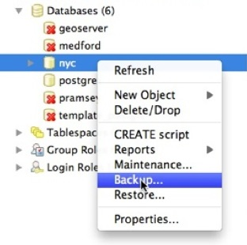
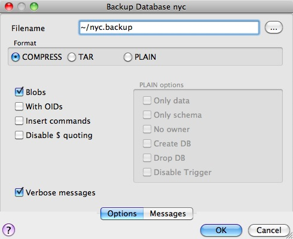
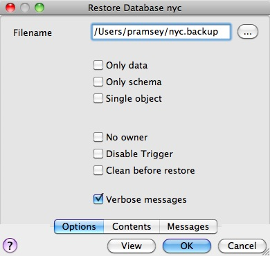
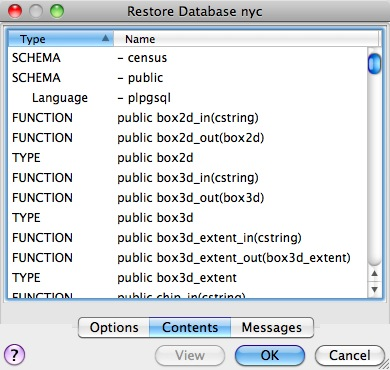
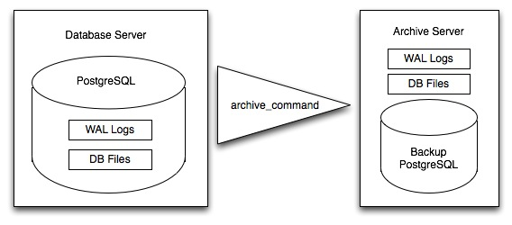

.. _backup:

PostgreSQL Backup and Restore
=============================

There are lots of ways to backup a PostgreSQL database, and the one you choose will depend a great deal on how you are using the database.

* For relatively static databases, the basic pg_dump/pg_restore tools can be used to take periodic snapshots of the data.
* For frequently changing data, using an "online backup" scheme allows continuous archiving of updates to a secure location.

Online backup is the basis for replication and stand-by systems for `high availability <http://www.postgresql.org/docs/current/static/high-availability.html>`_, particularly for versions of PostgreSQL >= 9.0.

Laying Out your Data
--------------------

As discussed in :ref:`schemas`, ensuring that production data is always stored in separate schemas is a very important **best practice** in managing data. There are two reasons:

* Backing up and restoring data in schemas is much simpler than managing lists of tables to be backed up individually.
* Keeping data tables out of the "public" schema allows far easier upgrades, as discussed in :ref:`upgrades`.

Basic Backup and Restore
-------------------------

Backing up a full database is easy using the pg_dump_ utility. The utility is a command-line tool, which makes it easy to automate with scripting, and it can also be invoke via a GUI in the PgAdmin utility.

To backup our ``nyc`` database, we can use the GUI, just right-click the database you want to backup:

Enter the name of the backup file you want to create.

Note that there are three backup format options: compress, tar and plain.

* **Plain** is just a textual SQL file. This is the simplest format and in many ways the most flexible, since it can be editing or altered easily and then loaded back into a database, allowing offline changes to things like ownership or other global information.
* **Tar** using a UNIX archive format to hold components of the dump in separate files. Using the tar format allows the pg_restore_ utility to selectively restore parts of the dump.
* **Compress** is like the Tar format, but compresses the internal components individually, allowing them to be selectively restored without decompressing the entire archive.

We'll check the Compress option and go, saving out a backup file.

The same operation can be done with the command line like this:

::

  pg_dump --file=nyc.backup --format=c --port=54321 --username=postgres nyc

Because the backup file is in Compress format, we can view the contents using the pg_restore_ command to list the manifest. In the PgAdmin GUI, "View" is an option in the panel.

When you look at the manifest, one of the things you might notice is that there are a lot of "FUNCTION" signatures in there. 

That's because the pg_dump_ utility dumps **every** non-system object in the database, and that includes the PostGIS function definitions.

.. note::

  PostgreSQL 9.1+ includes an "EXTENSION" feature that allows add-on packages like PostGIS to be installed as registered system components and therefore excluded from pg_dump_ output. PostGIS 2.0 and higher support installation using this extension system.

We can see the same manifest from the command-line using pg_restore_ directly:

:: 

  pg_restore --list nyc.backup

The problem with a dump file full of PostGIS function signatures is that we really wanted a dump of our data, not our system functions. 

Since every object is in the dump file, we can restore to a blank database and get full functionality. In doing so, we are expecting that system we are restoring to has exactly the same version of PostGIS as the one we dumped from (since the function signature definitions reference a particular version of the PostGIS shared library).

From the command-line the restore looks like this:

::

  createdb --port 54321 nyc2
  pg_restore --dbname=nyc2 --port 54321 --username=postgres nyc.backup 

Dumping just data, without function signatures, is where having data in schemas is handy, because there is a command-line flag to only dump a particular schema:

::   

  pg_dump --port=54321 -format=c --schema=census --file=census.backup

Now when we list the contents of the dump, we see just the data tables we wanted::

  pg_restore --list census.backup

  ;
  ; Archive created at Thu Aug  9 11:02:49 2012
  ;     dbname: nyc
  ;     TOC Entries: 11
  ;     Compression: -1
  ;     Dump Version: 1.11-0
  ;     Format: CUSTOM
  ;     Integer: 4 bytes
  ;     Offset: 8 bytes
  ;     Dumped from database version: 8.4.9
  ;     Dumped by pg_dump version: 8.4.9
  ;
  ;
  ; Selected TOC Entries:
  ;
  6; 2615 20091 SCHEMA - census postgres
  146; 1259 19845 TABLE census nyc_census_blocks postgres
  145; 1259 19843 SEQUENCE census nyc_census_blocks_gid_seq postgres
  2691; 0 0 SEQUENCE OWNED BY census nyc_census_blocks_gid_seq postgres
  2692; 0 0 SEQUENCE SET census nyc_census_blocks_gid_seq postgres
  2681; 2604 19848 DEFAULT census gid postgres
  2688; 0 19845 TABLE DATA census nyc_census_blocks postgres
  2686; 2606 19853 CONSTRAINT census nyc_census_blocks_pkey postgres
  2687; 1259 20078 INDEX census nyc_census_blocks_geom_gist postgres

Having just the data tables is handy, because it means we can store to a database with any version of PostGIS installed, as we talk about in :ref:`upgrades`.

Backing Up Users
~~~~~~~~~~~~~~~~

The pg_dump_ utility operates a database at a time (or a schema or table at a time, if you restrict it). However, information about users is is stored across an entire cluster, it's not stored in any one database! 

To backup your user information, use the pg_dumpall_ utility, with the "--globals-only" flag. 

::

  pg_dumpall --globals-only --port 54321

You can also use pg_dumpall_ in its default mode to backup an entire cluster, but be aware that, as with pg_dump_, you will end up backing up the PostGIS function signatures, so the dump will have to be restored against an identical software installation, it can't be used as part of an upgrade process.

Online Backup and Restore
-------------------------

Online backup and restore allows an administrator to keep an extremely up-to-date set of backup files without the overhead of repeatedly dumping the entire database. If the database is under frequent insert and update load, then online backup might be preferable to basic backup.

.. note::

  The best way to learn about online backup is to read the relevant sections of the PostgreSQL manual on `continuous archiving and point-in-time recovery <http://www.postgresql.org/docs/current/static/continuous-archiving.html>`_. This section of the PostGIS workshop will just provide a brief snapshot of online backup set-up.

How it Works
~~~~~~~~~~~~

Rather than continually write to the main data tables, PostgreSQL stores changes initially in "write-ahead logs" (WAL). Taken together, these logs are a complete record of all changes made to a database.  Online backup consists of taking a copy of the database main data table, then taking a copy of each WAL that is generated from then on. 

When it is time to recover to a new database, the system starts on the main data copy, then replays all the WAL files into the database. The end result is a restored database in the same state as the original at the time of the last WAL received.

Because WAL are being written anyways, and transferring copies to an archive server is computationally cheap, online backup is an effective means of keeping a very up-to-date backup of a system without resorting to intensive regular full dumps.

Archiving the WAL Files
~~~~~~~~~~~~~~~~~~~~~~~

The first thing to do in setting up online backup is to create an archiving method. PostgreSQL archiving methods are the ultimate in flexibility: the PostgreSQL backend simply calls a script specified in the ``archive_command`` configuration parameter.

That means archiving can be as simple as copying the file to a network-mounted drive, and as complex as encrypting and emailing the files to the remote archive. Any process you can script you can use to archive the files.

To turn on archiving we will edit ``postgresql.conf``, first turning on WAL archiving:

::

  wal_level = archive
  archive_mode = on

And then setting the ``archive_command`` to copy our archive files to a safe location (changing the destination paths as appropriate):

:: 

  # Unix
  archive_command = 'test ! -f /archivedir/%f && cp %p /archivedir/%f' 
  
  # Windows
  archive_command = 'copy "%p" "C:\\archivedir\\%f"' 

It is important that the archive command not over-write existing files, so the unix command includes an initial test to ensure that the files aren't already there. It is also important that the command returns a non-zero status if the copy process fails.

Once the changes are made you can re-start PostgreSQL to make them effective.

Taking the Base Backup
~~~~~~~~~~~~~~~~~~~~~~

Once the archiving process is in place, you need to take a base back-up.

Put the database into backup mode (this doesn't do anything to alter operation of queries or data updates, it just forces a checkpoint and writes a label file indicating when the backup was taken).

.. code-block:: sql

  SELECT pg_start_backup('/archivedir/basebackup.tgz');

For the label, using the path to the backup file is a good practice, as it helps you track down where the backup was stored.

Copy the database to an archival location:

::
 
  # Unix
  tar cvfz /archivedir/basebackup.tgz ${PGDATA}

Then tell the database the backup process is complete.

.. code-block:: sql

  SELECT pg_stop_backup();

All these steps can of course be scripted for regular base backups.

Restoring from the Archive
~~~~~~~~~~~~~~~~~~~~~~~~~~

These steps are taking from the PostgreSQL manual on `continuous archiving and point-in-time recovery <http://www.postgresql.org/docs/current/static/continuous-archiving.html>`_.

* Stop the server, if it's running.
* If you have the space to do so, copy the whole cluster data directory and any tablespaces to a temporary location in case you need them later. Note that this precaution will require that you have enough free space on your system to hold two copies of your existing database. If you do not have enough space, you should at least save the contents of the cluster's pg_xlog subdirectory, as it might contain logs which were not archived before the system went down.
* Remove all existing files and subdirectories under the cluster data directory and under the root directories of any tablespaces you are using.
* Restore the database files from your file system backup. Be sure that they are restored with the right ownership (the database system user, not root!) and with the right permissions. If you are using tablespaces, you should verify that the symbolic links in pg_tblspc/ were correctly restored.
* Remove any files present in pg_xlog/; these came from the file system backup and are therefore probably obsolete rather than current. If you didn't archive pg_xlog/ at all, then recreate it with proper permissions, being careful to ensure that you re-establish it as a symbolic link if you had it set up that way before.
* If you have unarchived WAL segment files that you saved in step 2, copy them into pg_xlog/. (It is best to copy them, not move them, so you still have the unmodified files if a problem occurs and you have to start over.)
* Create a recovery command file recovery.conf in the cluster data directory (see Chapter 26). You might also want to temporarily modify pg_hba.conf to prevent ordinary users from connecting until you are sure the recovery was successful.
* Start the server. The server will go into recovery mode and proceed to read through the archived WAL files it needs. Should the recovery be terminated because of an external error, the server can simply be restarted and it will continue recovery. Upon completion of the recovery process, the server will rename recovery.conf to recovery.done (to prevent accidentally re-entering recovery mode later) and then commence normal database operations.
* Inspect the contents of the database to ensure you have recovered to the desired state. If not, return to step 1. If all is well, allow your users to connect by restoring pg_hba.conf to normal.

Links
-----

* `pg_dump <http://www.postgresql.org/docs/current/static/app-pgdump.html>`_
* `pg_dumpall <http://www.postgresql.org/docs/current/static/app-pg-dumpall.html>`_
* `pg_restore <http://www.postgresql.org/docs/current/static/app-pgrestore.html>`_
* `PostgreSQL High Availability <http://www.postgresql.org/docs/current/static/high-availability.html>`_
* `PostgreSQL High Availability Continuous Archiving and PITR <http://www.postgresql.org/docs/current/static/continuous-archiving.html>`_

.. _pg_dump: http://www.postgresql.org/docs/current/static/app-pgdump.html
.. _pg_dumpall: http://www.postgresql.org/docs/current/static/app-pg-dumpall.html
.. _pg_restore: http://www.postgresql.org/docs/current/static/app-pgrestore.html
