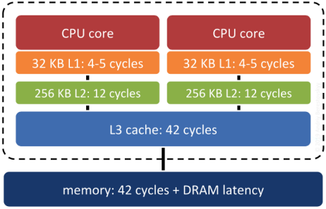

.. _clusterindex:

Clustering on Indices
=====================

Databases can only retrieve information as fast as they can get it off of disk. Small databases will float up entirely into RAM cache, and get away from physical disk limitations, but for large databases, access to the physical disk will be a limiting stop in disk access speed.

Data is written to disk opportunistically, so there is not necessarily any correlation between the order data is stored on the disk and the way it will be accessed or organized by applications.

.. image:: ./screenshots/clustering1.jpg
  :class: inline

One way to speed up access to data is to ensure that records which is likely to be retrieved together in the same result set are located in similar physical locations on the hard disk platters. This is called "clustering". 

The right clustering scheme to use can be tricky, but a general rule applies: indexes define a natural ordering scheme for data which is similar to the access pattern that will be used in retrieving the data.

.. image:: ./screenshots/clustering2.jpg
  :class: inline

Because of this, ordering the data on the disk in the same order as the index can provide a speed advantage in some cases.

Clustering on the R-Tree
------------------------

Spatial data tends to be accessed in spatially correlated windows: think of the map window in a web or desktop application. All the data in the windows has similar location value (or it wouldn't be in the window!)

So, clustering based on a spatial index makes sense for spatial data that is going to be accessed with spatial queries: similar things tend to have similar locations.

Let's cluster our ``nyc_census_blocks`` based on their spatial index:

.. code-block:: sql

  -- Cluster the blocks based on their spatial index
  CLUSTER nyc_census_blocks USING nyc_census_blocks_geom_idx;

The command re-writes the ``nyc_census_blocks`` in the order defined by the spatial index ``nyc_census_blocks_geom_gist``. Can you perceive a speed difference? Maybe not, because the original data may have already had some pre-existing spatial ordering (this is not uncommon in GIS data sets).

Disk Versus Memory/SSD
----------------------

Most modern databases are run using SSD storage, which is much faster at random access than old spinning magnetic media. Also, most modern databases are running on top of data which is small enough to fit into the RAM of the database server, and ends up there as the operating system "virtual filesystem" caches it.

Is clustering still necessary?

Surprisingly, yes. Keeping records that are "near each other" in space "near each other" in memory increases the odds that related records will move up the servers "memory cache hierarchy" together, and thus make memory accesses faster.

System RAM is not the fastest memory on a modern computer. There are several levels of cache between system RAM and the actual CPU, and the underlying operating system and processor will move data up and down the cache hierarchy in blocks. If the block getting moved up happens to include the piece of data the system will need next... that's a big win. Correlating the memory structure with the spatial structure is a way in increase the odds of that win happening.

Does Index Structure Matter?
----------------------------

In theory, yes. In practice, no really. As long as the index is a "pretty good" spatial decomposition of the data, the main determinant of performance will be the order of the actual table tuples.

The difference between "no index" and "index" is generally huge and highly measurable. The difference between "mediocre index" and "great index" usually takes quite careful measurement to discern, and can be very sensitive to the workload being tested.

Function List
-------------

`CLUSTER <https://www.postgresql.org/docs/current/sql-cluster.html>`_: Re-orders the data in a table to match the ordering in the index.
