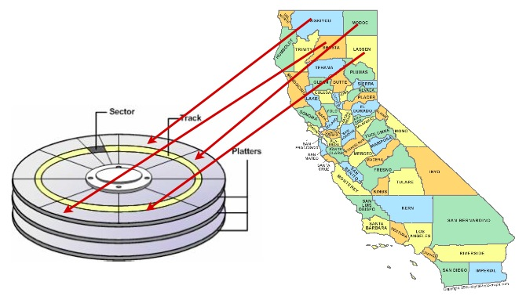
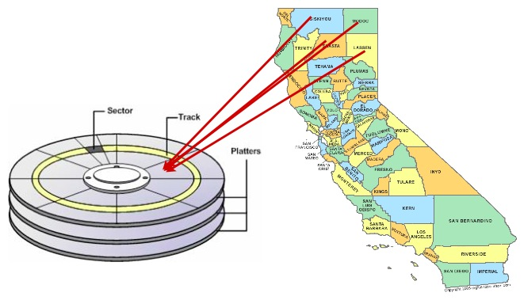
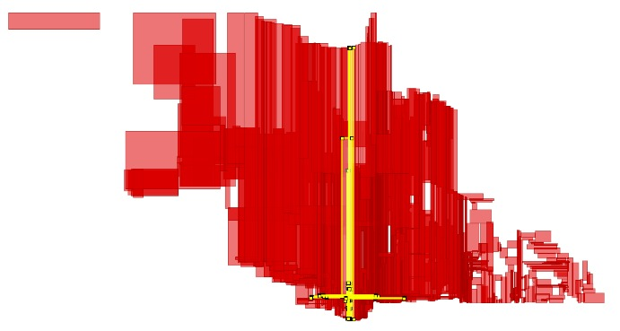
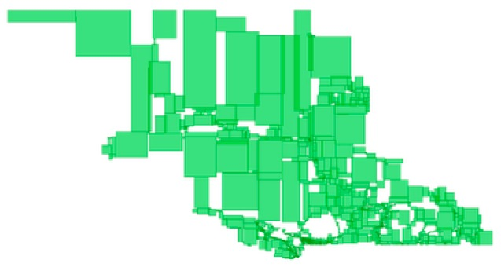

.. _clusterindex:

Clustering on Indices
=====================

Databases can only retrieve information as fast as they can get it off of disk. Small databases will float up entirely into RAM cache, and get away from physical disk limitations, but for large databases, access to the physical disk will be a limiting stop in disk access speed.

Data is written to disk opportunistically, so there is not necessarily any correlation between the order data is stored on the disk and the way it will be accessed or organized by applications.

One way to speed up access to data is to ensure that records which is likely to be retrieved together in the same result set are located in similar physical locations on the hard disk platters. This is called "clustering". 

The right clustering scheme to use can be tricky, but a general rule applies: indexes define a natural ordering scheme for data which is similar to the access pattern that will be used in retrieving the data.

Because of this, ordering the data on the disk in the same order as the index can provide a speed advantage in some cases.

Clustering on the R-Tree
------------------------

Spatial data tends to be accessed in spatially correlated windows: think of the map window in a web or desktop application. All the data in the windows has similar location value (or it wouldn't be in the window!)

So, clustering based on a spatial index makes sense for spatial data that is going to be accessed with spatial queries: similar things tend to have similar locations.

Let's cluster our ``nyc_census_blocks`` based on their spatial index:

.. code-block:: sql

  -- Cluster the blocks based on their spatial index
  CLUSTER nyc_census_blocks USING nyc_census_blocks_geom_gist;

The command re-writes the ``nyc_census_blocks`` in the order defined by the spatial index ``nyc_census_blocks_geom_gist``. Can you perceive a speed difference? Probably not, because the table is quite small and easily fits into memory, so disk access overhead doesn't affect performance.

One of the surprises of the R-Tree is that an R-Tree built incrementally on spatial data might not have high spatial coherence of the leaves. For example, see this visualization of the spatial index leaves of an index on roads in the province of British Columbia.

We would prefer to cluster using a more spatially compact tree, like this balanced R-Tree.

We don't have a balanced R-Tree algorithm available in PostGIS, but we do have a useful proxy that puts spatial data into a spatially autocorrelated order, the **ST_GeoHash()** function.

Clustering on GeoHash
---------------------

To cluster on the ST_GeoHash() function, you first need to have a geohash index on your data. Fortunately, they are easy to build.

The geohash algorithm only works on data in geographic (longitude/latitude) coordinates, so we need to transform the geometries (to EPSG:4326, which is longitude/latitude) at the same time as we hash them.

.. code-block:: sql

  CREATE INDEX nyc_census_blocks_geohash ON nyc_census_blocks (ST_GeoHash(ST_Transform(geom,4326)));

Once you have a geohash index, clustering on it uses the same syntax as the R-Tree clustering.

.. code-block:: sql

  CLUSTER nyc_census_blocks USING nyc_census_blocks_geohash;

Now your data is nicely arranged in spatially correlated order!

Function List
-------------

`ST_GeoHash(geometry A) <http://postgis.net/docs/ST_GeoHash.html>`_: Returns a text string representing the GeoHash of the bounds of the object. 
