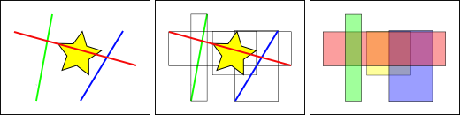
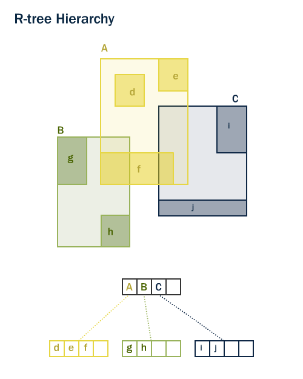
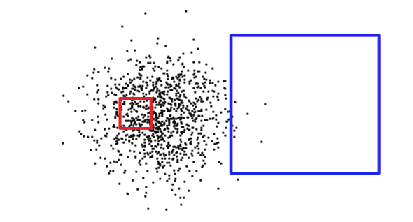

.. _indexing:

Spatial Indexing
================

Recall that spatial index is one of the three key features of a spatial database. Indexes make using a spatial database for large data sets possible. Without indexing, any search for a feature would require a "sequential scan" of every record in the database. Indexing speeds up searching by organizing the data into a search tree which can be quickly traversed to find a particular record.

Spatial indices are one of the greatest assets of PostGIS.  In the previous example building spatial joins requires comparing whole tables with each other. This can get very costly: joining two tables of 10,000 records each without indexes would require 100,000,000 comparisons; with indexes the cost could be as low as 20,000 comparisons.

Our data load file already included spatial indexes for all the tables, so in order to demonstrate the efficacy of indexes we will have to first remove them.

Let's run a query on ``nyc_census_blocks`` **without** our spatial index.

Our first step is to **remove** the index.

.. code-block:: sql

  DROP INDEX nyc_census_blocks_geom_idx;

.. note::

   The ``DROP INDEX`` statement drops an existing index from the database system. For more information, see the PostgreSQL `documentation <http://www.postgresql.org/docs/current/interactive/sql-dropindex.html>`_.

Now, watch the "Timing" meter at the lower right-hand corner of the pgAdmin query window and run the following. Our query searches through every single census block in order to identify blocks that contain subway stops that start with "B".

.. code-block:: sql

  SELECT count(blocks.blkid)
   FROM nyc_census_blocks blocks
   JOIN nyc_subway_stations subways
   ON ST_Contains(blocks.geom, subways.geom)
   WHERE subways.name LIKE 'B%';

::

      count
  ---------------
      46

The ``nyc_census_blocks`` table is very small (only a few thousand records) so even without an index, the query only takes **300 ms** on my test computer.

Now add the spatial index back in and run the query again.

.. code-block:: sql

  CREATE INDEX nyc_census_blocks_geom_idx
    ON nyc_census_blocks
    USING GIST (geom);

.. note:: The ``USING GIST`` clause tells PostgreSQL to use the generic index structure (GIST) when building the index.  If you receive an error that looks like ``ERROR: index row requires 11340 bytes, maximum size is 8191`` when creating your index, you have likely neglected to add the ``USING GIST`` clause.

On my test computer the time drops to **50 ms**. The larger your table, the larger the relative speed improvement of an indexed query will be.

How Spatial Indexes Work
------------------------

Standard database indexes create a hierarchical tree based on the values of the column being indexed. Spatial indexes are a little different -- they are unable to index the geometric features themselves and instead index the bounding boxes of the features.

In the figure above, the number of lines that intersect the yellow star is **one**, the red line. But the bounding boxes of features that intersect the yellow box is **two**, the red and blue ones.

The way the database efficiently answers the question "what lines intersect the yellow star" is to first answer the question "what boxes intersect the yellow box" using the index (which is very fast) and then do an exact calculation of "what lines intersect the yellow star" **only for those features returned by the first test**.

For a large table, this "two pass" system of evaluating the approximate index first, then carrying out an exact test can radically reduce the amount of calculations necessary to answer a query.

Both PostGIS and Oracle Spatial share the same "R-Tree" [#RTree]_ spatial index structure. R-Trees break up data into rectangles, and sub-rectangles, and sub-sub rectangles, etc.  It is a self-tuning index structure that automatically handles variable data density, differing amounts of object overlap, and object size.

Spatially Indexed Functions
---------------------------

Only a subset of functions will automatically make use of a spatial index, if one is available.

* `ST_Intersects <http://postgis.net/docs/ST_Intersects.html>`_
* `ST_Contains <http://postgis.net/docs/ST_Contains.html>`_
* `ST_Within <http://postgis.net/docs/ST_Within.html>`_
* `ST_DWithin <http://postgis.net/docs/ST_DWithin.html>`_
* `ST_ContainsProperly <http://postgis.net/docs/ST_ContainsProperly.html>`_
* `ST_CoveredBy <http://postgis.net/docs/ST_CoveredBy.html>`_
* `ST_Covers <http://postgis.net/docs/ST_Covers.html>`_
* `ST_Overlaps <http://postgis.net/docs/ST_Overlaps.html>`_
* `ST_Crosses <http://postgis.net/docs/ST_Crosses.html>`_
* `ST_DFullyWithin <http://postgis.net/docs/ST_DFullyWithin.html>`_
* `ST_3DIntersects <http://postgis.net/docs/ST_3DIntersects.html>`_
* `ST_3DDWithin <http://postgis.net/docs/ST_3DDWithin.html>`_
* `ST_3DDFullyWithin <http://postgis.net/docs/ST_3DDFullyWithin.html>`_
* `ST_LineCrossingDirection <http://postgis.net/docs/ST_LineCrossingDirection.html>`_
* `ST_OrderingEquals <http://postgis.net/docs/ST_OrderingEquals.html>`_
* `ST_Equals <http://postgis.net/docs/ST_Equals.html>`_

The first four are the ones most commonly used in queries, and `ST_DWithin <http://postgis.net/docs/ST_DWithin.html>`_ is very important for doing "within a distance" or "within a radius" style queries while still getting a performance boost from the index.

In order to add index acceleration to other functions that are not in this list (most commonly, `ST_Relate <http://postgis.net/docs/ST_Relate.html>`_) add an index-only clause as described below.

Index-Only Queries
------------------

Most of the commonly used functions in PostGIS (:command:`ST_Contains`, :command:`ST_Intersects`, :command:`ST_DWithin`, etc) include an index filter automatically. But some functions (e.g., :command:`ST_Relate`) do not include an index filter.

To do a bounding-box search using the index (and no filtering), make use of the :command:`&&` operator. For geometries, the :command:`&&` operator means "bounding boxes overlap or touch" in the same way that for numbers the :command:`=` operator means "values are the same".

Let's compare an index-only query for the population of the 'West Village' to a more exact query. Using :command:`&&` our index-only query looks like the following:

.. code-block:: sql

  SELECT Sum(popn_total)
  FROM nyc_neighborhoods neighborhoods
  JOIN nyc_census_blocks blocks
  ON neighborhoods.geom && blocks.geom
  WHERE neighborhoods.name = 'West Village';

::

  49821

Now let's do the same query using the more exact :command:`ST_Intersects` function.

.. code-block:: sql

  SELECT Sum(popn_total)
  FROM nyc_neighborhoods neighborhoods
  JOIN nyc_census_blocks blocks
  ON ST_Intersects(neighborhoods.geom, blocks.geom)
  WHERE neighborhoods.name = 'West Village';

::

  26718

A much lower answer! The first query summed up every block whose bounding box intersects the neighborhood's bounding box; the second query only summed up those blocks that intersect the neighborhood itself.

Analyzing
---------

The PostgreSQL query planner intelligently chooses when to use or not to use indexes to evaluate a query. Counter-intuitively, it is not always faster to do an index search: if the search is going to return every record in the table, traversing the index tree to get each record will actually be slower than just sequentially reading the whole table from the start.

Knowing the size of the query rectangle is not enough to pin down whether a query will return a large number or small number of records. Below, the red square is small, but will return many more records than the blue square.

In order to figure out what situation it is dealing with (reading a small part of the table versus reading a large portion of the table), PostgreSQL keeps statistics about the distribution of data in each indexed table column.  By default, PostgreSQL gathers statistics on a regular basis. However, if you dramatically change the contents of your table within a short period of time, the statistics will not be up-to-date.

To ensure the statistics match your table contents, it is wise the to run the ``ANALYZE`` command after bulk data loads and deletes in your tables. This force the statistics system to gather data for all your indexed columns.

The ``ANALYZE`` command asks PostgreSQL to traverse the table and update its internal statistics used for query plan estimation (query plan analysis will be discussed later).

.. code-block:: sql

   ANALYZE nyc_census_blocks;

Vacuuming
---------

It's worth stressing that just creating an index is not enough to allow PostgreSQL to use it effectively.  VACUUMing must be performed whenever a large number of UPDATEs, INSERTs or DELETEs are issued against a table.  The ``VACUUM`` command asks PostgreSQL to reclaim any unused space in the table pages left by updates or deletes to records.

Vacuuming is so critical for the efficient running of the database that PostgreSQL provides an "autovacuum" facility by default.

Autovacuum both vacuums (recovers space) and analyzes (updates statistics) on your tables at sensible intervals determined by the level of activity.  While this is essential for highly transactional databases, it is not advisable to wait for an autovacuum run after adding indices or bulk-loading data.  Whenever a large batch update is performed, you should manually run ``VACUUM``.

Vacuuming and analyzing the database can be performed separately as needed.  Issuing ``VACUUM`` command will not update the database statistics; likewise issuing an ``ANALYZE`` command will not recover unused table rows.  Both commands can be run against the entire database, a single table, or a single column.

.. code-block:: sql

   VACUUM ANALYZE nyc_census_blocks;

Function List
-------------

`geometry_a && geometry_b <http://postgis.net/docs/geometry_overlaps.html>`_: Returns TRUE if A's bounding box overlaps B's.

`geometry_a = geometry_b <http://postgis.net/docs/ST_Geometry_EQ.html>`_: Before PostGIS 2.4 returns true if A's bounding box is same as B's. From 2.4 on Returns TRUE only if A's geometry is the same as B.

`geometry_a ~= geometry_b <http://postgis.net/docs/ST_Geometry_Same.html>`_: Returns TRUE if A's bounding box equals B's bounding box.

`ST_Intersects(geometry_a, geometry_b) <http://postgis.net/docs/ST_Intersects.html>`_: Returns TRUE if the Geometries/Geography "spatially intersect" - (share any portion of space) and FALSE if they don't (they are Disjoint).

.. rubric:: Footnotes

.. [#RTree] http://postgis.net/docs/support/rtree.pdf

