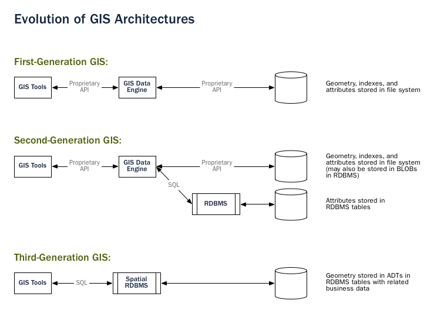
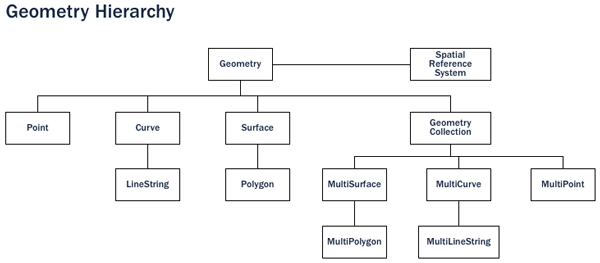
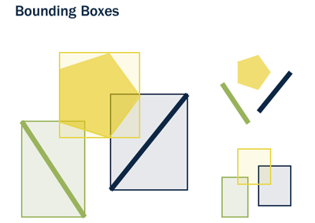

.. _introduction:

Introduction
************

What is a Spatial Database?
===========================

PostGIS is a spatial database. Oracle Spatial and SQL Server (2008 and later) are also spatial databases. But what does that mean; what is it that makes an ordinary database a spatial database?

The short answer, is...

**Spatial databases store and manipulate spatial objects like any other object in the database.**

The following briefly covers the evolution of spatial databases, and then reviews three aspects that associate *spatial* data with a database -- data types, indexes, and functions.

#. **Spatial data types** refer to shapes such as point, line, and polygon; 
#. Multi-dimensional **spatial indexing** is used for efficient processing of spatial operations;
#. **Spatial functions**, posed in :term:`SQL`, are for querying of spatial properties and relationships.

Combined, spatial data types, indexes, and functions provide a flexible structure for optimized performance and analysis.

In the Beginning
----------------

In legacy first-generation :term:`GIS` implementations, all spatial data is stored in flat files and special :term:`GIS` software is required to interpret and manipulate the data.  These first-generation management systems are designed to meet the needs of users where all required data is within the user's organizational domain.  They are proprietary, self-contained systems specifically built for handling spatial data.  

Second-generation spatial systems store some data in relational databases (usually the "attribute" or non-spatial parts) but still lack the flexibility afforded with direct integration.  

**True spatial databases were born when people started to treat spatial features as first class database objects.**  

Spatial databases fully integrate spatial data with a relational database.  The system orientation changes from GIS-centric to database-centric.     

.. note:: A spatial database management system may be used in applications besides the geographic world.  Spatial databases are used to manage data related to the anatomy of the human body, large-scale integrated circuits, molecular structures, and electro-magnetic fields, among others.

Spatial Data Types
------------------

An ordinary database has strings, numbers, and dates. A spatial database adds additional (spatial) types for representing **geographic features**. These spatial data types abstract and encapsulate spatial structures such as boundary and dimension. In many respects, spatial data types can be understood simply as shapes.

Spatial data types are organized in a type hierarchy.  Each sub-type inherits the structure (attributes) and the behavior (methods or functions) of its super-type. 

Spatial Indexes and Bounding Boxes
----------------------------------

An ordinary database provides **indexes** to allow for fast and random access to subsets of data.  Indexing for standard types (numbers, strings, dates) is usually done with `B-tree <http://en.wikipedia.org/wiki/B-tree>`_ indexes.  

A B-tree partitions the data using the natural sort order to put the data into a hierarchical tree. The natural sort order of numbers, strings, and dates is simple to determine -- every value is less than, greater than or equal to every other value. 

But because polygons can overlap, can be contained in one another, and are arrayed in a two-dimensional (or more) space, a B-tree cannot be used to efficiently index them. Real spatial databases provide a "spatial index" that instead answers the question "which objects are within this particular bounding box?".  

A **bounding box** is the smallest rectangle -- parallel to the coordinate axes -- capable of containing a given feature.

Bounding boxes are used because answering the question "is A inside B?" is very computationally intensive for polygons but very fast in the case of rectangles.  Even the most complex polygons and linestrings can be represented by a simple bounding box.

Indexes have to perform quickly in order to be useful. So instead of providing exact results, as B-trees do, spatial indexes provide approximate results. The question "what lines are inside this polygon?" will be instead interpreted by a spatial index as "what lines have bounding boxes that are contained inside this polygon's bounding box?" 

The actual spatial indexes implemented by various databases vary widely. The most common implementations are the `R-Tree <http://en.wikipedia.org/wiki/R-tree>`_ and `Quadtree <http://en.wikipedia.org/wiki/Quadtree>`_ (used in PostGIS), but there are also `grid-based indexes <http://en.wikipedia.org/wiki/Grid_(spatial_index)>`_ and `GeoHash indexes <https://en.wikipedia.org/wiki/Geohash>`_ implemented in other spatial databases.

Spatial Functions
-----------------

For manipulating data during a query, an ordinary database provides **functions** such as concatenating strings, performing hash operations on strings, doing mathematics on numbers, and extracting information from dates.  

A spatial database provides a complete set of functions for analyzing geometric components, determining spatial relationships, and manipulating geometries.  These spatial functions serve as the building block for any spatial project.

The majority of all spatial functions can be grouped into one of the following five categories:

#. **Conversion**: Functions that *convert* between geometries and external data formats. 
#. **Management**: Functions that *manage* information about spatial tables and PostGIS administration.
#. **Retrieval**: Functions that *retrieve* properties and measurements of a Geometry. 
#. **Comparison**: Functions that *compare* two geometries with respect to their spatial relation. 
#. **Generation**: Functions that *generate* new geometries from others.

The list of possible functions is very large, but a common set of functions is defined by the :term:`OGC` :term:`SFSQL` and implemented (along with additional useful functions) by PostGIS.

What is PostGIS?
================

PostGIS turns the `PostgreSQL <http://www.postgresql.org/>`_ Database Management System into a spatial database by adding support for the three features: spatial types, spatial indexes, and spatial functions.  Because it is built on PostgreSQL, PostGIS automatically inherits important "enterprise" features as well as open standards for implementation.

But what is PostgreSQL?
-----------------------

PostgreSQL is a powerful relational database management system (RDBMS). It is released under a BSD-style license and is thus free and open source software. As with many other open source programs, PostgreSQL is not controlled by any single company, but has a `global community of developers <https://www.postgresql.org/community/contributors/>`_ and companies to develop it.

PostgreSQL was designed from the very start with type extension in mind -- the ability to add new data types, functions and indexes at run-time. Because of this, the PostGIS extension can be developed by a separate development team, yet still integrate very tightly into the core PostgreSQL database.

Why choose PostgreSQL?
~~~~~~~~~~~~~~~~~~~~~~

A common question from people familiar with open source databases is, "Why wasn't PostGIS built on MySQL?".

PostgreSQL has:

* Proven reliability and transactional integrity by default (ACID)
* Careful support for SQL standards (full SQL92)
* Pluggable type extension and function extension
* Community-oriented development model
* No limit on column sizes ("TOAST"able tuples) to support big GIS objects
* Generic index structure (GiST) to allow R-Tree index
* Easy to add custom functions

Combined, PostgreSQL provides a very easy development path to add new spatial types. In the proprietary world, only `Illustra <https://en.wikipedia.org/wiki/Illustra>`_ (now Informix Universal Server) allowed such easy extension. This is no coincidence; Illustra is a proprietary re-working of the original PostgreSQL code base from the 1980's. 

Because the development path for adding types to PostgreSQL was so straightforward, it made sense to start there. When MySQL released basic spatial types in version 4.1, the PostGIS team took a look at their code, and the exercise reinforced the original decision to use PostgreSQL. 

Because MySQL spatial objects had to be hacked on top of the string type as a special case, the MySQL code was spread over the entire code base. Development of PostGIS 0.1 took under a month. Doing a "MyGIS" 0.1 would have taken a lot longer, and as such, might never have seen the light of day.

Why not files?
--------------

The `Shapefile <http://en.wikipedia.org/wiki/Shapefile>`_ (and other formats like the Esri File Geodatabase and the `GeoPackage <https://www.geopackage.org/>`_) have been a standard way of storing and interacting with spatial data since GIS software was first written. However, these "flat" files have the following disadvantages:

* **Files require special software to read and write.**  SQL is an abstraction for random data access and analysis. Without that abstraction, you will need to write all the access and analysis code yourself.
* **Concurrent users can cause corruption and slowdowns.** While it's possible to write extra code to ensure that multiple writes to the same file do not corrupt the data, by the time you have solved the problem and also solved the associated performance problem, you will have written the better part of a database system. Why not just use a standard database?
* **Complicated questions require complicated software to answer.** Complicated and interesting questions (spatial joins, aggregations, etc) that are expressible in one line of SQL in the database take hundreds of lines of specialized code to answer when programming against files.

Most users of PostGIS are setting up systems where multiple applications will be expected to access the data, so having a standard SQL access method simplifies deployment and development. Some users are working with large data sets; with files, they might be segmented into multiple files, but in a database they can be stored as a single large table.

In summation, the combination of support for multiple users, complex ad hoc queries, and performance on large data sets are what sets spatial databases apart from file-based systems.

A brief history of PostGIS
--------------------------

In the May of 2001, `Refractions Research <http://www.refractions.net/>`_  released the first version of PostGIS. PostGIS 0.1 had objects, indexes and a handful of functions. The result was a database suitable for storage and retrieval, but not analysis.

As the number of functions increased, the need for an organizing principle became clear.  The "Simple Features for SQL" (:term:`SFSQL`) specification from the Open Geospatial Consortium provided such structure with guidelines for function naming and requirements.

With PostGIS support for simple analysis and spatial joins, `Mapserver <http://mapserver.org/>`_ became the first external application to provide visualization of data in the database. 

Over the next several years the number of PostGIS functions grew, but its power remained limited. Many of the most interesting functions (e.g., ST_Intersects(), ST_Buffer(), ST_Union()) were very difficult to code.  Writing them from scratch promised years of work.

Fortunately a second project, the "Geometry Engine, Open Source" or `GEOS <http://trac.osgeo.org/geos>`_, came along. The GEOS library provides the necessary algorithms for implementing the :term:`SFSQL` specification. By linking in GEOS, PostGIS provided complete support for :term:`SFSQL` by version 0.8.

As PostGIS data capacity grew, another issue surfaced: the representation used to store geometry proved relatively inefficient. For small objects like points and short lines, the metadata in the representation had as much as a 300% overhead. For performance reasons, it was necessary to put the representation on a diet.  By shrinking the metadata header and required dimensions, overhead greatly reduced. In PostGIS 1.0, this new, faster, lightweight representation became the default.

Recent releases of PostGIS continue to add features and performance improvements, as well as support for new features in the PostgreSQL core system.

Who uses PostGIS?
-----------------

For a complete list of case studies, see the `PostGIS case studies <http://postgis.net/casestudy>`_ page.

Institut Geographique National, France
~~~~~~~~~~~~~~~~~~~~~~~~~~~~~~~~~~~~~~

IGN is the national mapping agency of France, and uses PostGIS to store the high resolution topographic map of the country, "BDUni". BDUni has more than 100 million features, and is maintained by a staff of over 100 field staff who verify observations and add new mapping to the database daily. The IGN installation uses the database transactional system to ensure consistency during update processes, and a `warm standby system <http://developer.postgresql.org/pgdocs/postgres/warm-standby.html>`_ to maintain uptime in the event of a system failure.

RedFin
~~~~~~

`RedFin <https://www.redfin.com>`_ is a real estate agency with a web-based service for exploring properties and estimate values. Their system was originally build on MySQL, but they found that moving to PostgreSQL and PostGIS provided `huge benefits in performance and reliability <https://www.redfin.com/news/elephant_versus_dolphin_which_is_faster_which_is_smarter/>`_.

What applications support PostGIS?
----------------------------------

PostGIS has become a widely used spatial database, and the number of third-party programs that support storing and retrieving data using it has increased as well. The `programs that support PostGIS <http://trac.osgeo.org/postgis/wiki/UsersWikiToolsSupportPostgis>`_ include both open source and proprietary software on both server and desktop systems.

The following table shows a list of some of the software that leverages PostGIS:

+-------------------------------------------------+----------------------------------------------+
| Open/Free                                       | Closed/Proprietary                           |
+=================================================+==============================================+
|                                                 |                                              |   
| * Loading/Extracting                            | * Loading/Extracting                         |   
|                                                 |                                              |     
|   * Shp2Pgsql                                   |   * Safe FME Desktop Translator/Converter    |      
|   * ogr2ogr                                     |                                              |        
|   * Dxf2PostGIS                                 |                                              |          
|                                                 | * Web-Based                                  |         
| * Web-Based                                     |                                              |             
|                                                 |   * Ionic Red Spider (now ERDAS)             |              
|   * Mapserver                                   |   * Cadcorp GeognoSIS                        |            
|   * GeoServer (Java-based WFS / WMS -server )   |   * Iwan Mapserver                           |     
|   * SharpMap SDK - for ASP.NET 2.0              |   * MapDotNet Server                         |      
|   * MapGuide Open Source (using FDO)            |   * MapGuide Enterprise (using FDO)          |   
|                                                 |   * ESRI ArcGIS Server                       |         
| * Desktop                                       |                                              |           
|                                                 | * Desktop                                    |               
|   * uDig                                        |                                              |           
|   * QGIS                                        |   * Cadcorp SIS                              |      
|   * mezoGIS                                     |   * Microimages TNTmips GIS                  |         
|   * OpenJUMP                                    |   * ESRI ArcGIS                              |           
|   * OpenEV                                      |   * Manifold                                 |   
|   * SharpMap SDK for Microsoft.NET 2.0          |   * GeoConcept                               |       
|   * ZigGIS for ArcGIS/ArcObjects.NET            |   * MapInfo (v10)                            |           
|   * GvSIG                                       |   * AutoCAD Map 3D (using FDO)               |   
|   * GRASS                                       |                                              |           
|                                                 |                                              |             
+-------------------------------------------------+----------------------------------------------+

