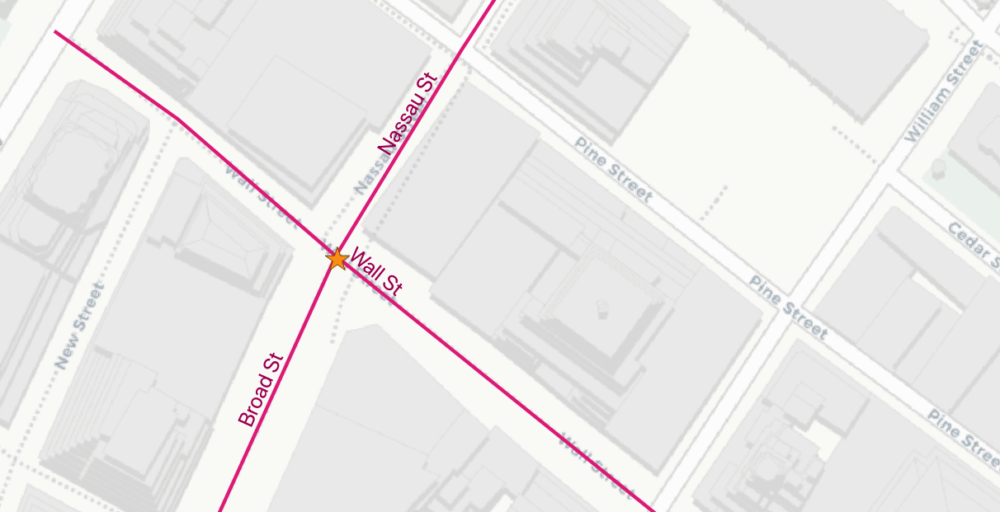
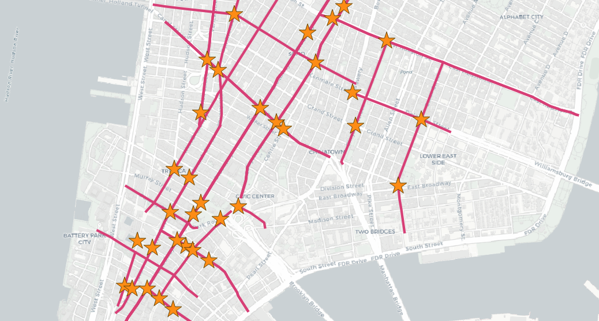

.. _knn:

Nearest-Neighbour Searching
===========================

What is a Nearest Neighbour Search?
-----------------------------------

A frequently posed spatial query is: "what is the nearest <candidate feature> to <query feature>?"

Unlike a distance search, the "nearest neighbour" search doesn't include any measurement restricting how far away candidate geometries might be, features of any distance away will be accepted, as long as they are the *nearest*.

PostgreSQL solves the nearest neighbor problem by introducing an "order by distance" (``<->``) operator that induces the database to use an index to speed up a sorted return set. With an "order by distance" operator in place, a nearest neighbor query can return the "N nearest features" just by adding an ordering and limiting the result set to N entries.

The "order by distance" operator works for both geometry and geography types.  The only difference between how they work between the two types is the distance value returned.  For geometry ``<->`` returns the same answer as `ST_Distance` which is dependent on the units of the spatial reference system in use. For geography the distance value returned is the sphere distance, instead of the more accurate spheroidal distance that ``ST_Distance(geography,geography)`` returns.

Here's the 3 nearest streets to 'Broad St' subway station:

.. code-block:: sql

  -- Get the geometry of Broad St
  SELECT ST_AsEWKT(geom, 1)
  FROM nyc_subway_stations
  WHERE name = 'Broad St';

::

  SRID=26918;POINT(583571.9 4506714.3)

.. code-block:: sql

  -- Plug the geometry into a nearest-neighbor query
  SELECT streets.gid, streets.name,
    ST_Transform(streets.geom, 4326),
    streets.geom <-> 'SRID=26918;POINT(583571.9 4506714.3)'::geometry AS dist
  FROM
    nyc_streets streets
  ORDER BY
    dist
  LIMIT 3;

::

    gid  |   name    |        dist
  -------+-----------+--------------------
   17385 | Wall St   |  0.749987508809928
   17390 | Broad St  | 0.8836306235191059
   17436 | Nassau St | 1.3368280241070414

How can we be sure we are getting an index-assisted query? It's a good idea to check the ``EXPLAIN`` output for a nearest-neighbor query, because it's possible to get correct answers from non-indexed SQL and the lack of an index might not be obvious until the size of the tables scales up.

This is the output from ``EXPLAIN``, note the index scan over the order by:

::

                                QUERY PLAN
  ---------------------------------------------------------------------------------
  Limit  (cost=0.28..79.58 rows=3 width=31)
     ->  Index Scan using nyc_streets_geom_idx on nyc_streets streets
         (cost=0.28..504685.12 rows=19091 width=31)
           Order By:
           (geom <-> '0101000020266900000EEBD4CF27CF2141BC17D69516315141'::geometry)

Nearest Neighbor Join
---------------------

The index assisted order by operator has one major draw back: it only works with a **single geometry literal** on one side of the operator. This is fine for finding the objects nearest to one query object, but does not help for a spatial join, where the goal is to find the nearest neighbor for each of a full set of candidates.

Fortunately, there's a SQL language feature that allows us to run a query repeatedly driven in a loop: the `LATERAL join <https://medium.com/kkempin/postgresqls-lateral-join-bfd6bd0199df>`_.

Here we will find the nearest street to each subway station:

.. code-block:: sql

  SELECT subways.gid AS subway_gid,
         subways.name AS subway,
         streets.name AS street,
         streets.gid AS street_gid,
         streets.geom::geometry(MultiLinestring, 26918) AS street_geom,
         streets.dist
  FROM nyc_subway_stations subways
  CROSS JOIN LATERAL (
    SELECT streets.name, streets.geom, streets.gid, streets.geom <-> subways.geom AS dist
    FROM nyc_streets AS streets
    ORDER BY dist
    LIMIT 1
  ) streets;

Note the way the ``CROSS JOIN LATERAL`` acts as the inner part of a loop driven by the subways table. Each record in the subways table gets fed into the lateral subquery, one at a time, so you get a nearest result for each subway record.

The explain shows the loop on the subway stations, and the index-assisted order by inside the loop where we want it:

::

                             QUERY PLAN
  -------------------------------------------------------------------------
   Nested Loop  (cost=0.28..13140.71 rows=491 width=37)
     ->  Seq Scan on nyc_subway_stations subways
         (cost=0.00..15.91 rows=491 width=46)
     ->  Limit
         (cost=0.28..1.71 rows=1 width=170)
           ->  Index Scan using nyc_streets_geom_idx on nyc_streets streets
               (cost=0.28..27410.12 rows=19091 width=170)
                  Order By: (geom <-> subways.geom)

