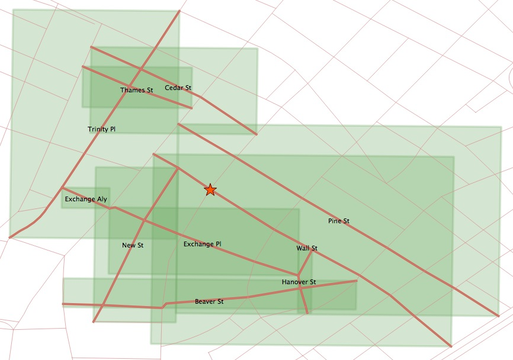
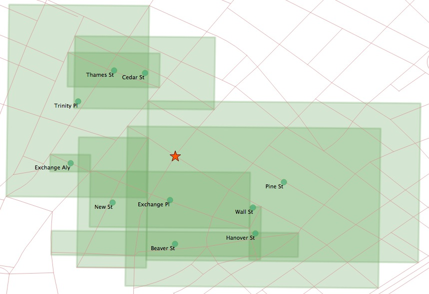
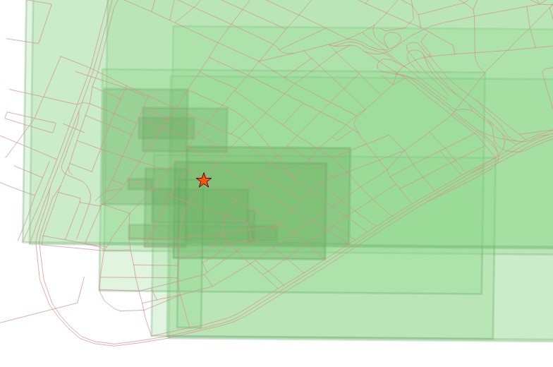

.. _knn:

Nearest-Neighbour Searching
===========================

.. note::

  This section refers to a feature that is only available with PostGIS 2.0 and higher.

What is a Nearest Neighbour Search?
-----------------------------------

A frequently posed spatial query is: "what is the nearest <candidate feature> to <query feature>?"

Unlike a distance search, the "nearest neighbour" search doesn't include any measurement restricting how far away candidate geometries might be, features of any distance away will be accepted, as long as they are the *nearest*. This poses a problem for traditional index-assisted queries, that require a search box, and therefore need some kind of measurement value to build the box.

The naive way to carry out a nearest neighbour query is to order the candidate table by distance from the query geometry, and then take the record with the smallest distance:

.. code-block:: sql

  -- Closest street to Broad Street station is Wall St
  SELECT streets.gid, streets.name 
  FROM 
    nyc_streets streets, 
    nyc_subway_stations subways
  WHERE subways.name = 'Broad St'
  ORDER BY ST_Distance(streets.geom, subways.geom) ASC
  LIMIT 1;

The trouble with this approach is that it forces the database to calculate the distance between the query geometry and *every* feature in the table of candidate features, then sort them all. For a large table of  candidate features, it is not a reasonable approach.

One way to improve performance is to add an index constraint to the search. This requires a magic number: what's the smallest box we could search around the query geometry, and still come up with at least one candidate geometry? 

If you turn on timing, you can see the performance difference between the box-assisted query below and the simple query above.

.. code-block:: sql

  -- Closest street to Broad Street station is Wall St
  SELECT streets.gid, streets.name 
  FROM 
    nyc_streets streets, 
    nyc_subway_stations subways
  WHERE subways.name = 'Broad St'
  AND streets.geom && ST_Expand(subways.geom, 200) -- Magic number: 200m
  ORDER BY ST_Distance(streets.geom, subways.geom) ASC
  LIMIT 1;

The problem with this approach is the magic number of 200 meters. What if there had not happened to be any roads within 200m? We would have failed to come up with a result: there is always a nearest neighbour, it just might not be within 200m.

Index-based KNN
---------------

"KNN" stands for "K nearest neighbours", where "K" is the number of neighbours you are looking for.

KNN is a pure index based nearest neighbour search. By walking up and down the index, the search can find the nearest candidate geometries without using any magical search radius numbers, so the technique is suitable and high performance even for very large tables with highly variable data densities.

.. note:: 

  The KNN feature is only available on PostGIS 2.0 with PostgreSQL 9.1 or greater.

The KNN system works by evaluating distances between bounding boxes inside the PostGIS GIST index.

Because the index is built using the bounding boxes of geometries, the distances between any geometries that are not points will be inexact: they will be the distances between the bounding boxes of geometries.

The syntax of the index-based KNN query places a special "index-based distance operator" in the ORDER BY clause of the query, in this case "<->". There are two index-based distance operators, 

* **<->** means "distance between box centers"
* **<#>** means "distance between box edges"

One side of the index-based distance operator must be a literal geometry value. We can get away with a subquery that returns as single geometry, or we could include a :term:`WKT` geometry instead.

.. code-block:: sql

  -- Closest 10 streets to Broad Street station are ?
  SELECT 
    streets.gid, 
    streets.name
  FROM 
    nyc_streets streets
  ORDER BY 
    streets.geom <-> 
    (SELECT geom FROM nyc_subway_stations WHERE name = 'Broad St')
  LIMIT 10;

  -- Same query using a geometry EWKT literal

  SELECT ST_AsEWKT(geom)
  FROM nyc_subway_stations 
  WHERE name = 'Broad St';
  -- SRID=26918;POINT(583571 4506714)

  SELECT 
    streets.gid, 
    streets.name,
    ST_Distance(
      streets.geom, 
      'SRID=26918;POINT(583571.905921312 4506714.34119218)'::geometry
      ) AS distance
  FROM 
    nyc_streets streets
  ORDER BY 
    streets.geom <-> 
    'SRID=26918;POINT(583571.905921312 4506714.34119218)'::geometry
  LIMIT 10;

The results of the second query show how odd the index-based query on non-point geometries can appear at first glance.   Wall Street is coming up third in our list, even though the absolute distance from the station to the street is 0.714 meters!

::

    gid  |     name     |     distance      
  -------+--------------+-------------------
   17360 | Exchange Pl  |    101.6241843136
   17350 | New St       |  63.9499165490674
   17385 | Wall St      | 0.714202224374917
   17332 | Exchange Aly |  159.618545539243
   17402 | Pine St      |  75.8461038368021
   17347 | Cedar St     |  133.009278387597
   17335 | Beaver St    |  221.988864601724
   17314 | Trinity Pl   |  205.942231743204
   17515 | Hanover St   |  198.414568622805
   17345 | Thames St    |  167.802276238319

Remember that all the calculations are being done on bounding boxes. The bounding box of the station point is just the point itself, so there is no approximation there. **But the bounding boxes of the streets aren't the same as the street lines.** Here's what the boxes of the top ten closest streets look like:

We can see that the station falls right on the Wall Street line, and within the Wall Street box, but this index ordering is controlled by the **<->** operator, which calculates distance between box centers. The centers of the boxes look like this:

Now it is clear why Wall Street isn't showing up as the first item in our search. The center of the Wall Street box is indeed further from the station than the centers of the Exchange Place and New Street boxes.

What about the **<#>** operator? If we calculate the distance between box edges, the station would fall **inside** the Wall Street box, giving it a distance of zero and the first entry in the list, right?

.. code-block:: sql

  -- Closest 10 streets to Broad Street station are ?
  SELECT 
    streets.gid, 
    streets.name
  FROM 
    nyc_streets streets
  ORDER BY 
    streets.geom <#> 
    'SRID=26918;POINT(583571.905921312 4506714.34119218)'::geometry
  LIMIT 10;

Unfortunately, no.

::

    gid  |                               name                               
  -------+------------------------------------------------------------------
   19088 | FDR Dr
   17315 | Broadway
   19087 | FDR Dr
   17402 | Pine St
   17385 | Wall St
   17357 | South St
   17308 | Pearl St
   17235 | West Side Highway; West St; West Side Highway; West Side Highway
   17230 | 
   17390 | Broad St

There are a number of large street features with big boxes that **also** overlap the station and yield a box distance of zero. 

The right way to get a high-performance--yet accurate--nearest neighbour calculation is to recognize that you'll have to pull the top 100 (or a smaller number if you feel certain your data is more homogeneous in distribution) possible results in a sub-query, calculate the true distance for all of them, and return the closest record from that set.

.. code-block:: sql

  -- "Closest" 100 streets to Broad Street station are?
  WITH closest_candidates AS (
    SELECT 
      streets.gid, 
      streets.name,
      streets.geom
    FROM 
      nyc_streets streets
    ORDER BY 
      streets.geom <-> 
      'SRID=26918;POINT(583571.905921312 4506714.34119218)'::geometry
    LIMIT 100
  )
  SELECT gid, name
  FROM closest_candidates
  ORDER BY 
    ST_Distance(
      geom,
      'SRID=26918;POINT(583571.905921312 4506714.34119218)'::geometry
      )
  LIMIT 1;

Note that when querying a point table, because the boxes are identical to the points you can use the index-sorted result directly and dispense with the sub-query.

.. code-block:: sql

  -- The 10 nearest stations to Broad St station
  SELECT gid, name
  FROM nyc_subway_stations
  ORDER BY geom <-> 'SRID=26918;POINT(583571.905921312 4506714.34119218)'::geometry
  LIMIT 10;
  
