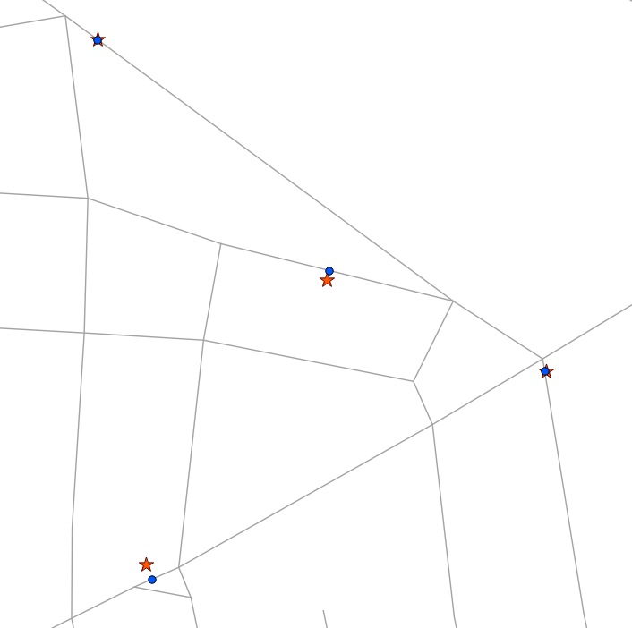

.. _linear_referencing:

Linear Referencing
==================

Linear referencing (sometimes called "dynamic segmentation") is a means of representing features that can be described by referencing a base set of linear features. Common examples of features that are modelled using linear referencing are:

* Highway assets, which are referenced using miles along a highway network
* Road maintenance operations, which are referenced as occurring along a road network between a pair of mile measurements.
* Aquatic inventories, where fish presence is recorded as existing between a pair of mileage-upstream measurements.
* Hydrologic characterizations ("reaches") of streams, recorded with a from- and to- mileage.
  
The benefit of linear referencing models is that the dependent spatial observations do not need to be separately recorded from the base observations, and updates to the base observation layer can be carried out knowing that the dependent observations will automatically track the new geometry.

.. note::

  The Esri terminological convention for linear referencing is to have a base table of linear spatial features, and a non-spatial table of "events" which includes a foreign key reference to the spatial feature and a measure along the referenced feature. We will use the term "event table" to refer to the non-spatial tables we build.

Creating Linear References
--------------------------

If you have an existing point table that you want to reference to a linear network, use the :command:`ST_LineLocatePoint` function, which takes a line and point, and returns the proportion along the line that the point can be found.

.. code-block:: sql

  -- Simple example of locating a point half-way along a line
  SELECT ST_LineLocatePoint('LINESTRING(0 0, 2 2)', 'POINT(1 1)');
  -- Answer 0.5
  
  -- What if the point is not on the line? It projects to closest point
  SELECT ST_LineLocatePoint('LINESTRING(0 0, 2 2)', 'POINT(0 2)');
  -- Answer 0.5
  
We can convert the **nyc_subway_stations** into an "event table" relative to the streets by using :command:`ST_LineLocatePoint`.

.. code-block:: sql

  -- All the SQL below is in aid of creating the new event table
  CREATE TABLE nyc_subway_station_events AS
  -- We first need to get a candidate set of maybe-closest
  -- streets, ordered by id and distance...
  WITH ordered_nearest AS (
  SELECT 
    ST_GeometryN(streets.geom,1) AS streets_geom, 
    streets.gid AS streets_gid,
    subways.geom AS subways_geom, 
    subways.gid AS subways_gid,
    ST_Distance(streets.geom, subways.geom) AS distance
  FROM nyc_streets streets 
    JOIN nyc_subway_stations subways 
    ON ST_DWithin(streets.geom, subways.geom, 200) 
  ORDER BY subways_gid, distance ASC
  )
  -- We use the 'distinct on' PostgreSQL feature to get the first
  -- street (the nearest) for each unique street gid. We can then
  -- pass that one street into ST_LineLocatePoint along with
  -- its candidate subway station to calculate the measure.
  SELECT 
    DISTINCT ON (subways_gid) 
    subways_gid, 
    streets_gid,
    ST_LineLocatePoint(streets_geom, subways_geom) AS measure,
    distance
  FROM ordered_nearest;

  -- Primary keys are useful for visualization softwares
  ALTER TABLE nyc_subway_station_events ADD PRIMARY KEY (subways_gid);

Once we have an event table, it's fun to turn it back into a spatial view, so we can visualize the events relative to the original points they were derived from.

To go from a measure to a point, we use the :command:`ST_LineInterpolatePoint` function. Here's our previous simple examples reversed:

.. code-block:: sql

  -- Simple example of locating a point half-way along a line
  SELECT ST_AsText(ST_LineInterpolatePoint('LINESTRING(0 0, 2 2)', 0.5));

  -- Answer POINT(1 1)

And we can join the **nyc_subway_station_events** tables back to the **nyc_streets** table and use the **measure** attribute to generate the spatial event points, without referencing the original **nyc_subway_stations** table.

.. code-block:: sql

  -- New view that turns events back into spatial objects
  CREATE OR REPLACE VIEW nyc_subway_stations_lrs AS
  SELECT 
    events.subways_gid,
    ST_LineInterpolatePoint(ST_GeometryN(streets.geom, 1), events.measure)AS geom,
    events.streets_gid
  FROM nyc_subway_station_events events
  JOIN nyc_streets streets 
  ON (streets.gid = events.streets_gid);

Viewing the original (red star) and event (blue circle) points with the streets, you can see how the events are snapped directly to the closest street lines.

.. note::

  One surprising use of the linear referencing functions has nothing to do with linear referencing models. As shown above, it's possible to use the functions to snap points to linear features. For use cases like GPS tracks or other inputs that are expected to reference a linear network, snapping is a handy feature to have available.

Function List
-------------

* `ST_LineInterpolatePoint(geometry A, double measure) <http://postgis.net/docs/ST_LineInterpolatePoint.html>`_: Returns a point interpolated along a line.
* `ST_LineLocatePoint(geometry A, geometry B) <http://postgis.net/docs/ST_LineLocatePoint.html>`_: Returns a float between 0 and 1 representing the location of the closest point on LineString to the given Point. 
* `ST_LineSubstring(geometry A, double from, double to) <http://postgis.net/docs/ST_LineSubstring.html>`_: Return a linestring being a substring of the input one starting and ending at the given fractions of total 2d length.
* `ST_LocateAlong(geometry A, double measure) <http://postgis.net/docs/ST_LocateAlong.html>`_: Return a derived geometry collection value with elements that match the specified measure.
* `ST_LocateBetween(geometry A, double from, double to) <http://postgis.net/docs/ST_LocateBetween.html>`_: Return a derived geometry collection value with elements that match the specified range of measures inclusively.
* `ST_AddMeasure(geometry A, double from, double to) <http://postgis.net/docs/ST_AddMeasure.html>`_: Return a derived geometry with measure elements linearly interpolated between the start and end points. If the geometry has no measure dimension, one is added. 

