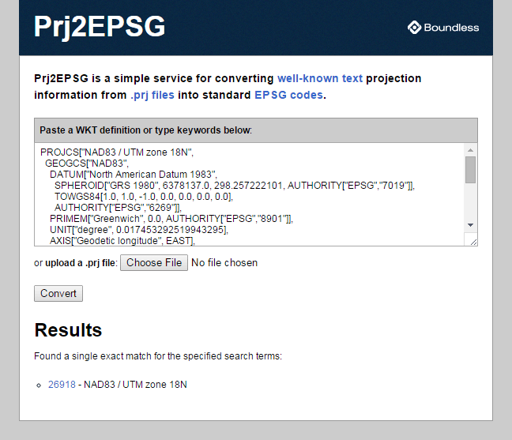

.. _loading_data:

Loading spatial data
====================

Supported by a wide variety of libraries and applications, PostGIS provides many options for loading data.  This section will focus on the basics -- loading shapefiles using the PostGIS shapefile loading tool.  

#. First, return to the Dashboard, and click on the **Import shapefiles** link in the PostGIS section. The GUI shapefile importer pgShapeLoader will launch.

   .. image:: ./screenshots/pgshapeloader_01.png
     :class: inline

#. Fill in the connection details for the *PostGIS Connection* section and click on the **OK** button. The loader will test the connection and report back in the log window.

   .. list-table::

     * - **Username**
       - ``postgres``
     * - **Password**
       - ``postgres``
     * - **Server Host**
       - ``localhost`` ``5432``
     * - **Database**
       - ``nyc``

   .. image:: ./screenshots/pgshapeloader_02.png
     :class: inline

#. Next, open the *Add File* browser and navigate to the data directory, file:`\\postgis-workshop\\data`. Select the :file:`nyc_census_blocks.shp` file. 

#. Change the SRID value for the file to **26918**. Note that the schema, table and column name are already filled in using the shapefile, but you can optionally change them (**Don't!** There are steps later in the workshop that expect the default names.) Click out of the fields after you are done editing, to ensure that the changes were entered.

   .. image:: ./screenshots/pgshapeloader_01a.png
     :class: inline
 
#. Fill in the details for the *Configuration* section.

   .. list-table::

     * - **Destination Schema**
       - ``public``
     * - **SRID**
       - ``26918``
     * - **Destination Table**
       - ``nyc_census_blocks``
     * - **Geometry Column**
       - ``geom``

#. Click the **Options** button to review the loading options. The loader will use the fast "COPY" mode and create a spatial index by default after loading the data.

   .. image:: ./screenshots/pgshapeloader_03.png
     :class: inline

#. Finally, click the **Import** button and watch the import process. It may take a few minutes to load, but this is the largest file in our test set.

#. Repeat the import process for the remaining shapefiles in the data directory. You can load multiple files in one import by adding multiple files before pressing the **Import** button:

   * ``nyc_streets.shp``
   * ``nyc_neighborhoods.shp``
   * ``nyc_subway_stations.shp``
   * ``nyc_homicides.shp``
   
#. Or, to load data via CLI tools, use:

.. code-block ::

   DATAFILES='nyc_census_blocks nyc_streets nyc_neighborhoods nyc_subway_stations nyc_homicides'
   for datafile in $DATAFILES
   do
       shp2pgsql -s 26918 _local/data/data_bundle/data/${datafile}.shp > ${datafile}.sql
       PGPASSWORD=${PROJECTNAME} psql -h localhost -U postgres -d nyc -f ${datafile}.sql
   done
 
#. When all the files are loaded, click the "Refresh" button in pgAdmin to update the tree view. You should see your four tables show up in the **Databases > nyc > Schemas > public > Tables** section of the tree.

   .. image:: ./screenshots/refresh.png
 
 
Shapefiles? What's that?
------------------------

You may be asking yourself -- "What's this shapefile thing?"  A "shapefile" commonly refers to a collection of files with ``.shp``, ``.shx``, ``.dbf``, and other extensions on a common prefix name (e.g., nyc_census_blocks). The actual shapefile relates specifically to files with the ``.shp`` extension. However, the ``.shp`` file alone is incomplete for distribution without the required supporting files.

Mandatory files:

* ``.shp``—shape format; the feature geometry itself
* ``.shx``—shape index format; a positional index of the feature geometry 
* ``.dbf``—attribute format; columnar attributes for each shape, in dBase III
    
Optional files include:

* ``.prj``—projection format; the coordinate system and projection information, a plain text file describing the projection using well-known text format

The pgShapeLoader makes shape data usable in PostGIS by converting it from binary data into a series of SQL commands that are then run in the database to load the data. 

SRID 26918? What's with that?
-----------------------------

Most of the import process is self-explanatory, but even experienced GIS professionals can trip over an **SRID**.

An "SRID" stands for "Spatial Reference IDentifier." It defines all the parameters of our data's geographic coordinate system and projection. An SRID is convenient because it packs all the information about a map projection (which can be quite complex) into a single number.

You can see the definition of our workshop map projection by looking it up either in an online database,

* http://spatialreference.org/ref/epsg/26918/

or directly inside PostGIS with a query to the ``spatial_ref_sys`` table.

.. code-block:: sql

  SELECT srtext FROM spatial_ref_sys WHERE srid = 26918;
  
.. note::

  The PostGIS ``spatial_ref_sys`` table is an :term:`OGC`-standard table that defines all the spatial reference systems known to the database. The data shipped with PostGIS, lists over 3000 known spatial reference systems and details needed to transform/re-project between them.  
   
In both cases, you see a textual representation of the **26918** spatial reference system (pretty-printed here for clarity):

::

  PROJCS["NAD83 / UTM zone 18N",
    GEOGCS["NAD83",
      DATUM["North_American_Datum_1983",
        SPHEROID["GRS 1980",6378137,298.257222101,AUTHORITY["EPSG","7019"]],
        AUTHORITY["EPSG","6269"]],
      PRIMEM["Greenwich",0,AUTHORITY["EPSG","8901"]],
      UNIT["degree",0.01745329251994328,AUTHORITY["EPSG","9122"]],
      AUTHORITY["EPSG","4269"]],
    UNIT["metre",1,AUTHORITY["EPSG","9001"]],
    PROJECTION["Transverse_Mercator"],
    PARAMETER["latitude_of_origin",0],
    PARAMETER["central_meridian",-75],
    PARAMETER["scale_factor",0.9996],
    PARAMETER["false_easting",500000],
    PARAMETER["false_northing",0],
    AUTHORITY["EPSG","26918"],
    AXIS["Easting",EAST],
    AXIS["Northing",NORTH]]

If you open up the ``nyc_neighborhoods.prj`` file from the data directory, you'll see the same projection definition. 

A common problem for people getting started with PostGIS is figuring out what SRID number to use for their data. All they have is a ``.prj`` file. But how do humans translate a ``.prj`` file into the correct SRID number?

The easy answer is to use a computer.  Plug the contents of the ``.prj`` file into http://prj2epsg.org. This will give you the number (or a list of numbers) that most closely match your projection definition. There aren't numbers for *every* map projection in the world, but most common ones are contained within the prj2epsg database of standard numbers.

Data you receive from local agencies—such as New York City—will usually be in a local projection noted by "state plane" or "UTM".  Our projection is "Universal Transverse Mercator (UTM) Zone 18 North" or EPSG:26918.  

Things to Try: View data using QGIS
-----------------------------------

`QGIS <http://qgis.org>`_, is a desktop GIS viewer/editor for quickly looking at data. You can view a number of data formats including flat shapefiles and a PostGIS database. Its graphical interface allows for easy exploration of your data, as well as simple testing and fast styling. 

Try using this software to connect your PostGIS database.  The application can be downloaded from http://qgis.org

.. rubric:: Footnotes

.. [#PostGIS_Install] "Chapter 2.5. Installation" PostGIS Documentation <http://postgis.net/docs/postgis_installation.html#PGInstall>

