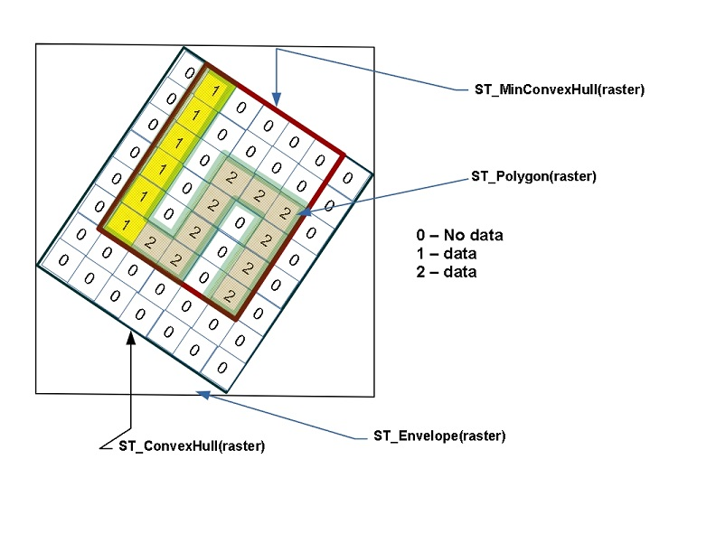
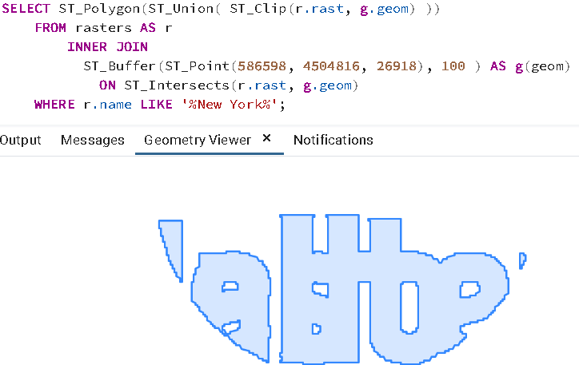
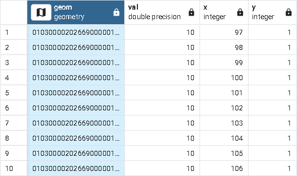
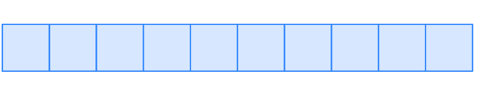

.. _rasters:

Rasters
=========

PostGIS supports another kind of spatial data type called a *raster*.
Raster data, much like geometry data, uses **Cartesian coordinates** and a spatial reference system.
However instead of vector data, raster data is represented as an n-dimensional matrix consisting of pixels and bands.
The bands defines the number of matrices you have. Each pixel stores a value corresponding to each band.
So a 3-banded raster such as an RGB image, would have 3 values for each pixel corresponding to the Red-Green-Blue bands.

Although pretty pictures such as those you see on your TV screen are rasters, rasters may not be that exciting to look at.
In a nutshell, a raster is a matrix, pinned on a coordinate system, that has values that can represent anything you want them to represent.

Since rasters live in cartesian space, rasters can interact with geometries.  PostGIS offers many functions that take as input both rasters and geometries.
Also many operations applied to rasters will result in geometries. Common ones are the `ST_Polygon`, `ST_Envelope`, `ST_ConvexHull`, and `ST_MinConvexHull`
as shown below.

The raster format is commonly used to store elevation data, temperature data, satellite data, and thematic data representing things like environmental contamination, population density, and environmental hazard occurrences.

Although raster data can be created from scratch in PostGIS, a more common approach is to load raster data from various formats using the `raster2pgsql <https://postgis.net/docs/using_raster_dataman.html#RT_Loading_Rasters>`_ command line tool packaged with PostGIS. Before all of that, you must enable raster support in your database by running the command:

.. code-block:: sql

  CREATE EXTENSION postgis_raster;

Creating Rasters From Geometries
--------------------------------
We'll start off by first creating raster data from vector data, and then move on to the more exciting approach of loading data from a raster source.
You will find that raster data is available in abundance and often free from various government sites.

We'll start by converting some geometries into rasters using `ST_AsRaster <https://postgis.net/docs/RT_ST_AsRaster.html>`_ function as follows.

.. code-block:: sql

  CREATE TABLE rasters (name varchar, rast raster);

  INSERT INTO rasters(name, rast)
  SELECT f.word, ST_AsRaster(geom, width=>150, height=>150)
  FROM (VALUES ('Hello'), ('Raster') ) AS f(word)
    , ST_Letters(word) AS geom;

  CREATE INDEX ix_rasters_rast
    ON rasters USING gist(ST_ConvexHull(rast));

The above example CREATEs a table (**rasters**) from geometries formed from letters using the PostGIS 3.2+ `ST_Letters <https://postgis.net/docs/ST_Letters.html>`_ function. Rasters similar to geometries, can take advantage of spatial indexes. The spatial index used for raster
is a functional index that indexes the geometry convexhull of the raster.
When loading data with :command:`raster2pgsql` with the :command:`I` switch, the :command:`CREATE INDEX`
step is done for you.

You can see some useful metadata of your rasters
with the following query which utilizes the postgis raster functions `ST_Count <https://postgis.net/docs/RT_ST_Count.html>`_ function to count the number of pixels that have data and the `ST_MetaData <https://postgis.net/docs/RT_ST_MetaData.html>`_ function to provide all sorts of useful background info for our rasters.

.. code-block:: sql

 SELECT name, ST_Count(rast) As num_pixels, md.*
    FROM rasters, ST_MetaData(rast) AS md;

.. code-block::

  name  | num_pixels | upperleftx |    upperlefty     | width | height |       scalex       |       scaley        | skewx | skewy | srid | numbands
  --------+------------+------------+-------------------+-------+--------+--------------------+---------------------+-------+-------+------+----------
  Hello  |      13926 |          0 | 77.10000000000001 |   150 |    150 |  1.226888888888889 | -0.5173333333333334 |     0 |     0 |    0 |        1
  Raster |      11967 |          0 |              75.4 |   150 |    150 | 1.7226319023207244 | -0.5086666666666667 |     0 |     0 |    0 |        1
  (2 rows)

.. note::

  There are two levels of raster functions.
  There are functions such as ST_MetaData that work at the raster level and there are functions such as
  :command:`ST_Count` function and :command:`ST_BandMetaData <https://postgis.net/docs/RT_ST_BandMetaData.html>`_
  function that work at the band level.
  Most functions in postgis raster that work at the
  band level, work with only one band at a time, and assume the band you want is `1`.

Note how all the rasters have a 150x150 dimension.  This is not ideal. This means that in order to force that,
our rasters, are squished in all sorts of ways.  If only we could see the ugliness of the rasters before us.

If you have a multi-band raster, and you need to count the pixel not no-data values in a band other than 1, you would explicitly specify the band number as follows `ST_Count(rast,2)`.

Viewing Rasters in Browser
------------------------------
Although pgAdmin and psql have no mechanism yet to view postgis rasters, we have a couple of options. For smallish rasters
the easiest is to output to a web-friendly raster format such as PNG using batteries included postgis raster
functions like `ST_AsPNG` or `ST_AsGDALRaster` listed in `PostGIS Raster output functions <https://postgis.net/docs/RT_reference.html#Raster_Outputs>`_.
As your rasters get larger, you'll want to graduate to a tool
such as QGIS to view them in all their glory or the GDAL family of commandline tools such as gdal_translate to export them to other raster formats.  Remember though, postgis rasters are built for analysis,
not for generating pretty pictures for you to look at.

One caveat, by default all different raster types outputs are disabled. In order to utilize these,
you'll need to enable drivers, all or a subset as detailed
in `Enable GDAL Raster drivers <https://postgis.net/docs/postgis_gdal_enabled_drivers.html>`_

.. code-block:: sql

  SET postgis.gdal_enabled_drivers = 'ENABLE_ALL';

If you don't want to have to do this for each connection, you can set at the database level using:

.. code-block:: sql

  ALTER DATABASE nyc SET postgis.gdal_enabled_drivers = 'ENABLE_ALL';

Each new connection to the database will use that setting.

Run the below query and copy and paste the output into the address bar of your web browser.

.. code-block:: sql

 SELECT 'data:image/png;base64,' ||
    encode(ST_AsPNG(rast),'base64')
    FROM rasters
    WHERE name = 'Hello';

For the rasters created thus far, we didn't specify the number of bands nor did we even
define their relation to earth.  As such our rasters have an unknown spatial reference system (0).

You can think of a rasters exoskeletal as a geometry.
A matrix encased in a geometric envelop. In order to do useful analysis,
we need to georeference our rasters,
meaning we want each pixel (rectangle) to represent some meaningful plot of space.

The `ST_AsRaster` has many overloaded representations. The earlier example used the simplest such implementation
and accepted the default arguments which are 8BUI and 1 band, with no data being 0.
If you need to use the other variants, you should use the named arguments call syntax so that you don't accidentally
fall into the wrong variant of the function or get **function is not unique** errors.

If you start with a geometry that has a spatial reference system, you'll end up with a raster
with same spatial reference system.  In this next example, we'll plop our words in New York in
bright cheery colors. We will also use pixel scale instead of width and height so that
our raster pixel sizes represent 1 meter x 1 meter of space.

.. code-block:: sql

  INSERT INTO rasters(name, rast)
  SELECT f.word || ' in New York' ,
    ST_AsRaster(geom,
      scalex => 1.0, scaley => -1.0,
      pixeltype => ARRAY['8BUI', '8BUI', '8BUI'],
      value => CASE WHEN word = 'Hello' THEN
        ARRAY[10,10,100] ELSE ARRAY[10,100,10] END,
      nodataval => ARRAY[0,0,0], gridx => NULL, gridy => NULL
      ) AS rast
  FROM (
      VALUES ('Hello'), ('Raster') ) AS f(word)
    , ST_SetSRID(
        ST_Translate(ST_Letters(word),586467,4504725), 26918
      ) AS geom;

If we then look at this, we'll see a non-squashed colored geometry.

.. code-block:: sql

 SELECT 'data:image/png;base64,' ||
    encode(ST_AsPNG(rast),'base64')
    FROM rasters
    WHERE name = 'Hello in New York';

Repeat for Raster:

.. code-block:: sql

 SELECT 'data:image/png;base64,' ||
    encode(ST_AsPNG(rast),'base64')
    FROM rasters
    WHERE name = 'Raster in New York';

What is more telling, if we rerun the

.. code-block:: sql

  SELECT name, ST_Count(rast) As num_pixels, md.*
    FROM rasters, ST_MetaData(rast) AS md;

Observe the metadata of the New York entries. They have the New York state plane meter spatial reference system.
They also have the same scale.  Since each unit is 1x1 meter,
the width of the word **Raster** is now wider than **Hello**.

.. code-block::

        name         | num_pixels | upperleftx |    upperlefty     | width | height |       scalex       |       scaley        | skewx | skewy | srid  | numbands
  -------------------+------------+------------+-------------------+-------+--------+--------------------+---------------------+-------+-------+-------+----------
  Hello              |      13926 |          0 | 77.10000000000001 |   150 |    150 |  1.226888888888889 | -0.5173333333333334 |     0 |     0 |     0 |        1
  Raster             |      11967 |          0 |              75.4 |   150 |    150 | 1.7226319023207244 | -0.5086666666666667 |     0 |     0 |     0 |        1
  Hello in New York  |       8786 |     586467 |         4504802.1 |   184 |     78 |                  1 |                  -1 |     0 |     0 | 26918 |        3
  Raster in New York |      10544 |     586467 |         4504800.4 |   258 |     76 |                  1 |                  -1 |     0 |     0 | 26918 |        3
  (4 rows)

Raster Spatial Catalog tables
===============================
Similar to the geometry and geography types, raster has a set of catalogs that show you
all raster columns in your database.
These are `raster_columns and raster_overviews <https://postgis.net/docs/using_raster_dataman.html#RT_Raster_Catalog>`_.
Both of these are views similar to the `geometry_columns` and `geography_columns`.

.. code-block:: sql

  SELECT *
      FROM raster_columns;

Explore the table, and you'll find this:

.. code-block:: sql

  r_table_catalog | r_table_schema | r_table_name | r_raster_column | srid | scale_x | scale_y | blocksize_x | blocksize_y | same_alignment | regular_blocking | num_bands | pixel_types | nodata_values | out_db | extent | spatial_index
  -----------------+----------------+--------------+-----------------+------+---------+---------+-------------+-------------+----------------+------------------+-----------+-------------+---------------+--------+--------+---------------
  nyc             | public         | rasters      | rast            |    0 |         |         |             |             | f              | f                |           |             |               |        |        | t
  (1 row)

a very disappointing row of largely unfilled information.

Unlike geometry and geography, raster does not support type modifiers, because type modifier space is too
limited and there are more critical properties than what can fit in a type modifier.

Raster instead relies on constraints, and reads these constraints back as part of the view.
So let's try to add some constraints to our table.

.. code-block:: sql

  SELECT AddRasterConstraints('public'::name, 'rasters'::name, 'rast'::name);

And you'll be bombarded with a whole bunch of notices about how your raster data is mess
and nothing can be constrained. If you look at raster_columns again, still the same disappointing
story of many blank rows.

In order for constraints to be applied,
all rasters in your table must be constrainable by at least one rule.

We can perhaps do this, let's just lie and say all our data is in New York State plane.

.. code-block:: sql

  UPDATE rasters SET rast = ST_SetSRID(rast,26918)
    WHERE ST_SRID(rast) <> 26918;

  SELECT AddRasterConstraints('public'::name, 'rasters'::name, 'rast'::name);
  SELECT r_table_name AS t, r_raster_column AS c, srid,
    blocksize_x AS bx, blocksize_y AS by, scale_x AS sx, scale_y AS sy,
    ST_AsText(extent) AS e
    FROM raster_columns;

Ah progress:

.. code-block::

  t         |  c   | srid  | bx  | by  | sx | sy |  e
  ----------+------+-------+-----+-----+----+----+------------------------------------------
  rasters   | rast | 26918 | 150 | 150 |    |    | POLYGON((0 -0.90000000000..
  (1 row)

The more you can constrain all your rasters, the more columns you'll see filled in
and also the more operations you'll be able to do across all the tiles in your raster.
Keep in mind that in some cases, you may not want to apply all constraints.

For example, if you plan to load more data into your raster table,
you'll want to skip the extent constraint since that
would require that all rasters are within the extent of the extent constraint.

You'll often here in PostGIS lingo, the term **raster tile** and **raster** used somewhat interchangeably.
A raster tile really corresponds to a particular raster in a raster column which is a subset of a bigger raster.
This is because when rasters are loaded into PostGIS from big raster files, they are often chopped up to make them
manageable.

Exploring Raster Functions
===========================
The :command:`postgis_raster` extension has over 100 functions to choose from.
We'll focus on the ones you will commonly use.
PostGIS raster functionality was patterned after the PostGIS geometry support. As such you'll
find an overlap of functions between raster and geometry where it makes sense.
Common ones you'll use that have equivalent in geometry world are :command:`ST_Intersects`, :command:`ST_SetSRID`, :command:`ST_SRID`, :command:`ST_Union`, :command:`ST_Intersection`, and :command:`ST_Transform`.
In addition to those overlapping functions, it offers many functions that work in conjunction with geometry
or are very specific to rasters.

Unioning Rasters
--------------------------
The `ST_Union <https://postgis.net/docs/RT_ST_Union.html>`_ function for raster,
just as the geometry equivalent :command:`ST_Union`, aggregates a set of rasters together
into a single raster.  However, just as with geometry,
not all rasters can be combined together,
but the rules for raster unioning are more complicated than geometry rules.
In the case of geometries, all you need is to have the same spatial reference system,
but for rasters that is not sufficient.

If you were to attempt, the following

.. code-block:: sql

 SELECT ST_Union(rast)
    FROM rasters;

You'd be summarily punished with an error:

**ERROR:  rt_raster_from_two_rasters: The two rasters provided do not have the same alignment
SQL state: XX000**

What is this same alignment thing, that is preventing you from unioning your precious rasters?

In order for rasters to be combined, they need to be on the same grid so to speak. Meaning
they must have same pixel sizes, same orientation (the skew), same spatial reference system,
and their pixels must not cut into each other, meaning they share the same worldly pixel grid.

If you try the same query, but just with words we carefully placed in New York.

Again, the same error. These are the same spatial ref system, the same pixel sizes,
and yet it's still not good enough.
Because their grids are off.

We can fix this by shifting the upper left y coordinates ever so slightly and then trying again.
If our grids start at integer level since our pixel sizes are whole integer,
then the pixels won't cut into each other.

.. code-block:: sql

  UPDATE rasters SET rast = ST_SetUpperLeft(rast,
    ST_UpperLeftX(rast)::integer,
    ST_UpperLeftY(rast)::integer)
  WHERE name LIKE '%New York';

  SELECT ST_Union(rast ORDER BY name)
    FROM rasters
    WHERE name LIKE '%New York%';

Voila it worked, and if we were to view, we'd see something like this:

.. note::

  If ever you are unclear why your rasters don't have the same alignment, you can use the function
  `ST_SameAlignment <https://postgis.net/docs/RT_ST_SameAlignment.html>`_, which will compare 2 rasters
  or a set of rasters and tell you if they have the same alignment.  If you have notices enabled, the
  NOTICE will tell you what is off with the rasters in question. The
  `ST_NotSameAlignmentReason <https://postgis.net/docs/RT_ST_NotSameAlignmentReason.html>`_, instead of just a notice
  will output the reason. It however only works with two rasters at a time.

One major way in which the `ST_Union(raster) <https://postgis.net/docs/RT_ST_Union.html>`_ raster function deviates
from the `ST_Union(geometry) <https://postgis.net/docs/ST_Union.html>`_ geometry function is that
it allows for an argument called *uniontype*.  This argument by default is set to `LAST` if you don't specify it,
which means, take the **LAST** raster pixel values in occasions where the raster pixel values overlap.
As a general rule, pixels in a band that are marked as no-data are ignored.

Just as with most aggregates in PostgreSQL, you can put a :command:`ORDER BY` clause as part of the function call
as is done in the prior example.  Specifying the order, allows you to control which raster takes priority.
So in our prior example, *Raster* trumped *Hello* because *Raster* is alphabetically last.

Observe, if you switch the order:

.. code-block:: sql

  SELECT ST_Union(rast ORDER BY name DESC)
    FROM rasters
    WHERE name LIKE '%New York%';

Then *Hello* trumps *Raster* because Hello is now the last overlaid.

The :command:`FIRST` union type is the reverse of :command:`LAST`.

But on occassion, **LAST** may not be the right operation.
Let's suppose our rasters represented two different sets of
observations from two different devices. These devices measure the same
thing, and we aren't sure which is right when they cross paths,
so we'd instead like to take the `MEAN` of the results.  We'd do this:

.. code-block:: sql

  SELECT ST_Union(rast, 'MEAN')
    FROM rasters
    WHERE name LIKE '%New York%';

Voila it worked, and if we were to view, we'd see something like this:

So instead of trumping, we have a blending of the two forces.
In the case of :command:`MEAN` union type, there is no point in specifying order,
because the result would be the average of overlapping pixel values.

Note that for geometries
since geometries are vector and thus have no values besides there or not there,
there really isn't any ambiguity on how to combine two vectors when they intersect.

Another feature of the raster :command:`ST_Union` we glossed over,
is this idea of if you should return all bands or just some bands.
When you don't specify what bands to union, :command:`ST_Union` will combine
same banded numbers and use the :command:`LAST` unioning
strategy.  If you have multiple bands, this may not be what you want to do.
Perhaps you only want to union, the second band.
In this case, the Green Band and you want the count of pixel values.

.. code-block:: sql

  SELECT ST_BandPixelType(ST_Union(rast, 2, 'COUNT'))
    FROM rasters
    WHERE name LIKE '%New York%';

.. code-block::

  st_bandpixeltype
  ------------------
  32BUI
  (1 row)

Note in the case of the **COUNT** union type, which counts the number of pixels filled in and returns that value,
the result is always a **32BUI** similar to how when you do a :command:`COUNT` in sql, the result is always a bigint,
to accommodate large counts.

In other cases, the band pixel type does not change and is set to the max value or rounded
if the amounts exceed the bounds of the type.
Why would anyone ever want to count pixels that intersect at a location.
Well suppose each of your rasters
represent police squadrons and incidents of arrests in the areas.
Each value, might represent a different kind
of arrest reason. You are doing stats on how many arrests in each region,
therefore you only care about the count of arrests.

Or perhaps, you want to do all bands, but you want different strategies.

.. code-block:: sql

  SELECT ST_Union(rast, ARRAY[(1, 'MAX'),
    (2, 'MEAN'),
    (3, 'RANGE')]::unionarg[])
    FROM rasters
    WHERE name LIKE '%New York%';

Using the *unionarg[]* variant of the :command:`ST_Union` function, also allows you to shuffle the order of the bands.

Clipping Rasters
-----------------
The `ST_Clip <https://postgis.net/docs/RT_ST_Clip.html>`_ function is one of the most widely used functions
for PostGIS rasters.  The main reason is the more pixels you need to inspect or do operations on, the slower your processing.
**ST_Clip** clips your raster to just the area of interest, so you can isolate your operations to just that area.

This function is also special in that it utilizes the power of geometry to help raster analysis.
To reduce the number of pixels, :command:`ST_Union` has to handle, each raster is clipped first to the area we are interested in.

.. code-block:: sql

  SELECT ST_Union( ST_Clip(r.rast, g.geom) )
    FROM rasters AS r
        INNER JOIN
          ST_Buffer(ST_Point(586598, 4504816, 26918), 100 ) AS g(geom)
            ON ST_Intersects(r.rast, g.geom)
    WHERE r.name LIKE '%New York%';

This example showcases several functions working in unison.  The :command:`ST_Intersects` function employed
is the one packaged with **postgis_raster** and can intersect 2 rasters or a raster and a geometry.
Similar to the geometry :command:`ST_Intersects` the raster :command:`ST_Intersects`
can take advantage of spatial indexes on the raster or geometry tables.

Converting Rasters to Geometries
---------------------------------
Rasters can just as easily be morphed into geometries.
Lets start with our prior example, but convert it to a polygon using `ST_Polygon <https://postgis.net/docs/RT_ST_Polygon.html>`_ function.

.. code-block:: sql

  SELECT ST_Polygon(ST_Union( ST_Clip(r.rast, g.geom) ))
    FROM rasters AS r
        INNER JOIN
          ST_Buffer(ST_Point(586598, 4504816, 26918), 100 ) AS g(geom)
            ON ST_Intersects(r.rast, g.geom)
    WHERE r.name LIKE '%New York%';

If you click on the geometry viewer in pgAdmin, you can see this in all it's glory without any hacks.

ST_Polygon considers all the pixels that have values (not no-data) in a particular band,
and converts them to geometry.  Like many other functions in raster, ST_Polygon only considers 1 band.
If no band is specified, it will consider only the first band.

Another popularly used function is the `ST_PixelAsPolygons <https://postgis.net/docs/RT_ST_PixelAsPolygons.html>`_ function. You should rarely use :command:`ST_PixelAsPolygons` on a large raster without first
clipping because you will end up with millions of rows, one for each pixel.

:command:`ST_PixelAsPolygons` returns a table consisting of geom, val, x, and y.
Where x is the column number, and y is the row number in the raster.

:command:`ST_PixelAsPolygons` similar to other raster functions works
on one band at a time and works on band 1 if no band is specified.
It also by default returns only pixels that have values.

.. code-block:: sql

  SELECT gv.*
    FROM rasters AS r
      CROSS JOIN LATERAL ST_PixelAsPolygons(rast) AS gv
    WHERE r.name LIKE '%New York%'
    LIMIT 10;

Which outputs:

and if we inspect using the geometry viewer, we'd see:

If we want all pixels of all our bands, we'd need to do something like below.
Note the differences in this example from previous.

  1. Setting  :command:`exclude_nodata_value` to make sure all pixels are returned so that
  our sets of calls return the same number of rows. The rows out of the function will be naturally in the same order.

  2. Using the `PostgreSQL ROWS FROM constructor <https://www.postgresql.org/docs/current/queries-table-expressions.html#QUERIES-TABLEFUNCTIONS>`_ , and aliasing each set of columns
  from our function output with names. So for example the band 1 columns (geom, val, x, y)
  are renamed to g1, v1, x1, x2

.. code-block:: sql

  SELECT pp.g1, pp.v1, pp.v2, pp.v3
    FROM rasters AS r
      CROSS JOIN LATERAL
      ROWS FROM (
        ST_PixelAsPolygons(rast, 1, exclude_nodata_value => false ),
        ST_PixelAsPolygons(rast, 2, exclude_nodata_value => false),
        ST_PixelAsPolygons(rast, 3, exclude_nodata_value => false )
        ) AS pp(g1, v1, x1, y1,
          g2, v2, x2, y2,
          g3, v3, x3, y3 )
    WHERE r.name LIKE '%New York%'
     AND ( pp.v1 = 0 OR  pp.v2 > 0 OR pp.v3 > 0) ;

.. note::

  We used CROSS JOIN LATERAL in these examples because
  we wanted to be explicit what we are doing.
  Since these are all set returning functions, you can replace CROSS JOIN LATERAL
  with , for short-hand.  We'll use a , in the next set of examples

Raster also introduces an additional composite type called a :command:`geomval`.
Consider a :command:`geomval` as the offspring of a geometry and raster.
It contains a geometry and it contains a pixel value.

You will find several raster functions that return geomvals.

A commonly used function that outputs geomvals is `ST_DumpAsPolygons <https://postgis.net/docs/RT_ST_DumpAsPolygons.html>`_,
which returns a set of contiguous pixels with the same value as a polygon.  Again this by default will only check band 1 and exclude no data values
unless you override. This example selects only polygons from band 2.
You can also apply filters to the values. For most use cases, :command:`ST_DumpAsPolygons` is a better option than :command:`ST_PixelAsPolygons` as it will return far fewer rows.

This will output 6 rows, and return polygons corresponding to the letters
in "Raster".

.. code-block:: sql

  SELECT gv.geom , gv.val
    FROM rasters AS r,
      ST_DumpAsPolygons(rast, 2) AS gv
    WHERE r.name LIKE '%New York%'
        AND gv.val = 100;

Note that it doesn't return a single geometry, because it finds continguous set of pixels
with the same value that form a polygon.
Even though all these values are the same, they are not continguous.

A common approach to produce more complex geometries is to group by the values and union.

.. code-block:: sql

  SELECT ST_Union(gv.geom) AS geom , gv.val
    FROM rasters AS r,
      ST_DumpAsPolygons(rast, 2) AS gv
    WHERE r.name LIKE '%New York%'
    GROUP BY gv.val;

This will give you 2 rows back corresponding to the words "Raster" and "Hello".

Map Algebra Functions
-----------------------------------
Map algebra is the idea that you can do math on your pixel values.
The :command:`ST_Union` function covered earlier is a special fast case of map algebra.
Then there are the `ST_MapAlgebra <https://postgis.net/docs/RT_ST_Polygon.html>`_
family of functions which allow you to define your own
crazy math, but at cost of performance.

People have the habit of jumping to  :command:`ST_MapAlgebra`,
probably cause the name sounds so cool and sophisticated.
Who wouldn't want to tell their friends, "I'm using a function called ST_MapAlgebra."
My advice, explore other functions before you jump for that shot-gun.
Your life will be simpler and your performance will be 100 times better, and your code will be shorter.

An often overlooked map-algebraish
function is the `ST_Reclass <https://postgis.net/docs/RT_ST_Reclass.html>`_ function, who sits in the background
waiting for someone to discover the power and speed it can offer.

What does **ST_Reclass** do? It as the name implies, reclassifies your pixel values based on minimalist range algebra.

.. TODO continue here
