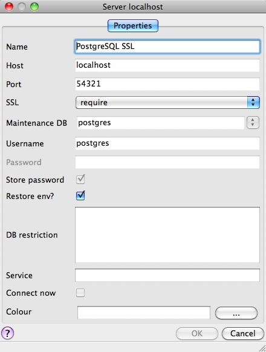
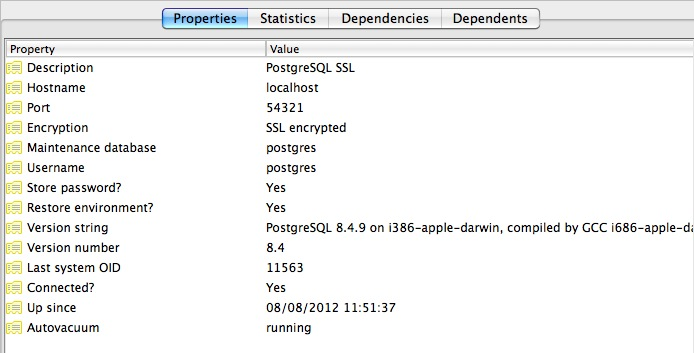

.. _security:

PostgreSQL Security
===================

PostgreSQL has a rich and flexible permissions system, with the ability to parcel out particular privileges to particular roles_, and provide users with the powers of one or more of those roles_.

In addition, the PostgreSQL server can use multiple different systems to authenticate users. This means that the database can use the same authentication infrastructure as other architecture components, simplifying password management.

Users and Roles
---------------

In this chapter we will create two useful production users:

* A read-only user for use in a publishing application.
* A read/write user for use by a developer in building a software or analyzing data.

Rather than creating users and granting them the necessary powers, we will create two roles with the right powers and then create two users and add them to the appropriate roles. That way we can easily reuse the roles when we create further users.

Creating Roles
~~~~~~~~~~~~~~

A role is a user and a user is a role. The only difference is that a "user" can be said to be a role with the "login" privilege. 

So functionally, the two SQL statements below are the same, they both create a "role with the login privilege", which is to say, a "user".

.. code-block:: sql

  CREATE ROLE mrbean LOGIN;
  CREATE USER mrbean;

Read-only Users
~~~~~~~~~~~~~~~

Our read-only user will be for a web application to use to query the ``nyc_streets`` table.

The application will have specific access to the ``nyc_streets`` table, but will inherit the necessary system access for PostGIS operations from the ``postgis_reader`` role.

.. code-block:: sql

  -- A user account for the web app
  CREATE USER app1;
  -- Web app needs access to specific data tables
  GRANT SELECT ON nyc_streets TO app1;
  
  -- A generic role for access to PostGIS functionality
  CREATE ROLE postgis_reader INHERIT;
  -- Give that role to the web app
  GRANT postgis_reader TO app1;

Now, when we login as app1, we can select rows from the ``nyc_streets`` table. However, we cannot run an :command:`ST_Transform` call! Why not?

.. code-block:: sql

  -- This works!
  SELECT * FROM nyc_streets LIMIT 1; 

  -- This doesn't work!
  SELECT ST_AsText(ST_Transform(geom, 4326)) 
    FROM nyc_streets LIMIT 1; 

:: 

  ERROR:  permission denied for relation spatial_ref_sys
  CONTEXT:  SQL statement "SELECT proj4text FROM spatial_ref_sys WHERE srid = 4326 LIMIT 1"

The answer is contained in the error statement. Though our ``app1`` user can view the contents of the ``nyc_streets`` table fine, it cannot view the contents of ``spatial_ref_sys``, so the call to :command:`ST_Transform` fails. 

So, we need to also grant the ``postgis_reader`` role read access to all the PostGIS metadata tables:

.. code-block:: sql

  GRANT SELECT ON geometry_columns TO postgis_reader;
  GRANT SELECT ON geography_columns TO postgis_reader;
  GRANT SELECT ON spatial_ref_sys TO postgis_reader;

Now we have a nice generic ``postgis_reader`` role we can apply to any user that need to read from PostGIS tables.

.. code-block:: sql

  -- This works now!
  SELECT ST_AsText(ST_Transform(geom, 4326)) 
    FROM nyc_streets LIMIT 1; 

Read/write Users
~~~~~~~~~~~~~~~~

There are two kinds of read/write scenarios we need to consider:

* Web applications and others that need to write to existing data tables.
* Developers or analysts that need to create new tables and geometry columns as part of their work.

For web applications that require write access to data tables, we just need to grant extra permissions to the tables themselves, and we can continue to use the ``postgis_reader`` role.

.. code-block:: sql

  -- Add insert/update/delete abilities to our web application
  GRANT INSERT,UPDATE,DELETE ON nyc_streets TO app1;

These kinds of permissions would be required for a read/write WFS service, for example.

For developers and analysts, a little more access is needed to the main PostGIS metadata tables.  We will need a ``postgis_writer`` role that can edit the PostGIS metadata tables!

.. code-block:: sql

  -- Make a postgis writer role
  CREATE ROLE postgis_writer;

  -- Start by giving it the postgis_reader powers
  GRANT postgis_reader TO postgis_writer;

  -- Add insert/update/delete powers for the PostGIS tables
  GRANT INSERT,UPDATE,DELETE ON spatial_ref_sys TO postgis_writer;
 
  -- Make app1 a PostGIS writer to see if it works!
  GRANT postgis_writer TO app1;

Now try the table creation SQL above as the app1 user and see how it goes!

Encryption
----------

PostgreSQL provides a lot of `encryption facilities <http://www.postgresql.org/docs/current/static/encryption-options.html>`_, many of them optional, some of them on by default.

* By default, all passwords are MD5 encrypted. The client/server handshake double encrypts the MD5 password to prevent re-use of the hash by anyone who intercepts the password.
* `SSL connections <http://www.postgresql.org/docs/current/static/libpq-ssl.html>`_ are optionally available between the client and server, to encrypt all data and login information. SSL certificate authentication is also available when SSL connections are used.
* Columns inside the database can be encrypted using the pgcrypto_ module, which includes hashing algorithms, direct ciphers (blowfish, aes) and both public key and symmetric PGP encryption.

SSL Connections
~~~~~~~~~~~~~~~

In order to use SSL connections, both your client and server must support SSL. 

* First, turn off PostgreSQL, since activating SSL will require a restart.
* Next, we acquire or generate an SSL certificate and key. The certificate will need to have no passphrase on it, or the database server won't be able to start up. You can generate a self-signed key as follows:

  :: 
     
    # Create a new certificate, filling out the certification info as prompted
    openssl req -new -text -out server.req
     
    # Strip the passphrase from the certificate
    openssl rsa -in privkey.pem -out server.key
     
    # Convert the certificate into a self-signed cert
    openssl req -x509 -in server.req -text -key server.key -out server.crt

    # Set the permission of the key to private read/write
    chmod og-rwx server.key
     
* Copy the ``server.crt`` and ``server.key`` into the PostgreSQL data directory.

* Enable SSL support in the ``postgresql.conf`` file by turning the "ssl" parameter to "on".

* Now re-start PostgreSQL; the server is ready for SSL operation.

With the server enabled for SSL, creating an encrypted connection is easy. In PgAdmin, create a new server connection (File > Add Server...), and set the SSL parameter to “require”.

Once you connect with the new connection, you can see in its properties that it is using an SSL connection.

Since the default SSL connection mode is "prefer", you don't even need to specify an SSL preference when connecting. A connection with the command line ``psql`` terminal will pick up the SSL option and use it by default:

:: 

  psql (8.4.9)
  SSL connection (cipher: DHE-RSA-AES256-SHA, bits: 256)
  Type "help" for help.

  postgres=# 

Note how the terminal reports the SSL status of the connection.

Data Encryption
~~~~~~~~~~~~~~~

The pgcrypto_ module has a huge range of encryption options, so we will only demonstrate the simplest use case: encrypting a column of data using a symmetric cipher.

* First, enable pgcrypto by loading the contrib SQL file, either in PgAdmin or psql.

  :: 
     
    pgsql/8.4/share/postgresql/contrib/pgcrypto.sql

* Then, test the encryption function.

  .. code-block:: sql
      
    -- encrypt a string using blowfish (bf)
    SELECT encrypt('this is a test phrase', 'mykey', 'bf');

* And make sure it's reversible too!

  .. code-block:: sql
      
    -- round-trip a string using blowfish (bf)
    SELECT decrypt(encrypt('this is a test phrase', 'mykey', 'bf'), 'mykey', 'bf');

Authentication
--------------

PostgreSQL supports many different `authentication methods <http://www.postgresql.org/docs/current/static/auth-methods.html>`_, to allow easy integration into existing enterprise architectures. For production purposes, the following methods are commonly used:

* **Password** is the basic system where the passwords are stored by the database, with MD5 encryption.
* Kerberos_ is a standard enterprise authentication method, which is used by both the GSSAPI_ and SSPI_ schemes in PostgreSQL. Using SSPI_, PostgreSQL can authenticate against Windows servers.
* LDAP_ is another common enterprise authentication method. The `OpenLDAP <http://www.openldap.org/>`_ server bundled with most Linux distributions provides an open source implementation of LDAP_.
* **Certificate** authentication is an option if you expect all client connections to be via SSL and are able to manage the distribution of keys.
* PAM_ authentication is an option if you are on Linux or Solaris and use the PAM_ scheme for transparent authentication provision.

Authentication methods are controlled by the ``pg_hba.conf`` file. The "HBA" in the file name stands for "host based access", because in addition to allowing you to specify the authentication method to use for each database, it allows you to limit host access using network addresses.

Here is an example ``pg_hba.conf`` file:

:: 

  # TYPE  DATABASE    USER        CIDR-ADDRESS          METHOD

  # "local" is for Unix domain socket connections only
  local   all         all                               trust
  # IPv4 local connections:
  host    all         all         127.0.0.1/32          trust
  # IPv6 local connections:
  host    all         all         ::1/128               trust
  # remote connections for nyc database only
  host    nyc         all         192.168.1.0/2         ldap

The file consists of five columns

* **TYPE** determines the kind of access, either "local" for connections from the same server or "host" for remote connections.
* **DATABASE** specifies what database the configuration line refers to or "all" for all databases
* **USER** specifies what users the line refers to or "all" for all users
* **CIDR-ADDRESS** specifies the network limitations for remote connections, using network/netmask syntax
* **METHOD** specifies the authentication protocol to use. "trust" skips authentication entirely and simply accepts any valid username without challenge.

It's common for local connections to be trusted, since access to the server itself is usually privileged. Remote connections are disabled by default when PostgreSQL is installed: if you want to connect from remote machines, you'll have to add an entry.

The line for ``nyc`` in the example above is an example of a remote access entry. The ``nyc`` example allows LDAP authenticated access only to machines on the local network (in this case the 192.168.1. network) and only to the nyc database. Depending on the security of your network, you will use more or less strict versions of these rules in your production set-up.

Links
-----

* `PostgreSQL Authentication <http://www.postgresql.org/docs/current/static/auth-methods.html>`_
* `PostgreSQL Encrpyption <http://www.postgresql.org/docs/current/static/encryption-options.html>`_
* `PostgreSQL SSL Support <http://www.postgresql.org/docs/current/static/libpq-ssl.html>`_

.. _GSSAPI: http://en.wikipedia.org/wiki/Generic_Security_Services_Application_Program_Interface
.. _SSPI: http://msdn.microsoft.com/en-us/library/windows/desktop/aa380493(v=vs.85).aspx
.. _RADIUS: http://en.wikipedia.org/wiki/RADIUS
.. _LDAP: http://en.wikipedia.org/wiki/Lightweight_Directory_Access_Protocol
.. _Kerberos: http://en.wikipedia.org/wiki/Kerberos_(protocol)
.. _PAM: http://en.wikipedia.org/wiki/Pluggable_authentication_module
.. _pgcrypto: http://www.postgresql.org/docs/current/static/pgcrypto.html
.. _roles: http://www.postgresql.org/docs/current/static/user-manag.html
