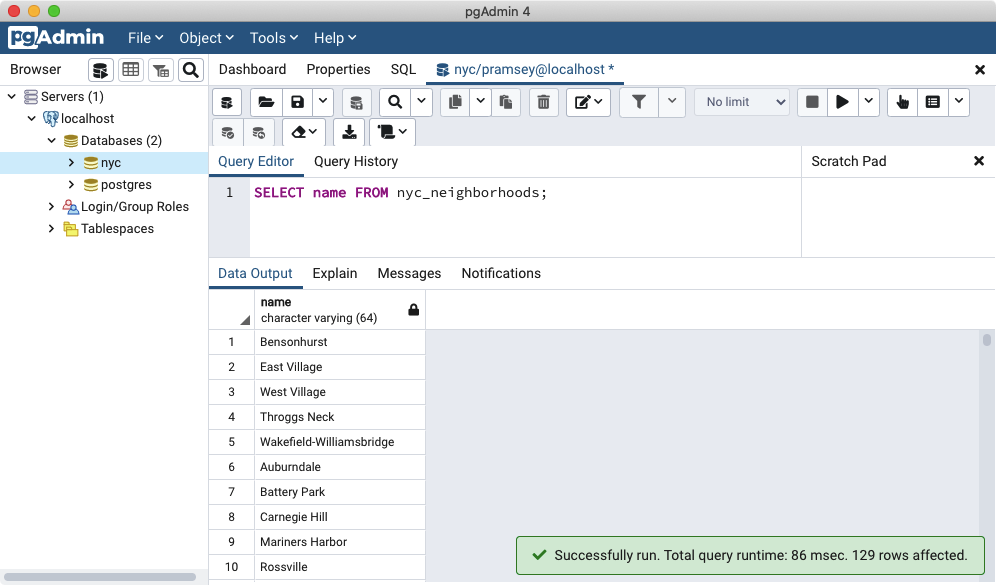

.. _simple_sql:

Simple SQL
==========

:term:`SQL`, or "Structured Query Language", is a means of asking questions of, and updating data in, relational databases. You have already seen SQL when we created our first database.  Recall:

.. code-block:: sql

   SELECT postgis_full_version();

But that was a question about the database.  Now that we've loaded data into our database, let's use SQL to ask questions of the data! For example,

  "What are the names of all the neighborhoods in New York City?"
  
Open up the SQL query window in pgAdmin by clicking the SQL button

then enter the following query in to the query window

.. code-block:: sql

  SELECT name FROM nyc_neighborhoods;
  
and click the **Execute Query** button (the green triangle).
  

The query will run for a few (milli)seconds and return the 129 results.

But what exactly happened here?  To understand, let's begin with the four "verbs" of SQL, 

* ``SELECT``, returns rows in response to a query
* ``INSERT``, adds new rows to a table
* ``UPDATE``, alters existing rows in a table
* ``DELETE``, removes rows from a table
 
We will be working almost exclusively with ``SELECT`` in order to ask questions of tables using spatial functions.

SELECT queries
--------------

A select query is generally of the form::

  SELECT some_columns FROM some_data_source WHERE some_condition;
  
.. note::

    For a synopsis of all ``SELECT`` parameters, see the `PostgresSQL documentation  <http://www.postgresql.org/docs/current/interactive/sql-select.html>`_.
    
The ``some_columns`` are either column names or functions of column values. The ``some_data_source`` is either a single table, or a composite table created by joining two tables on a key or condition. The ``some_condition`` is a filter that restricts the number of rows to be returned.

  "What are the names of all the neighborhoods in Brooklyn?"

We return to our ``nyc_neighborhoods`` table with a filter in hand.  The table contains all the neighborhoods in New York, but we only want the ones in Brooklyn.

.. code-block:: sql

  SELECT name 
    FROM nyc_neighborhoods 
    WHERE boroname = 'Brooklyn';

The query will run for even fewer (milli)seconds and return the 23 results.

Sometimes we will need to apply a function to the results of our query. For example,

  "What is the number of letters in the names of all the neighborhoods in Brooklyn?"
  
Fortunately, PostgreSQL has a string length function, :command:`char_length(string)`.

.. code-block:: sql

  SELECT char_length(name) 
    FROM nyc_neighborhoods 
    WHERE boroname = 'Brooklyn';

Often, we are less interested in the individual rows than in a statistic that applies to all of them. So knowing the lengths of the neighborhood names might be less interesting than knowing the average length of the names. Functions that take in multiple rows and return a single result are called "aggregate" functions.  

PostgreSQL has a series of built-in aggregate functions, including the general purpose :command:`avg()` for average values and :command:`stddev()` for standard deviations.

  "What is the average number of letters and standard deviation of number of letters in the names of all the neighborhoods in Brooklyn?"
  
.. code-block:: sql

  SELECT avg(char_length(name)), stddev(char_length(name)) 
    FROM nyc_neighborhoods 
    WHERE boroname = 'Brooklyn';
  
::

           avg         |       stddev       
  ---------------------+--------------------
   11.7391304347826087 | 3.9105613559407395

The aggregate functions in our last example were applied to every row in the result set. What if we want the summaries to be carried out over smaller groups within the overall result set? For that we add a ``GROUP BY`` clause. Aggregate functions often need an added ``GROUP BY`` statement to group the result-set by one or more columns.  

  "What is the average number of letters in the names of all the neighborhoods in New York City, reported by borough?"

.. code-block:: sql

  SELECT boroname, avg(char_length(name)), stddev(char_length(name)) 
    FROM nyc_neighborhoods 
    GROUP BY boroname;
 
We include the ``boroname`` column in the output result so we can determine which statistic applies to which borough. In an aggregate query, you can only output columns that are either (a) members of the grouping clause or (b) aggregate functions.
  
::

     boroname    |         avg         |       stddev       
  ---------------+---------------------+--------------------
   Brooklyn      | 11.7391304347826087 | 3.9105613559407395
   Manhattan     | 11.8214285714285714 | 4.3123729948325257
   The Bronx     | 12.0416666666666667 | 3.6651017740975152
   Queens        | 11.6666666666666667 | 5.0057438272815975
   Staten Island | 12.2916666666666667 | 5.2043390480959474
  
Function List
-------------

`avg(expression) <http://www.postgresql.org/docs/current/static/functions-aggregate.html#FUNCTIONS-AGGREGATE-TABLE>`_: PostgreSQL aggregate function that returns the average value of a numeric column.

`char_length(string) <http://www.postgresql.org/docs/current/static/functions-string.html>`_: PostgreSQL string function that returns the number of character in a string.

`stddev(expression) <http://www.postgresql.org/docs/current/static/functions-aggregate.html#FUNCTIONS-AGGREGATE-STATISTICS-TABLE>`_: PostgreSQL aggregate function that returns the standard deviation of input values.
  
  
