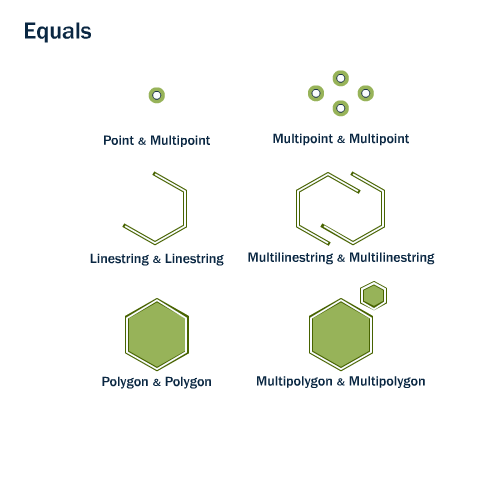
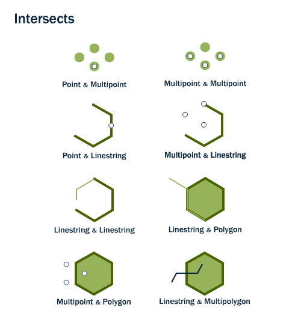
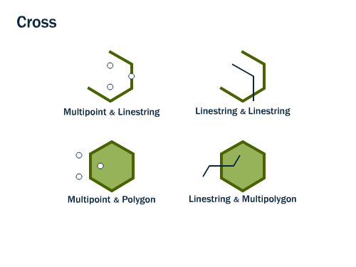
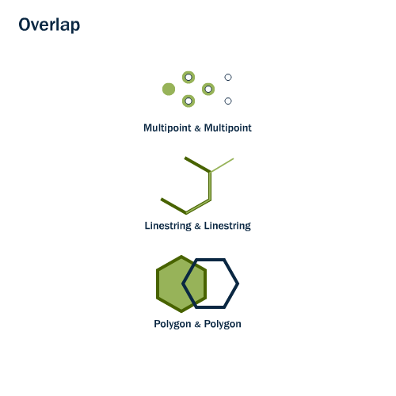
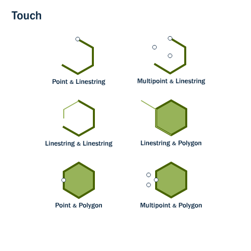
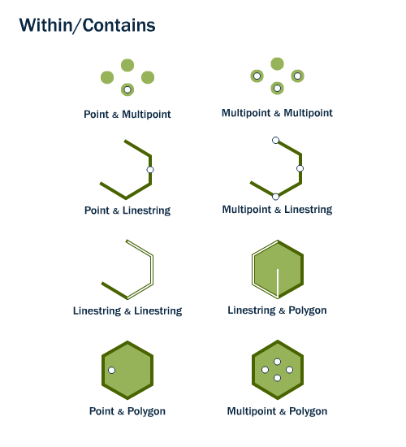
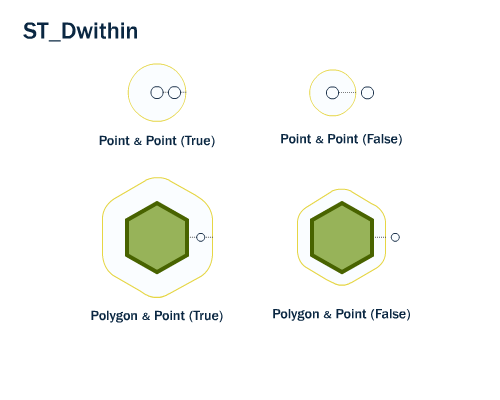
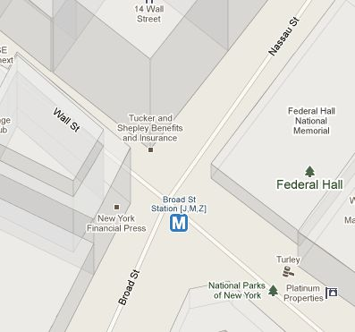

.. _spatial_relationships:

Spatial Relationships
=====================

So far we have only used spatial functions that measure (:command:`ST_Area`, :command:`ST_Length`), serialize (:command:`ST_GeomFromText`) or deserialize (:command:`ST_AsGML`) geometries. What these functions have in common is that they only work on one geometry at a time.

Spatial databases are powerful because they not only store geometry, they also have the ability to compare *relationships between geometries*. 

Questions like "Which are the closest bike racks to a park?" or "Where are the intersections of subway lines and streets?" can only be answered by comparing geometries representing the bike racks, streets, and subway lines.

The OGC standard defines the following set of methods to compare geometries.

ST_Equals
---------
 
:command:`ST_Equals(geometry A, geometry B)` tests the spatial equality of two geometries. 

ST_Equals returns TRUE if two geometries of the same type have identical x,y coordinate values, i.e. if the second shape is equal (identical) to the first shape.

First, let's retrieve a representation of a point from our ``nyc_subway_stations`` table. We'll take just the entry for 'Broad St'.

.. code-block:: sql

  SELECT name, geom, ST_AsText(geom)
  FROM nyc_subway_stations 
  WHERE name = 'Broad St';             

::

     name   |                      geom                          |      st_astext
  ----------+----------------------------------------------------+-----------------------
   Broad St | 0101000020266900000EEBD4CF27CF2141BC17D69516315141 | POINT(583571 4506714)
 
Then, plug the geometry representation back into an :command:`ST_Equals` test:

.. code-block:: sql

  SELECT name 
  FROM nyc_subway_stations 
  WHERE ST_Equals(geom, '0101000020266900000EEBD4CF27CF2141BC17D69516315141');

::

   Broad St

.. note::

  The representation of the point was not very human readable (``0101000020266900000EEBD4CF27CF2141BC17D69516315141``) but it was an exact representation of the coordinate values. For a test like equality, using the exact coordinates is necessary.

ST_Intersects, ST_Disjoint, ST_Crosses and ST_Overlaps
------------------------------------------------------

:command:`ST_Intersects`, :command:`ST_Crosses`, and :command:`ST_Overlaps` test whether the interiors of the geometries intersect. 

:command:`ST_Intersects(geometry A, geometry B)` returns t (TRUE) if the two shapes have any space in common, i.e., if their boundaries or interiors intersect.

.. figure:: ./spatial_relationships/st_disjoint.png
   :align: center

The opposite of ST_Intersects is :command:`ST_Disjoint(geometry A , geometry B)`. If two geometries are disjoint, they do not intersect, and vice-versa. In fact, it is often more efficient to test "not intersects" than to test "disjoint" because the intersects tests can be spatially indexed, while the disjoint test cannot.

For multipoint/polygon, multipoint/linestring, linestring/linestring, linestring/polygon, and linestring/multipolygon comparisons, :command:`ST_Crosses(geometry A, geometry B)` returns t (TRUE) if the intersection results in a geometry whose dimension is one less than the maximum dimension of the two source geometries and the intersection set is interior to both source geometries.

:command:`ST_Overlaps(geometry A, geometry B)` compares two geometries of the same dimension and returns TRUE if their intersection set results in a geometry different from both but of the same dimension.

Let's take our Broad Street subway station and determine its neighborhood using the :command:`ST_Intersects` function:

.. code-block:: sql

  SELECT name, ST_AsText(geom)
  FROM nyc_subway_stations 
  WHERE name = 'Broad St';               

::

  POINT(583571 4506714)

.. code-block:: sql   

  SELECT name, boroname 
  FROM nyc_neighborhoods
  WHERE ST_Intersects(geom, ST_GeomFromText('POINT(583571 4506714)',26918));

::

          name        | boroname  
  --------------------+-----------
   Financial District | Manhattan

ST_Touches
----------

:command:`ST_Touches` tests whether two geometries touch at their boundaries, but do not intersect in their interiors 

:command:`ST_Touches(geometry A, geometry B)` returns TRUE if either of the geometries' boundaries intersect or if only one of the geometry's interiors intersects the other's boundary.

ST_Within and ST_Contains
-------------------------

:command:`ST_Within` and :command:`ST_Contains` test whether one geometry is fully within the other. 

    
:command:`ST_Within(geometry A , geometry B)` returns TRUE if the first geometry is completely within the second geometry. ST_Within tests for the exact opposite result of ST_Contains.  

:command:`ST_Contains(geometry A, geometry B)` returns TRUE if the second geometry is completely contained by the first geometry. 

ST_Distance and ST_DWithin
--------------------------

An extremely common GIS question is "find all the stuff within distance X of this other stuff". 

The :command:`ST_Distance(geometry A, geometry B)` calculates the *shortest* distance between two geometries and returns it as a float. This is useful for actually reporting back the distance between objects.

.. code-block:: sql

  SELECT ST_Distance(
    ST_GeometryFromText('POINT(0 5)'),
    ST_GeometryFromText('LINESTRING(-2 2, 2 2)'));

::

  3

For testing whether two objects are within a distance of one another, the :command:`ST_DWithin` function provides an index-accelerated true/false test. This is useful for questions like "how many trees are within a 500 meter buffer of the road?". You don't have to calculate an actual buffer, you just have to test the distance relationship.

    
Using our Broad Street subway station again, we can find the streets nearby (within 10 meters of) the subway stop:

.. code-block:: sql

  SELECT name 
  FROM nyc_streets 
  WHERE ST_DWithin(
          geom, 
          ST_GeomFromText('POINT(583571 4506714)',26918), 
          10
        );

:: 

       name     
  --------------
     Wall St
     Broad St
     Nassau St

And we can verify the answer on a map. The Broad St station is actually at the intersection of Wall, Broad and Nassau Streets.

Function List
-------------

`ST_Contains(geometry A, geometry B) <http://postgis.net/docs/ST_Contains.html>`_: Returns true if and only if no points of B lie in the exterior of A, and at least one point of the interior of B lies in the interior of A.

`ST_Crosses(geometry A, geometry B)  <http://postgis.net/docs/ST_Crosses.html>`_: Returns TRUE if the supplied geometries have some, but not all, interior points in common.

`ST_Disjoint(geometry A , geometry B) <http://postgis.net/docs/ST_Disjoint.html>`_: Returns TRUE if the Geometries do not "spatially intersect" - if they do not share any space together.

`ST_Distance(geometry A, geometry B)  <http://postgis.net/docs/ST_Distance.html>`_: Returns the 2-dimensional cartesian minimum distance (based on spatial ref) between two geometries in projected units. 

`ST_DWithin(geometry A, geometry B, radius) <http://postgis.net/docs/ST_DWithin.html>`_: Returns true if the geometries are within the specified distance (radius) of one another. 

`ST_Equals(geometry A, geometry B) <http://postgis.net/docs/ST_Equals.html>`_: Returns true if the given geometries represent the same geometry. Directionality is ignored.

`ST_Intersects(geometry A, geometry B) <http://postgis.net/docs/ST_Intersects.html>`_: Returns TRUE if the Geometries/Geography "spatially intersect" - (share any portion of space) and FALSE if they don't (they are Disjoint). 

`ST_Overlaps(geometry A, geometry B) <http://postgis.net/docs/ST_Overlaps.html>`_: Returns TRUE if the Geometries share space, are of the same dimension, but are not completely contained by each other.

`ST_Touches(geometry A, geometry B)  <http://postgis.net/docs/ST_Touches.html>`_: Returns TRUE if the geometries have at least one point in common, but their interiors do not intersect.

`ST_Within(geometry A , geometry B) <http://postgis.net/docs/ST_Within.html>`_: Returns true if the geometry A is completely inside geometry B

