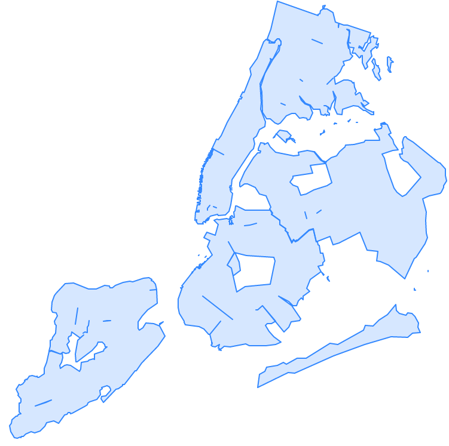

.. _topology:

Topology
=========

PostGIS supports the SQL/MM SQL-MM 3 Topo-Geo and Topo-Net 3 specifications
via an extension called **postgis_topology**. You can learn about all the functions and types provided by this extension in
`Manual: PostGIS Topology <https://postgis.net/docs/Topology.html>`_
The *postgis_topology* extension
includes another kind of core spatial type, called a **topogeometry**.
In addition to the *topogeometry* spatial type, you will find functions for building
*topologies* and populating topologies.

Before you can start using topologies, you must install postgis_topology extension as follows:

.. code-block:: sql

  CREATE EXTENSION postgis_topology;

After you install the extension, you will see a new schema in your database called `topology`.
The `topology` schema catalogs all the topologies in your database.

The `topology` schema contains two tables and all the helper functions for topology.

* topology - lists all the topologies in your database, and what schema they are stored in
* layer - lists all the table columns in your database that hold topogeometries

The *layer* table is very similar to the `raster_columns`, `geometry_columns`, and `geography_columns`
catalogs we learned about earlier, but specifically for topogeometries.

What exactly is a topology and a topogeometry, and how are they related?
Before we explain, let's start by creating
a topology to house our NYC topologically perfect data using the `CreateTopology <https://postgis.net/docs/CreateTopology.html>`_
function and set the tolerance to be 0.5 meters.
Note the 0.5 is in meters since our spatial reference system is State Plany NY meters.

.. code-block:: sql

  SELECT topology.CreateTopology('nyc_topo', 26918, 0.5);

Which outputs:

.. code-block:: sql

  1

Which is the id it assigned the new topology.
Once you run the above command, you will see a new schema in your database called `nyc_topo`.
You can name the topology anything you want.
My convention is to add `_topo` at the end to distinguish
it from other schemas I have in my database.

If you explore the `topology.topology` table,

.. code-block:: sql

  SELECT * FROM topology.topology;

You will see:

.. code-block::

  id |   name    | srid  | precision | hasz
  ----+----------+-------+-----------+------
    1 | nyc_topo | 26918 |         0 | f
  (1 row)

A topology is implemented as a schema in a PostgreSQL database.
If you explore the `nyc_topo` schema, you will see these tables and views:

* edge - This is a view built against edge_data, mostly for SQL/MM compliance.
         It has a subset of the columns in the `edge_data` table.
* edge_data - Contains all the linestrings that make up the topology
* face - Contains a list of all closed surfaces that can be formed from the edge_data.
        It does not contain the actual geometry, but instead just the bounding box of the geometry.
* node - Contains all the start and end points of all edges as well as points not connected to anything (isolated nodes)
* relation - this defines what elements in a topology make up a topogeometry.

So what is a topogeometry again?  A topogeometry is a representation of a geometry formed from the
edges, faces, nodes, and other topogeometries in a topology.

Where does a topogeometry reside?  It resides somewhere else which references elements of a topology via the *relation* table.
Although we could throw the topogeometries
in our `nyc_topo` schema, the general convention, is to define other tables in other schemas
that have a topogeometry, and also have any other kind of data you might be interested in tracking.

Using topogeometries keeps your data tidy and connected.
Topogeometries are very useful for Cadastral work, where you want to make sure two parcels of land don't overlap each
other even if you change the boundaries of one or you want to make sure roads stay connected as you change their geometries.
Geometries live in an island of their own, you can duplicate them, morph them.
Geometries are carefree, not caring about other geometries that share space with them.
Topogeometries, in contrast, follow the rules of their topology; they can't exist unless there is an
edge, node, face, or other topogeometry
that defines them. A topogeometry belongs to one and only one topology.

We have an `nyc_topo` topology devoid of any data.  Let's populate it with our NYC data.
Topology edges, faces, and nodes can be created in 2 keys ways.

* Edges, Faces, and Nodes can also be created directly using topology primitive functions.
* Edges, Faces, and Nodes can also be formed by creating topogeometries.
  When a topogeometry is created from a geometry and their are missing edges, faces,
  or nodes that match its coordinates, then new edges, faces, and nodes are created as part of the process

The most common way to populate topologies is to create topogeometries.
Lets start by creating a table to hold neighborhoods and then add a topogeometry column
using the `AddTopoGeometryColumn <https://postgis.net/docs/AddTopoGeometryColumn.html>`_

.. code-block:: sql

  CREATE TABLE nyc_neighborhoods_t(boroname varchar(43), name varchar(67),
    CONSTRAINT pk_nyc_neighborhoods_t PRIMARY KEY(boroname,name) );
  SELECT topology.AddTopoGeometryColumn('nyc_topo', 'public', 'nyc_neighborhoods_t',
    'topo', 'POLYGON') As  layer_id;

The output of the above is
..code-block::

  layer_id
  --------
  1

Now we are ready to populate our table.
It's best to ensure your geometries are valid before adding, otherwise you'll get errors such as
SQL\MM geometry is not simple.

So lets start by adding valid ones.  The 1 used here refers to the layer_id generated from the
previous query. If you don't know the layer id, you would look it up using the `FindLayer <https://postgis.net/docs/FindLayer.html>`_ function
which we'll use in later examples.

.. code-block:: sql

  INSERT INTO nyc_neighborhoods_t(boroname,name, topo)
  SELECT boroname, name,  topology.toTopoGeom(geom, 'nyc_topo', 1)
    FROM nyc_neighborhoods
    WHERE ST_ISvalid(geom);

The above step should take 3-4 secs.
Now lets add the invalid ones:

.. code-block:: sql

  INSERT INTO nyc_neighborhoods_t(boroname,name, topo)
  SELECT boroname, name,  topology.toTopoGeom(
    ST_UnaryUnion(
      ST_CollectionExtract(
        ST_MakeValid(geom), 3)
        ), 'nyc_topo', 1)
    FROM nyc_neighborhoods
    WHERE NOT ST_ISvalid(geom);

The above should take about 300-400ms.

Now we have data in our topology.  A quick check will show, nyc_topo.edge, nyc_topo.node, and nyc_topo.face have data:

.. code-block:: sql

  SELECT 'edge' AS name, count(*)
    FROM nyc_topo.edge
  UNION ALL
  SELECT 'node' AS name, count(*)
    FROM nyc_topo.node
  UNION ALL
  SELECT 'face' AS name, count(*)
    FROM nyc_topo.face;

outputs:

.. code-block::

  name | count
  ------+-------
  edge |   580
  node |   396
  face |   218
  (3 rows)

Now we can express declaritively that boros are formed from a collection of neighborhoods
by defining a column called *topo* in *nyc_boros_t* table that is of type POLYGON
and is a collection of other topogeometries from *nyc_neighborhoods_t.topo* column.

.. code-block:: sql

  CREATE TABLE nyc_boros_t(boroname varchar(43),
    CONSTRAINT pk_nyc_boros_t PRIMARY KEY(boroname) );
  SELECT topology.AddTopoGeometryColumn('nyc_topo', 'public', 'nyc_boros_t',
    'topo', 'POLYGON',
      (topology.FindLayer('public', 'nyc_neighborhoods_t', 'topo')).layer_id
          ) AS  layer_id;

Which outputs:

.. code-block

  layer_id
  ----------
          2
  (1 row)

In order to populate this new table, we'll use the CreateTopoGeom function.

.. code-block:: sql

  INSERT INTO nyc_boros_t(boroname, topo)
  SELECT n.boroname,
    topology.CreateTopoGeom('nyc_topo',
    3,  (topology.FindLayer('public', 'nyc_boros_t', 'topo')).layer_id ,
      topology.TopoElementArray_Agg( ARRAY[ (n.topo).id, (n.topo).layer_id ]::topoelement ) )
    FROM nyc_neighborhoods_t AS n
  GROUP BY n.boroname;

Which will insert 5 records corresponding to the boroughs of New York.

To view these in pgAdmin, you can cast the topogeometry to a geometry as follows:

.. code-block:: sql

 SELECT boroname, topo::geometry AS geom
  FROM nyc_boros_t;

The output will look like below:

If you are thinking, what a total mess, yes it is a total mess.
This is what happens after numerous cycles of simplification and other geometry processes
where each geometry is treated as a separate unit.  You get gaps, you get dangling islands.
Luckily we can use topology to clean up this mess and to help us maintain good clean connected data.

Let's put our land surveyor hat on and ask the question, if we are dividing our plots of land into
districts (boros or neighborhoods) such that each district may border other neighborhoodsdistricts
but should not share any area in common,
does it make sense for districts to have areas in common?  No it does not make sense.
And here we are:  because we said so. But our data says otherwise.

Lets first look at neighborhoods and look for neighborhoods that share elements in common:

.. code-block:: sql

 SELECT te, array_agg(DISTINCT b.boroname)
  FROM nyc_boros_t AS b, topology.GetTopoGeomelements(topo) AS te
  GROUP BY te
  HAVING count(DISTINCT b.boroname) > 1;

The output is:

.. code-block::

    te    |     array_agg
  --------+-------------------
  {44,3}  | {Brooklyn,Queens}
  {51,3}  | {Brooklyn,Queens}
  {76,3}  | {Brooklyn,Queens}
  {114,3} | {Brooklyn,Queens}
  {117,3} | {Brooklyn,Queens}
  (5 rows)

Which tells us that Queens and Brooklyn are in the middle of border wars.
In this query we use the  `GetTopoGeomElements <https://postgis.net/docs/GetTopoGeomElements.html>`_
function to declaritively state what components are shared across boroughs.

What is returned are a set of topolements.  A topoelement is represented as an array of 2 integers with the first number
being the id of the element, and the second, being the layer (or primitive type) of the element.
PostGIS GetTopoElements returns the primitives of a topoelemnt with types number 1-3 corresponding to (1 nodes, 2 edges, 3 faces).
All the topoelements for neighborhoods and boroughs are type 3, which corresponds to a face. We can use the `ST_GetFaceGeometry <https://postgis.net/docs/ST_GetFaceGeometry.html>`_
to get a visual representation of these shared faces as folows:

.. code-block:: sql

  SELECT te, t.geom, ST_Area(t.geom) AS area, array_agg(DISTINCT d.boroname) AS shared_boros
  FROM nyc_boros_t AS d, topology.GetTopoGeomelements(topo) AS te
    , topology.ST_GetFaceGeometry('nyc_topo',te[1]) AS t(geom)
  GROUP BY te, t.geom
  HAVING count(DISTINCT d.boroname) > 1
  ORDER BY area;

The result will be 5 rows corresponding to border disputes between Queens and Brooklyn.

If we look at our neighborhoods, we'll see a similar story but with 44 border disputes:

.. code-block:: sql

  SELECT te, t.geom, ST_Area(t.geom) AS area, array_agg(DISTINCT d.name) AS shared_d
  FROM nyc_neighborhoods_t AS d, topology.GetTopoGeomelements(d.topo) AS te
    , topology.ST_GetFaceGeometry('nyc_topo',te[1]) AS t(geom)
  GROUP BY te, t.geom
  HAVING count(DISTINCT d.name) > 1
  ORDER BY area;

Because boroughs are an aggregation of neighborhoods, we can fix the borough issue by fixing the neighborhood border disputes.

There are a number of ways we could fix this. We could go out surveying asking people
what neighbhood do they think they are standing in.  Alternatively we could just assign slivers of
land to the neighborhood with the least amount of area or to the highest bidder.

Removing elements from Topogeometries is handled using the `TopoGeom_remElement <https://postgis.net/docs/TopoGeom_remElement.html>`_ function.  So lets get on with it, removing element from neighborhoods with the most amount of area as follows:

.. code-block:: sql

  WITH to_remove AS (SELECT te, MAX( ST_Area(d.topo::geometry) ) AS max_area, array_agg(DISTINCT d.name) AS shared_d
    FROM nyc_neighborhoods_t AS d, topology.GetTopoGeomelements(d.topo) AS te
      , topology.ST_GetFaceGeometry('nyc_topo',te[1]) AS t(geom)
    GROUP BY te
    HAVING count(DISTINCT d.name) > 1)
    UPDATE nyc_neighborhoods_t AS d SET topo = TopoGeom_remElement(topo, te)
    FROM to_remove
    WHERE d.name = ANY(to_remove.shared_d)
      AND ST_Area(d.topo::geometry) = to_remove.max_area;

The result of the above is 29 neighborhoods were updated.
IF you rerun the border dispute queries for neighborhoods and boros, you'll find you have no more border disputes.

We do still have gaps of empty space between neighborhoods caused by intensive simplication.
Such issues can be fixed by directly editing the topology using the
`Topology Editor family of functions <https://postgis.net/docs/Topology.html#Topology_Editing>`_
and/or filling in the holes and assigning those to neighborhoods.

