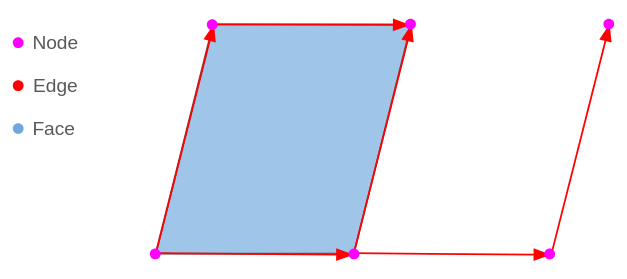
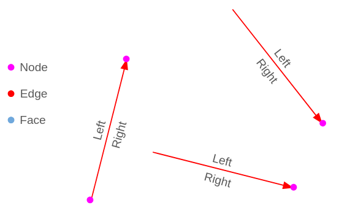
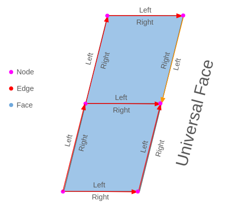
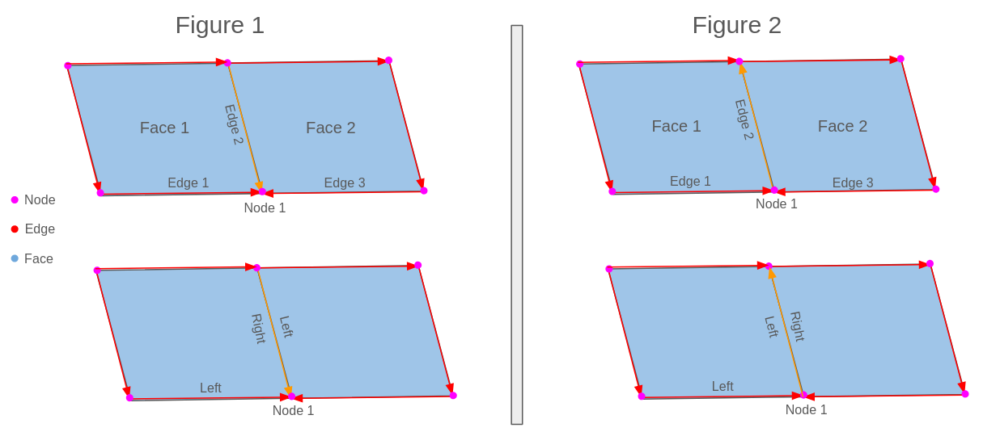

.. _topology:

Topology Logic Introduction
=========

Before read this document, at least check one of this documents:

`Introductory workshop: PostGIS Topology Workshop <https://postgis.net/workshops/en/postgis-intro/topology.html>`_.

`Manual: PostGIS Topology <https://postgis.net/docs/Topology.html>`_.

`ISO Topology: OGC-SFS Geometries <https://www.gaia-gis.it/fossil/libspatialite/wiki?name=topo-intro>`_.

In this workshop, we will check some fundamentals of topology, its basics and definitions. It is not intended to be a way to use them directly, is to understand it to then be able to use it easily.

Types
-----

The basic topology works on three basic types.

- Node: 2D point, everything starts or ends here
- Edge: A linestring with direction that start and ends on a node
- Face: Closed set of linestrings, that conforms a polygon

There are some rules for a set of nodes, edges and faces to be valid, check the ISO Topology document, has a very good summary of these conditions, a topology that follows all the rules, is a valid topology.

Is good to know, until now Postgis will save all this information internally, each type has its own unique ID, and with it we can edit and change them using the available functions, for example with ST_RemEdgeNewFace you can remove an edge and create a new face.

But there is still a missing piece, how do we say for example, a face has a specific attribute? Postgis implements several concepts to do this like Layers, TopoGeometry, TopoElement.

Edge interpretation
-------------------

To correctly represent a topology and their forms, there are some definitions that are used to construct the tables that store everything, the edge is on the more complex ones.

All the information about edges are stored on the edge_data table, in your custom topology schema, and which information do we need if the edges? basically is nodes and faces information, edge is the primitive who connects both.

The edges have left and right properties, as we see they are defined using the linestring direction, see the linestring from the start node to the end node perspective, there will always be a well defined left and right.

This helps to relate which faces are related to a specific edge:

Now we can have some perspective of directions for faces.

First we can see that from each edge perspective, each face is on the left or right.

There is an orange edge, just to show that the right and left are still from the edge direction, this edge has the opposite direction as the other, and we can see the upper face is on the right, while if we have followed the direction as all the other edges would be on the left.

The cian faces are not the only faces! you can see there is some edge sides, left and right that are not in any face, but there is one remaining face, the "Universal Face", this face cover all that does not cover the actual faces constructed by edges, so for example, on the left of the orange edge, there is the universal face.

Universal Face will always have the ID 0.

Is time to use this concept to add the last concept of the edge_data table, and is a sign of IDs.

Actually from the edge_data table, we can interpret most of it, it has the next fields:

- edge_id: Unique ID for the edge
- start_node: ID for the node who is the same as the start point of the edge
- end_node: ID for the node who is the same as the end point of the edge
- next_left_edge: Signed ID of the next left edge
- abs_next_left_edge: ID of the next left edge
- next_right_edge: Signed ID of the next right edge
- abs_next_right_edge: ID of the next right edge
- left_face: ID of the face on the left of the edge
- right_face: ID of the face on the right of the edge
- geom: Geometry of the edge

The next element concept is a little tricky, so it needs more explanation, they are intended not only to connect a edge with a particular face by the side of the edge, it is used to also represent the continuity of edges that construct a face.

This figure is almost the same, only the orange edge is in the opposite direction, let's start with the basics of this.

As we know, each edge has two sides, left and right, in each one there is a face, the first point when we ask about the next edge would explicitly ask this:

Ask about the next edge of Edge 1 by the left, is the same as the next:

Edge 1 on the Left has Face 1, if we see from the Edge 1 direction, which is the next edge that constructs the Face 1 that intersects Edge 1?

The Edge 2 is the answer, intersects Edge 1 and Face 1 is on the sides, on its right on Figure 1 and its left on the Figure 2.
While Edge 3 intersects with Edge 1, it constructs the Face 2 and the Universal Face.

You can also think of this like walking on the perimeter of the Face 1, walk on the left of the Edge 1, which is the next edge you will find? (always on the Face 1 walk).

This logic is used to look for the next edge for the face on the left and the face on the right. If you have looked at a topology edge_table before, you will notice some IDs can be negative, it has a special meaning, let's dig into it now.

It's time to look on the two figures (Figure 1 and Figure 2):

If we look at Figure 1, the next edge by the left of Edge 1 is Edge 2, on the left we are constructing Face 1, so, Face 1 is on the left or right of Edge 2? The answer is on the right, in this case the ID of this next edge will be negative, is the Edge -2.

Follow this rule for the next edge IDs, If the Face you are looking at is on the right of it, the ID will be recorded as a negative value.

In Figure 1, Face 1 is on the Right of Edge 2, so the edge ID will be -2.
In Figure 2, Face 1 is on the Left of Edge 2, so the edge ID will be 2.

While with abs_next_right_edge you can know the next Edge ID, with next_right_edge you also know which side of the edge is the face.

Just to finish the example, the values for the next edges for the figures are the next ones:

Figure 1:

- next_left_edge: -2
- abs_next_left_edge: 2
- next_right_edge: -3
- abs_next_right_edge: 3

Figure 2:

- next_left_edge: 2
- abs_next_left_edge: 2
- next_right_edge: -3
- abs_next_right_edge: 3

As a note, the next_right_edge on the Edge 1 is the Edge 3, who will look at the Universal Face.
