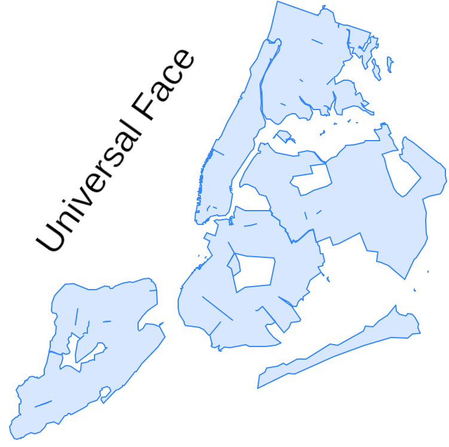
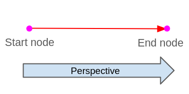
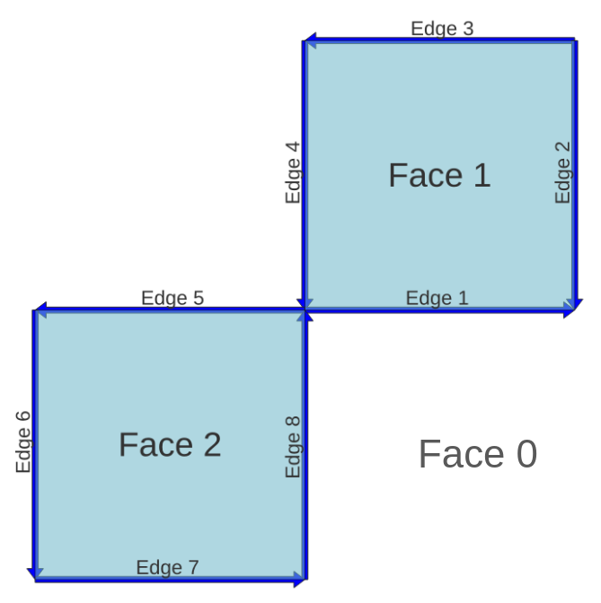
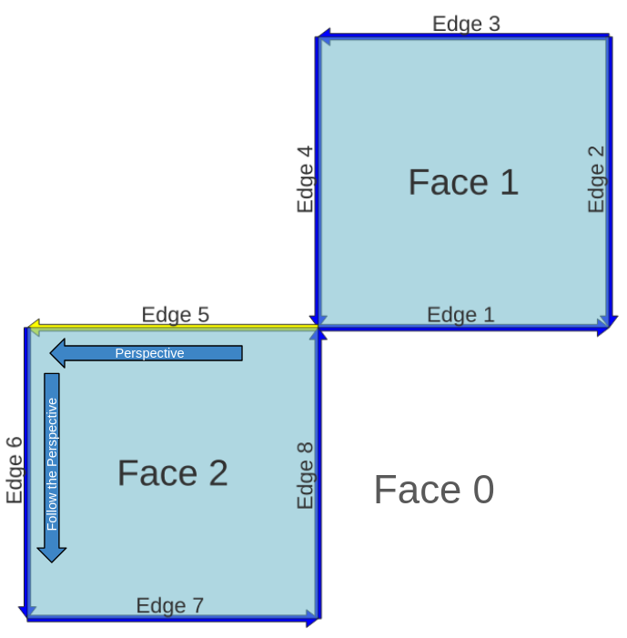
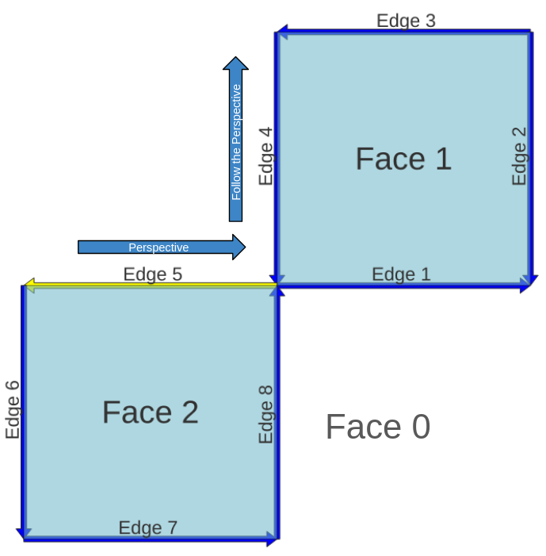
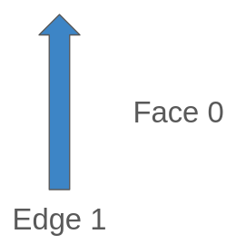
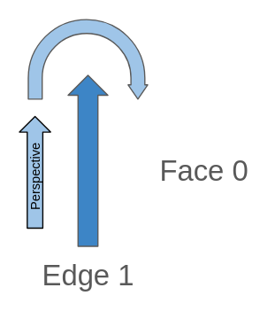
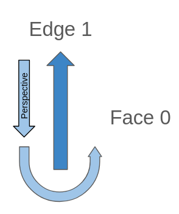

.. _topology:

Topology Basic Types
====================

Before read this document, at least check one of this documents:

`Introductory workshop: PostGIS Topology Workshop <https://postgis.net/workshops/en/postgis-intro/topology.html>`_.

`Manual: PostGIS Topology <https://postgis.net/docs/Topology.html>`_.

`ISO Topology: OGC-SFS Geometries <https://www.gaia-gis.it/fossil/libspatialite/wiki?name=topo-intro>`_.

In this workshop, we will check some fundamentals of topology, its basics and definitions. It is not intended to be a way to use them directly, is to understand it to then be able to use it easily.

Types
-----

.. image:: ./topology/basic_types.png
  :align: center

The basic topology works on three basic types.

- Node: 2D point, everything starts or ends here
- Edge: A linestring with direction that start and ends on a node
- Face: Closed set of linestrings, that conforms a polygon

There are some rules for a set of nodes, edges and faces to be valid, check the ISO Topology document, has a very good summary of these conditions, a topology that follows all the rules, is a valid topology.

Is good to know, until now Postgis will save all this information internally, each type has its own unique ID, and with it we can edit and change them using the available functions, for example with ST_RemEdgeNewFace you can remove an edge and create a new face.

But there is still a missing piece, how do we say for example, a face has a specific attribute? Postgis implements several concepts to do this like Layers, TopoGeometry, TopoElement.

Universal Face
--------------

It Might be intuitive to think that only the faces constructed by edges exist, there is one exception, all the white space out of all the faces is also a face!

The empty space is called the Universal Face, when a Topology is empty, all the space is the Universal Face, when we add a linestring is an edge of this face, then when we make a polygon it is like make a hole in the face and stealing it to assign it to a face.

This face is infinite and does not have any boundary.

   
The Universal Face has the ID 0.

Edge interpretation
-------------------

To correctly represent a topology and their forms, there are some definitions that are used to construct the tables that store everything, the edge is on the more complex ones.

All the information about edges is stored on the edge_data table, in your custom topology schema, and which information do we need in the edges? basically its nodes and faces information, edge is the primitive who connects both.

These linestrings are called Edges because they are the edges of the faces.

Edge direction, left and right
<<<<<<<<<<<<<<<<<<<<<<<<<<<<<<

Edges in topology has a right defined perspective and view, when we see them must be done in the next way:

When we want to see from the edge perspective is always from the end node to the start edge, always looking the edge forward.

.. image:: ./topology/edge_left_right.png
  :align: center

The edges have left and right properties, as we see they are defined using the edge perspective, see the linestring from the start node to the end node, there will always be a well defined left and right.

So see the edge forward and you always have a left and right side.

This helps to relate which faces are on each side of the edge:

.. image:: ./topology/face_directions.png
  :align: center

Check the edges on the image, while almost all the edges go from down to up and left to right, there is an orange edge which has the opposite direction, so its sides left and right are swapped in reference to the others, but if you look the edge forward, the right and left are right.

Continue seeing the orange edge, while on its right has a polygon built by the edges, on the left is the Universal Face.

When we want to analyze any edge, and we need to see it from the edge perspective, it is always looking the edge in forward, never in backward!

Which are all the next edges? Looking forward we go from start node to the end node, all the edges who start or end in the end node of the edge!

Edge Data
---------

The edge_data table has information related to the edge, from what we know right now we can interpret the next columns:

- edge_id: Unique ID for the edge
- start_node: ID for the node who is the same as the start point of the edge
- end_node: ID for the node who is the same as the end point of the edge
- left_face: ID of the face on the left of the edge
- right_face: ID of the face on the right of the edge
- geom: Geometry of the edge

Abs Next Edge & Next Edge
<<<<<<<<<<<<<<<<<<<<<<<<<

The table edge_data has the columns abs_next_left_edge and abs_next_right_edge, at this moment it gets a little tricky how to interpret it.

Until now we mainly see properties of the edge itself and what has on the sides, the next edge properties are different, do not ask only about the edge itself, it is about which is the next edge who builds the face on the right or left.

The logic of the right_edge and the left_edge are very similar, so we will look first on the left one deeper and then show the right one.

We will be using the next topology as example:

Left
>>>>

Let's pick as an example the Edge 5, this one has on the Left the Face 2, looking forward which is the next edge who builds the Face 2?

This is the Edge 6.

Something very important here is the perspective we follow the lines, depending on the Edge direction, is like see the Face clockwise or anticlockwise.

With this information we have abs_next_left_edge which will be 6.

The next_left_edge is almost the same as abs_next_left_edge, except it can be negative which depends on the perspective we see the edge.

If we follow the Edge perspective we will have two directions, the direction of the next edge, and the direction of the perspective on the next edge.

We will use the next sign in each case:

- Perspective direction and Next edge direction are opposed: "-"
- Perspective direction and Next edge direction are the same: None, keep the value positive

How the Perspective and Edge 6 have the same direction, next_left_edge will be 6.

- abs_next_left_edge: 6
- next_left_edge: 6

Right
>>>>>

The only difference between Left and Right analysis is the perspective, while in Left we use forward, in Right we will see backwards. Be careful, even if we look backwards the definition of Left Face and Right Face are still the same, looking forward! Only changes the perspective to follow.

The Edge 5 has the Face 0 on its Right, the Universal Face, looking Edge 5 backwards the next edge who builds Face 0 is the Edge 4.

Following the perspective of Edge 5 on Edge 4 we can see it goes up, while the Edge 4 goes down, the Perspective direction and the Edge 4 direction are opposed.

- abs_next_right_edge: 4
- nexr_right_edge: -4 (Perspective direction and Edge 4 direction are opposed)

Isolated Edge Case
>>>>>>>>>>>>>>>>>>

There is a case that may be confusing, all the rules above follow in the same way but it is good to take a look.

When we have an Edge that has no connections to other Edges, the first thing we can appreciate is that the Face of the Left is the same as the Right, in this case Face 0, the Universal Face.

If we follow the past logic, on the Left is the Face 0, which is the next edge who builds Face 0? Actually there is an Edge, and is itself, and it also has a perspective as before:

If we check the perspective direction we ends looking the same edge but in opposite direction, this means the Edge 1 and its Next Edge (Edge 1) has opposed directions.

- edge_id: 1
- abs_next_left_edge: 1
- next_left_edge: -1 (This will always be negative while we see forward a isolated edge)

For the Next Right Edge is the same, the Next Edge will be it self, the only what it changes is the perspective:

When we look backwards any isolated edge, the perspective will always have the same direction as the Edge so:

- edge_id: 1
- abs_next_right_edge: 1
- next_right_edge: -1 (This will always be positive while we see backwar a isolated edge)

Full columns of edge_data
<<<<<<<<<<<<<<<<<<<<<<<<<

We already checked all the columns of the edge_data table:

- edge_id: Unique ID for the edge.
- start_node: ID for the node which is the same as the start point of the edge.
- end_node: ID for the node which is the same as the end point of the edge.
- left_face: ID of the face on the left of the edge.
- abs_next_left_edge: Next edge who builds the face on the left.
- next_left_edge: abs_next_left_edge and negative sign if the right face is on the right of the next left edge.
- right_face: ID of the face on the right of the edge.
- abs_next_right_edge: Next edge who builds the face on the right.
- next_right_edge: abs_next_right_edge and negative sign if the left face is on the right of the next right edge.
- geom: Geometry of the edge.
