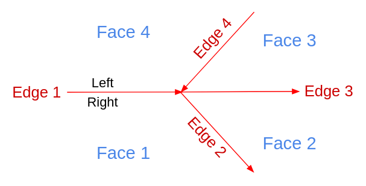

.. _topology:

Topology Basic Types
====================

Before read this document, at least check one of this documents:

`Introductory workshop: PostGIS Topology Workshop <https://postgis.net/workshops/en/postgis-intro/topology.html>`_.

`Manual: PostGIS Topology <https://postgis.net/docs/Topology.html>`_.

`ISO Topology: OGC-SFS Geometries <https://www.gaia-gis.it/fossil/libspatialite/wiki?name=topo-intro>`_.

In this workshop, we will check some fundamentals of topology, its basics and definitions. It is not intended to be a way to use them directly, is to understand it to then be able to use it easily.

Types
-----

.. image:: ./topology/basic_types.png
  :align: center

The basic topology works on three basic types.

- Node: 2D point, everything starts or ends here
- Edge: A linestring with direction that start and ends on a node
- Face: Closed set of linestrings, that conforms a polygon

There are some rules for a set of nodes, edges and faces to be valid, check the ISO Topology document, has a very good summary of these conditions, a topology that follows all the rules, is a valid topology.

Is good to know, until now Postgis will save all this information internally, each type has its own unique ID, and with it we can edit and change them using the available functions, for example with ST_RemEdgeNewFace you can remove an edge and create a new face.

But there is still a missing piece, how do we say for example, a face has a specific attribute? Postgis implements several concepts to do this like Layers, TopoGeometry, TopoElement.

Universal Face
--------------

Could be intuitive to think that only exists the faces constructed by edges, there is one exception, all the white space out of all the faces are also a face!

The empty space is called the Universal Face, when a Topology is empty, all the space is the Universal Face, when we add a linestring is an edge of this face, then when we make a polygon is like make hole in the face and steal it to assign it to a face.

This face is infinite and do not have any boundary.

.. image:: ./topology/boros_universal_face.png
  :width: 400
  :height: 400
  :align: center
   
The Universal Face has the ID 0.

Edge interpretation
-------------------

To correctly represent a topology and their forms, there are some definitions that are used to construct the tables that store everything, the edge is on the more complex ones.

All the information about edges are stored on the edge_data table, in your custom topology schema, and which information do we need in the edges? basically its nodes and faces information, edge is the primitive who connects both.

This linestrings are called Edges because are the edges of the faces.

Edge direction, left and right
<<<<<<<<<<<<<<<<<<<<<<<<<<<<<<

Edges in topology has a right defined perspective and view, when we see them must be done in the next way:

.. image:: ./topology/edge_perspective.png
  :align: center

When we want to see from the edge perspective is always from the end node to the start edge, always looking the edge forward.

.. image:: ./topology/edge_left_right.png
  :align: center

The edges have left and right properties, as we see they are defined using the edge perspective, see the linestring from the start node to the end node, there will always be a well defined left and right.

So see the edge forward and you have always a left and right side.

This helps to relate which faces are on each side of the edge:

.. image:: ./topology/face_directions.png
  :align: center

Check the edges on the image, while almost all the edges goes from down to up and left to right, there is a organge edge who has the opposite direction, so its sides left and right are swaped in reference to the others, but if you look the edge forward, the right and left are right.

Continue seeing the organge edge, while on its right has a polygon build by the edges, on the left is the Universal Face.

When we want to analyze any edge, and we need to see it from a the edge perspective, is always looking the edge in forward, never in backward!

Which are all the next edges? Looking forward we go from start node to the end node, all the edges who start or ends in the end node of the edge!

Edge Data
---------

The edge_data table has information related to the edge, from what we know right now we can interpret the next columns:

- edge_id: Unique ID for the edge
- start_node: ID for the node who is the same as the start point of the edge
- end_node: ID for the node who is the same as the end point of the edge
- left_face: ID of the face on the left of the edge
- right_face: ID of the face on the right of the edge
- geom: Geometry of the edge

Abs Next Edge
<<<<<<<<<<<<<

The table edge_data has the columns abs_next_left_edge and abs_next_right_edge, in this moment it goes little tricky how to interpret it.

Until now we are mainly see properties of the edge it self and what has on the sides, the next edge properties are different, do not ask only about the edge it self, is about which is the next edge who a face.

To explain this with an example lets see the image and find the Edge 1, on its right side has the Face 1, looking the Edge 1 forward, which is the Edge who follows to build the Face 1?

This would be the Edge 2, is the next edge who build the Face 1, this face is the abs_next_right_edge.

Get the abs_next_left_edge is similar, we just need to ask ourselves, on the left side of the Edge 1 is the Face 4, looking the Edge 1 forward, which edge who follows Edge 1 and builds the Face 4?

This would be the Edge 4.

Here the new two columns for this case:

- abs_next_right_edge: 2
- abs_next_left_edge: 4

And their interpretation:

- abs_next_right_edge: Looking the edge forward, which is the next edge who build the face on the right side?
- abs_next_left_edge: Looking the edge forward, which is the next edge who build the face on the left side?

Next Edge
<<<<<<<<<

This columns, next_right_edge and next_left_edge are very similar to the abs ones, actually it follows the same rules, we get the next edge id for the left and right faces, and when we have them we perform one extra operation.

Let follow as previously:

The Edge 1 has the Face 1 on the right, and the abs_right_edge is the Edge 2.

Edge 1 and Edge 2 are part of the Face 1.

The Face 1, is on the right or the left of Edge 2? if we see Edge 2 forward, the face is on its right, so the next_right_edge will be -2.

When we look on the next edge, if the face that is building is on the right we multiply the Edge id by -1, if not we keep the Edge id unchanged.

Right side of Edge 1
>>>>>>>>>>>>>>>>>>>>

Edge 1 has on its right side the Face 1.

The next edge who builds Face 1 is Edge 2.

Face 1 is on the right of Edge 2, so next_right_edge is -2.

If the Edge 2 would be in opposite direction, next_right_edge would be 2.

Left side of Edge 2
>>>>>>>>>>>>>>>>>>>

Edge 1 has on its left the Face 4.

The next edge who build Face 4 is Edge 4.

Face 4 is on the right of Edge 4, so next_left_edge is -4.

If the Edge 4 would be in opposite direction, next_left_edge would be 4.

Next Edge on edge_data
>>>>>>>>>>>>>>>>>>>>>>

Now we can know how to build and interpret the last two remaining columns, we already showed it several times, but want to write here as a summary:

For the Edge 1:

- next_right_edge: -2
- next_left_edge: -4

Full columns of edge_data
<<<<<<<<<<<<<<<<<<<<<<<<<

We already checked all the columns of the edge_data table:

- edge_id: Unique ID for the edge.
- start_node: ID for the node who is the same as the start point of the edge.
- end_node: ID for the node who is the same as the end point of the edge.
- left_face: ID of the face on the left of the edge.
- abs_next_left_edge: Next edge who builds the face on the left.
- next_left_edge: abs_next_left_edge and negative sign if the right face is on the right of the next left edge.
- right_face: ID of the face on the right of the edge.
- abs_next_right_edge: Next edge who build the face on the right.
- next_right_edge: abs_next_right_edge and negative sign if the left face is on the right of the next right edge.
- geom: Geometry of the edge.

