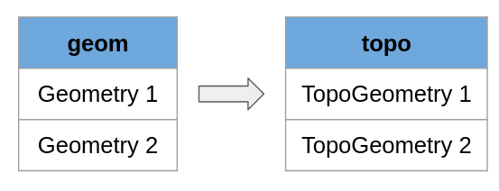
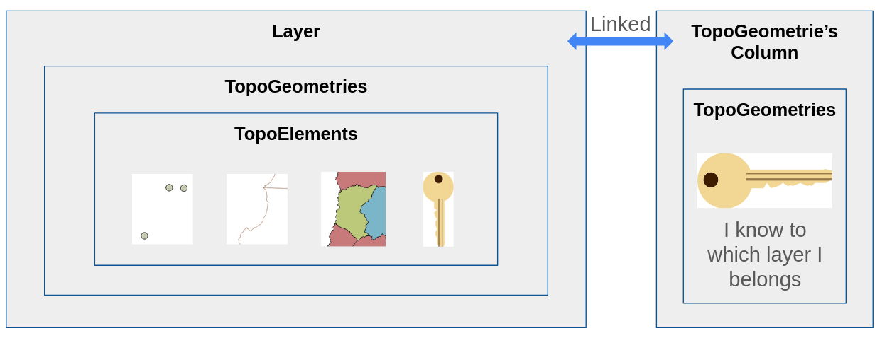
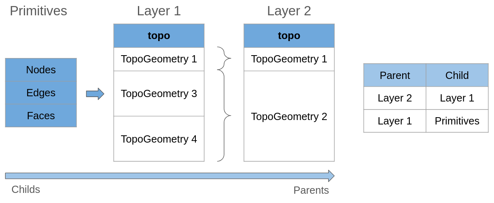
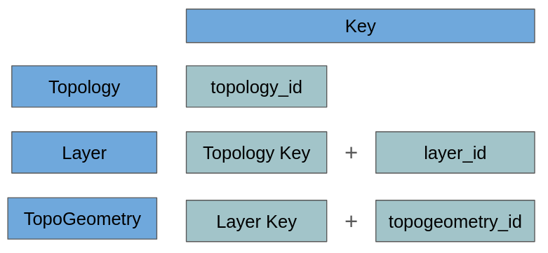
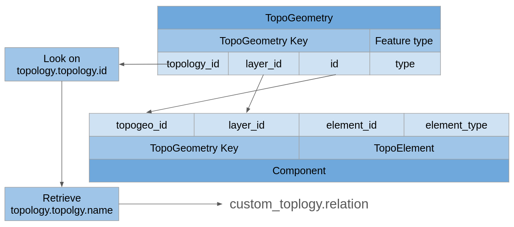
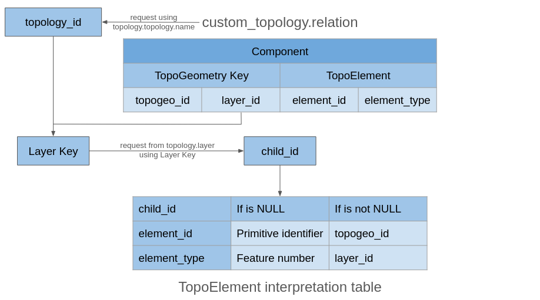

.. _topology:

Topology and Geometry Representation
====================================

Before reading this document, please review at least one of these resources:

<<<<<<< HEAD
* `Topology Basic Types <https://postgis.net/workshops/en/postgis-intro/topology_base_types.html>`_
* `Introductory workshop: PostGIS Topology Workshop <https://postgis.net/workshops/en/postgis-intro/topology.html>`_
Having a Topology with all its Primitives is useful, but to make it more practical, we need a way to represent these elements in a table. Similar to how we have spatial tables, we can have topology tables.
=======
>>>>>>> 8018d8a (improve readibility)

Introduction to geometry representation
---------------------------------------

If you have followed any example of using Topology to represent geometries you could remember this, when we populate a Topology table from a Geometry one we use TopoGeometries instead of Geometries, and in some way each TopoGeometry is able to represent one or several Primitives contained on the Topology.



The point is how we reach the actual primitives from the TopoGeometry, how the data is structured, so first lets see the most global definitions:



A TopoGeometry can represent a group of Primitives or other TopoGeometries, in order to create a TopoGeometry you need a Layer.

Layers are the biggest box, they store TopoGeometries which also stores TopoElements, this last ones represents Primitives or other TopoGeometries.


Just to write in two ways:

- Layer contains

  - TopoGeometries where each one one contains
  - TopoElements where each one can represent a

	- TopoGeometry of other Layer
	- Primitive from the Topology

  	- Nodes
  	- Edges
  	- Faces
  	- Geometry Collections

TopoGeometries are exposed as keys, they has a unique key inside the Layer, but also stores its Layer Key, this allows Postgis to store it in an arbitrary column and always be able to find its TopoElements, and with them what they represent.

You need a Layer where a TopoGeometry will be constructed, and after that you don't need to remember to which Layer it belongs.

This concept is the one used for the user, from this point we will explain deep and technical details.

As a side note, Postgis Topology has internally some tricks when its about keys, helps to optimize a lot of parts but at the same time there is a lot of reduntant information, do not be supreised if you find the same information in two or more places.

Features
--------

TopoElements can represent a TopoGeometry and a Primitive, think in a TopoGeometry, if store them in a TopoElement, they still contain other TopoElements, if we follow its path we will always ends in Primitives of the Topology.

Features will represent which type the set of geometries will be, is not important if you use TopoGeometries or Primitives, in the end a Layer can contain directly or indirectly any of this sets:

- (1) Nodes
- (2) Edges
- (3) Faces
- (4) Geometry Collections

The numbers are important, in any function which requests the Feature Type, you can specify it using the number or the name as string.

Hierarchical Layers, Childs and Parents
---------------------------------------

I would like to introduce this concept later, but to explain better and deeper the concept you will find this is needed.



The first aspect on the image is a table that is constructed using Primitives, Layer 1 will have TopoGeometries where its TopoElements only make a reference to Primitives of the topology.

We define the relationship between Layer 1 and Primitives as:

- Layer 1 is Parent of the Primitives
- Primitives are Childs of the Layer 1

The relation between Parent and Child is about the size, Childs are small, when we have a group of them we build a Parent, a bigger group.

Layer 2 has as childs the Layer 1, this implies each TopoGeometry from this layer, can make a reference to one or multiple TopoGeometries of the Layer 1.

This also means you can't pick half of a TopoGeometry from Layer 1, pick half of it means you need a reference to one of the TopoElements of a TopoGeometry, which in this case belongs to the Primitives (its Child), if you really need that then build Layer 2 using Layer 1 childs (Primitives).

Each Layer can only have one Child Layer, this means, the Child and Parent share the same Topology schema.

You will notice some aspects of Hierarchy could change to maybe support something like half TopoGeometry or mixing Layers, but right now is not implemented.

Layers
------

To store TopoGeometries we need a Layer, due to this when we create a TopoGeometrie's Column, we also create a Layer, this is why we use a special function to create a column for this.

`Crete TopoGeometry Column <https://postgis.net/docs/AddTopoGeometryColumn.html>`_

Layers and TopoGeometry Columns have a special relationship, they are linked, but they are not the same.

Layers have a lot of information that we must provide to know which type of Layer we want.

Layers have a unique identifier in each topology, this identifier is called layer_id.

- Layers Key: Composed Key with [topology_id, layer_id]
- Table route: Schema name, table name and column name to know where it is linked.
- Feature Type: Feature type the layer will contain.
- Level: This value starts at 0, in the case we construct this layer using another layer, it will add 1, so we know how many layers we are from the Primitives, if the value is 0 means the Layer is constructed using Primitives instead of TopoGeometries.
- child_id: In case the layer is built not using Primitives and using another Layer as base, we need the Layer Identifier (layer_id) of this layer, we do not need topology_id because we already know it from the parent.

Relation's Table
----------------

Finally, the section you may be looking at, how Postgis Topology goes from a TopoGeometry to what they contain.

The Relation's table function is be the bridge between the Parent and Childs.

This table can be found in: ``my_topology.relation``.

Keys and Identifiers we know now
<<<<<<<<<<<<<<<<<<<<<<<<<<<<<<<<

I'll use the word "Identifier" as a unique key in a particular context. For example each layer has a number as an identifier (layer_id), it is unique in its topology context, but is not enough to find a layer in a database.

While Identifiers will work in a context, the Key will be the full way to address an element, for example the key for any layer are two values [topology_id, layer_id].



The image is a good summary of how the keys for each are composed.

Implicit identifiers on Keys
>>>>>>>>>>>>>>>>>>>>>>>>>>>>

Postgis uses at some extent an implicit logic when working with Layers and TopoGeometries, this is because they have a context where you don't need to store the full Key to know it.

To show an example:

TopoGeometry is composed by:

- topology_id
- layer_id
- topogeometry_id

As we said before, the relation's table is stored inside the topology schema. This table will contain the relation of the TopoGeometry with the TopoElements, to make a reference in this context, do we need the topology_id?

We can skip it! While we are out of the topology schema we need the id to find it, but while we are inside it we can look at the schema name, and find its id on the table ``topology.topology``, which has all topologies ids and names.

TopoGeometry
<<<<<<<<<<<<

TopoGeometry is a composite key with the next elements:

- topology_id: topology_id of TopoGeometry Key
- layer_id: layer_id of the TopoGeometry Key
- id: topogeometry_id of the TopoGeometry Key
- type: Feature type as number

Basic Relation's table structure
<<<<<<<<<<<<<<<<<<<<<<<<<<<<<<<<

Each schema topology can have its own relation's table, it will be created when you create your first TopoGeometry, the table is stored inside the topology as ``custom_topology.relation``.

Each row of the table is called a "Component", like a component of the relations.

The component saves pairs of two things, a TopoGeometry Key and a TopoElement, remember that each TopoElement can only represent one Primitive or TopoGeometry, so for a TopoGeometry be able to represent several of them the tables stores multiple rows with the same TopoGeometry Key and different TopoElements, this way only filtering in the table we can get all the TopoElements for any TopoGeometry.

.. image:: ./topology/components.png
  :align: center
  :width: 800

Find Components of a TopoGeometry
<<<<<<<<<<<<<<<<<<<<<<<<<<<<<<<<<

To find which components belong to a TopoGeometry is a little tricky, because here will work the implicit Keys.

A component has the next elements:

- TopoGeometry Key

  - topogeom_id: topogeometry_id from TopoGeometry Key
  - layer_id: layer_id from TopoGeometry Key

- TopoElement

  - element_id
  - element_type

We can notice the TopoGeometry Key is incomplete, this is because the relation's table already belongs to a topology, so there is no need to store the topology identifier again.

To reach from a TopoGeometry to a Component we need to look the TopoGeometry.topology_id and search on ``topology.topology.id`` and retrieve the Topology Name, with it we can found the relation's table in their respective schema.



Reading TopoElements
<<<<<<<<<<<<<<<<<<<<

The last part to decompose TopoGeometry is to be able to interpret the TopoElements which is more complex than other keys, because its meaning can change based on the Layer it is saved.

As we talked, a Layer can have as Childs two options, Primitives or TopoGeometries.

The first we need to know is which Childs it is using, for this we need to look on ``topology.layer.id`` using the ``TopoGeometry Key.layer_id`` and get ```topology.layer.child_id```.

So the cases depends on child_id:

- If is NULL:

  - element_id: Primitive Identifier
  - element_type: Feature number, look on the Features to know to which primitive table too look on.

- If is not NULL:

  - element_id: topogeometry_id from a TopoGeometry Key
  - element_type: layer_id from a TopoGeometry Key

The first case is trivial, just look at their respective Primitive table and use the identifier to know which primitive is.

While the second case the TopoElement is used to build a new TopoGeometry Key, the topology_id is implicit as we talked, so the Key is complete, to find the new elements look again on the relation's table but using the new keys.


