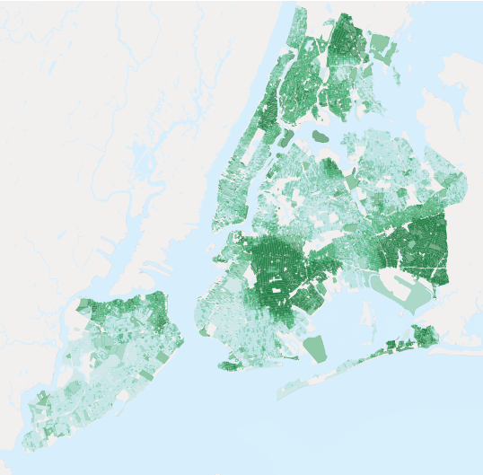
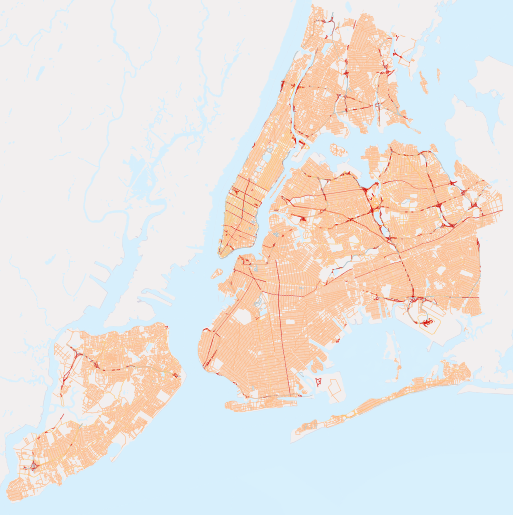
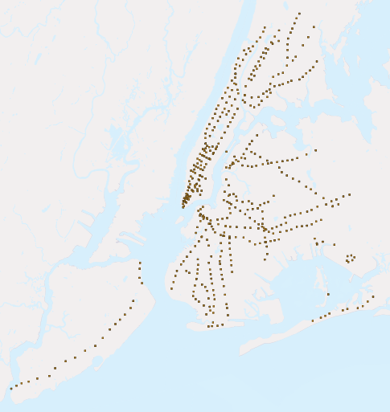

.. _about_data:

第5章: データについて
=========================

このワークショップのデータは、ニューヨーク市の4つのシェープファイルと、一つの社会統計変数の属性テーブルです。シェープファイルをPostGISのテーブルとして既にロードしてあり、社会統計データはこのワークショップの後半で追加します。

以下で、それぞれのデータセットのレコードとテーブル属性の数を説明しています。これらの属性値と関係性は将来の分析にとって基本です。

pgAdminでテーブルの性質を調べるには、ハイライトされたテーブルを右クリックし、 **Properties** を選択します。そうすれば **Columns** タブにあるテーブル属性のリストを含む、テーブルのプロパティの要約がわかります。

nyc_census_blocks
-----------------

統計ブロックは統計データが報告される最小の区域です。上位レベルの統計区域（ブロックグループ、地域、都市圏、カウンティなど）は統計ブロックの結合で作ることができます。いくつかのデモグラフィックデータをブロックの収集のために添付しています。

レコード数：36592

.. list-table::
   :widths: 20 80 

   * - **blkid**
     - すべての統計 **block** を一意に特定するための15桁のコード  例：360050001009000
   * - **popn_total**
     - その統計ブロックの合計人口
   * - **popn_white**
     - その統計ブロックの「白人」と自己認識する人口
   * - **popn_black**
     - その統計ブロックの「黒人」と自己認識する人口
   * - **popn_nativ**
     - その統計ブロックの「アメリカ原住民」と自己認識する人口
   * - **popn_asian**
     - その統計ブロックの「アジア民族」と自己認識する人口
   * - **popn_other**
     - その統計ブロックのその他の民族と自己認識する人口
   * - **hous_total**
     - その統計ブロックの世帯数
   * - **hous_own**
     - その統計ブロックの持ち家数
   * - **hous_rent**
     - その統計ブロックの借家数
   * - **boroname**
     - ニューヨークの区名（Manhattan, The Bronx, Brooklyn, Staten Island, Queens）
   * - **the_geom**
     - その統計ブロックのポリゴン境界

   
   *黒人の合計人口に占めるパーセンテージ* 

.. note:: 

    統計データをGISに入れるには、2種類の情報、すなわち実際のデータ（テキスト）と境界線のファイル（空間データ）を結合する必要があります。統計局 `American FactFinder <http://factfinder.census.gov>`_ から、データと境界線のダウンロードを含んで、データを取得する方法にはたくさんの選択肢があります。

nyc_neighborhoods
-----------------

ニューヨークにはneighborhood の名称と範囲には豊富な歴史があります。neighborhood は社会的な構成概念で、政府によって引かれた線を踏襲していません。例えば、 Carroll Gardens, Red Hook, と Cobble Hillの Brooklyn neighborhoodsは、かつて"South Brooklyn."としてまとめて知られていました。そして今は、話を聞く不動産業者によっては、 Red Hookとしてかつて知られた neighborhoodの中の同じ4つのブロックは、 Columbia Heights, Carroll Gardens West, あるいは Red Hookに属するとされることもあります！

レコード数： 129

.. list-table::
   :widths: 20 80 

   * - **name**
     - 地区の名称
   * - **boroname**
     - ニューヨークの区名（ Manhattan, The Bronx, Brooklyn, Staten Island, Queens）
   * - **the_geom**
     - 地区のポリゴン境界
   
.. figure:: ./screenshots/nyc_neighborhoods.png

    *ニューヨーク市の地区* 

nyc_streets
-----------

市の交通ネットワークからの道路中心線です。裏通り、地区の道路、フリーウェイなどの主要道路と小さな通りを区別するために種別分けされています。住むのに望ましい地域はフリーウェイの隣よりも住宅街路に面した方が良いかもしれません。

レコード数： 19091

.. list-table::
   :widths: 20 80 

   * - **name**
     - 道路（ストリート）名
   * - **oneway**
     - 道路一方通行か？ "yes" = yes, "" = no
   * - **type**
     - 道路種別  例 primary, secondary, residential, motorway
   * - **the_geom**
     - 道路中心線
   

     *ニューヨーク市の道路。主要道路は赤色です。*

   
nyc_subway_stations
-------------------

地下鉄の駅は、人々が生活する地面の上の世界とその下の目に見えない地下鉄のネットワークをつなげます。公共交通機関の玄関口として、駅の位置は、異なる人々が地下鉄に入るにはどのくらい簡単かを判断するのに役立ちます。

レコード数： 491

.. list-table::
   :widths: 20 80

   * - **name**
     - 駅名
   * - **borough**
     - ニューヨークの区名（Manhattan, The Bronx, Brooklyn, Staten Island, Queens）
   * - **routes**
     - この駅を通る地下鉄路線
   * - **transfers**
     - この駅を介して乗り換え可能な路線
   * - **express**
     - 急行列車が止まる駅  "express" = yes, "" = no
   * - **the_geom**
     - 駅の位置点

    *ニューヨーク市の地下鉄駅の位置点*

nyc_census_sociodata
--------------------

統計調査の中で集められた豊富な社会経済データがあります。しかし、統計区域の地理的に大きなレベルでのものです。統計ブロックは、統計区域（とブロックグループ）を形成するために結合します。ニューヨーク市に関する、さらに興味深い質問のいくつかに答えるために、社会経済データを統計区域レベルで収集しました。

.. note::

   ``nyc_census_sociodata`` はデータテーブルです。空間解析を行う前に、それを統計地域に結びつる必要があります。

.. list-table::
   :widths: 20 80

   * - **tractid**
     - すべての統計**tract（地域）**を一意に特定するための11桁のコード  例: 36005000100
   * - **transit_total**
     - 地域の労働者数
   * - **transit_public**
     - 公共交通機関を利用する地域の労働者数
   * - **transit_private**
     - マイカーやバイクを使う地域の労働者数
   * - **transit_other**
     - 徒歩や自転車などのその他の方法を使う地域の労働者数
   * - **transit_time_mins**
     - 地域すべての労働者による合計の通勤移動時間（分）
   * - **family_count**
     - 地域の世帯数
   * - **family_income_median**
     - 地域の世帯収入平均（ドル）
   * - **family_income_aggregate**
     - 地域すべての世帯の合計収入（ドル）
   * - **edu_total**
     - 教育歴のある人数
   * - **edu_no_highschool_dipl**
     - 高校を卒業していない人数
   * - **edu_highschool_dipl**
     - 高校を卒業しているがそれ以上の教育歴の無い人数
   * - **edu_college_dipl**
     - 大学卒でそれ以上の教育歴の無い人数
   * - **edu_graduate_dipl**
     - 大学院の学位を持つ人数

