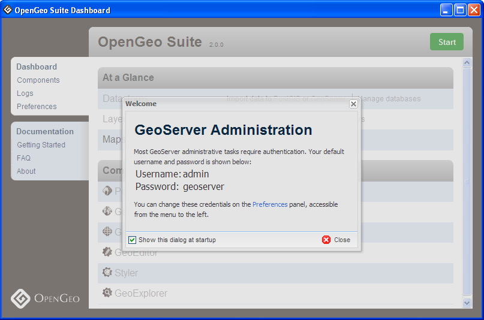

.. _creating_db:

第3章: 空間データベースの作成
======================================

DashboardとPgAdmin
-------------------------

"Dashboard"は、OpenGeoスイートのすべての部分にアクセスする主要なアプリケーションです。

最初にDashboardを起動すると、GeoServerにアクセスするためのデフォルトのパスワードに関しての画面が表示されます。

.. note::

 PostGISは、無制限のアクセス権を持つローカルユーザーでインストールされています。もし、リモートコンピュータから接続する場合は、ユーザーは、 "postgres" 、パスワードは "postgres" を指定して下さい。

ここでは、Dashboardの「PostGIS」を使用することになります。

#. 最初に、PostGISを起動する必要があります。Dashboardの右上隅の緑色の **Start** ボタンをクリックします。

#. Suiteが初めて起動したときは、データ領域を初期化して、template databasesが設定されます。これは数分かかることがあります。Suiteの起動後、pdAdminを起動するためにComponentsのPostGISに存在する **Manage** オプションをクリックすることができます。

      .. image:: ./screenshots/dashboard_02.png
  
      .. note::
  
         PostgreSQLには、多くの管理用のフロントエンドがあります。プライマリは、SQLを入力するためのコマンドラインツール `psql <http://www.postgresql.org/docs/8.1/static/app-psql.html>`_ があります。その他にも人気があるPostgreSQLのフロントエンドは、オープンソースのツールとして、 `pgAdmin <http://www.pgadmin.org/>`_ があります。

#. もし、pgAdminが初めてインストールされた場合は、pgAdminにおいて構成された **PostGIS(localhost: 54321)** のためのサーバエントリーがあります。PostGISエントリーをダブルクリックすると、データベースに接続するためにパスワードが求められますのでパスワードを入力してください。

    .. image:: ./screenshots/pgadmin_01.png

    .. note::

      お使いのコンピュータにPgAdminをインストールしている場合は、 **(localhost: 54321)** のエントリーは必要ありません。新しい接続を作成する必要があります。OpenGeoスイートのPostGISに接続するには、*File > Add Server*に移動して、 **localhost** とポート **54321** (標準ではないポート番号にしてください)で新しいサーバを登録してください。

データベースの作成
-------------------
PostgreSQLには、新しいデータベースを初期化するために使用できる **template database** の考えがあります。新しいデータベースが自動的にテンプレートからすべての情報を自動的に取得します。PostGISをインストールすると、 ``template_postgis`` を使用して空間情報が有効になるデータベースが作成されます。新しい空間データベースを作成する場合には ``template_postgis`` を使用します。

#. データベースのツリー項目を開き、利用可能なデータベースを見てください。``postgres`` データベースは、デフォルトのpostgresユーザへのユーザデータベースです。``template_postgis``は、空間データベースを作成するために使用されます。

#. ``Databases``項目を選択し、``New Database``上で右クリックしてください。

    .. image:: ./screenshots/pgadmin_01.png

    .. note::

      もし、データベース( ``template_postgis`` )が、他のユーザによってアクセスされていることを示すエラーが表示される場合は、 ``PostGIS (localhost:54321)`` 項目上で、右クリックして、 ``Disconnect`` を選択してください。再接続して、再度、同じ項目をダブルクリックしてください。

#. ``New Database`` には、以下に示すように設定して、 **OK** をクリックしてください。

   .. list-table::

      * - **Name**
        - ``nyc``
      * - **Owner**
        - ``postgres``
      * - **Encoding**
        - ``UTF8``
      * - **Template**
        - ``template_postgis``

   .. image:: ./screenshots/pgadmin_03.png

#. 新しい ``nyc`` データベースを選択してください。以下に示すようにobjectsのツリーが表示されます。Schemasの ``public`` 配下のTablesには、PostGIS固有のテーブルである ``geometry_columns`` と ``spatial_ref_sys`` が存在します。

   .. image:: ./screenshots/pgadmin_04.png

#. 以下に示したSQLボタンをクリックしてください。（または、 *Tools > Query Tool* を選択してください）

   .. image:: ./screenshots/pgadmin_05.png

#. SQLのテキストフィールドに次のSQL文を入力してください。

   .. code-block:: sql

      SELECT postgis_full_version();

   .. note::
   
      これは、最初のSQL文になります。 ``postgis_full_version()`` は、PostGISのバージョン情報とコンフィギュレーション情報を返します。
      
#.  ツールバーの **Play** ボタン、または、 **F5** を押して、クエリーを実行してください。PostGISは、データベースが適切で有効になっていることを確認して、以下の内容を表示します。

   .. image:: ./screenshots/pgadmin_06.png

PostGIS空間データベースの作成に成功しました!

関数一覧
-------------

`PostGISのフルバージョン <http://postgis.net/docs/PostGIS_Full_Version.html>`_ : レポートは、完全なPostGISのバージョン情報とコンフィギュレーション情報を報告します。
