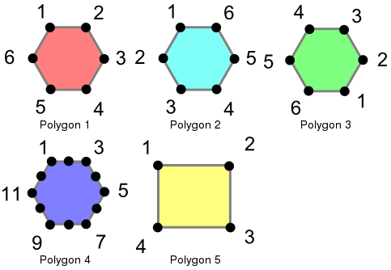
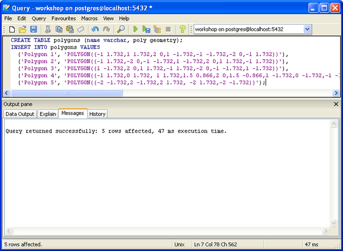
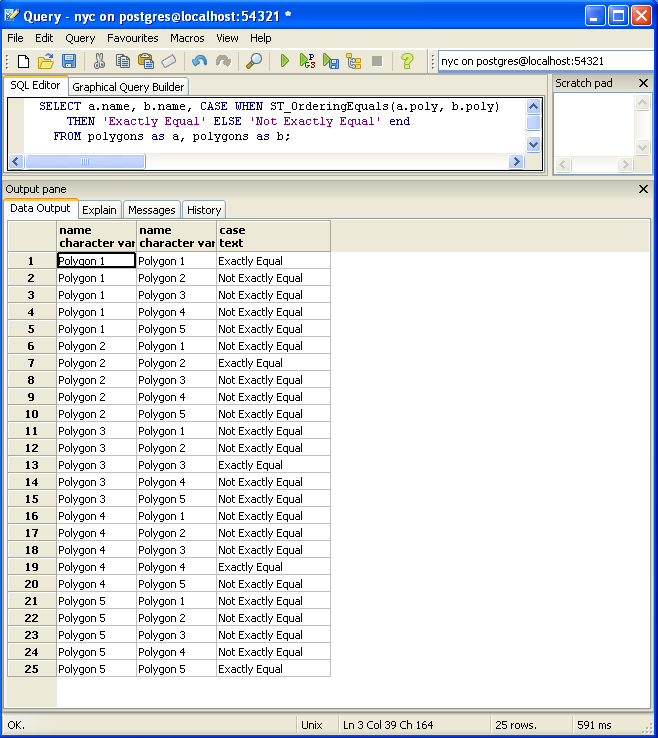
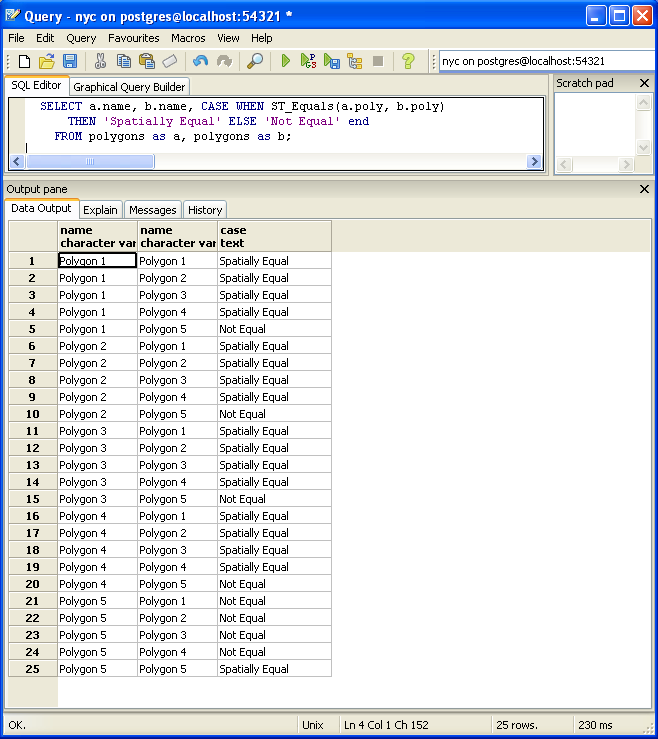
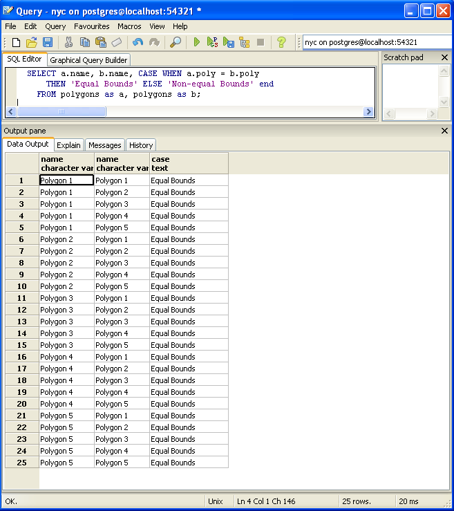

.. _equality:

第22章：等値性
=================================

等値
--------

ジオメトリを取り扱う際に等値を判別するのはややこしくなりがちです。PostGISは、透明性のためには下記の定義が用いたれますが、異なるレベルの等値を判別する目的の3種類の関数をサポートしています。これらの関数を描くためには、次のようなポリゴンを用います。

これらのポリゴンは、以下のコマンドを用いてロードされます。

.. code-block:: sql

  CREATE TABLE polygons (name varchar, poly geometry);
  
  INSERT INTO polygons VALUES 
    ('Polygon 1', 'POLYGON((-1 1.732,1 1.732,2 0,1 -1.732,
        -1 -1.732,-2 0,-1 1.732))'),
    ('Polygon 2', 'POLYGON((-1 1.732,-2 0,-1 -1.732,1 -1.732,
        2 0,1 1.732,-1 1.732))'),
    ('Polygon 3', 'POLYGON((1 -1.732,2 0,1 1.732,-1 1.732,
        -2 0,-1 -1.732,1 -1.732))'),
    ('Polygon 4', 'POLYGON((-1 1.732,0 1.732, 1 1.732,1.5 0.866,
        2 0,1.5 -0.866,1 -1.732,0 -1.732,-1 -1.732,-1.5 -0.866,
        -2 0,-1.5 0.866,-1 1.732))'),
    ('Polygon 5', 'POLYGON((-2 -1.732,2 -1.732,2 1.732, 
        -2 1.732,-2 -1.732))');
        
   SELECT Populate_Geometry_Columns();

完全等値
^^^^^^^^^^^^^

完全等値は、二つのポリゴンについて、位置が同じであることを確認するために、頂点を順に比較することで決定されます。以下の例は、この手法が有効性においてどう制限されることがあるかを示してます。

.. code-block:: sql

  SELECT a.name, b.name, CASE WHEN ST_OrderingEquals(a.poly, b.poly)
      THEN 'Exactly Equal' ELSE 'Not Exactly Equal' end
    FROM polygons as a, polygons as b;

この例では、ポリゴンはそれぞれ自身に等しいのみで、その他の外見は同等なポリゴン（Polygon 1から3の例）とは等しくありません。Polygon 1,2,3の場合、頂点は位置は同一ですが、順序が異なっています。Polygon 4はPolygon 1と同等でなくなるような、六角形の辺の上に同一線上で冗長な頂点があります。

空間等値
^^^^^^^^^^^^^^^

上で見たように、完全等値はジオメトリの空間的性質を考慮しません。ジオメトリの空間的な等値あるいは等価を試すために、`ST_Equals`と適切に名付けられた関数があります。

.. code-block:: sql

  SELECT a.name, b.name, CASE WHEN ST_Equals(a.poly, b.poly) 
      THEN 'Spatially Equal' ELSE 'Not Equal' end
    FROM polygons as a, polygons as b;

これらの結果は、等値の直感的な理解に合致しています。Polygon 1から4は同じ領域を閉じているため等値と見なされます。ポリゴンが描かれる方向、ポリゴンを定義するための始点、点の数は、ここではいずれも重要ではありません。重要なことは、ポリゴンが同じ空間を含んでいると言うことです。

等値境界
^^^^^^^^^^^^

完全等値は最悪の場合、等値を判別するためにジオメトリのすべての頂点を比較することを必要とします。これは時間がかかりますし、ジオメトリの膨大な数の比較を行うには適切でないこともあります。スピーディな比較をするためには、等値境界演算子の、`=`が用意されています。この演算子はバウンディングボックス（矩形）上のみで、ジオメトリが同じ二次元の範囲を専有している（しかし同じ空間の必要はありません）ことを確認しながら動作します。

.. code-block:: sql

  SELECT a.name, b.name, CASE WHEN a.poly = b.poly 
      THEN 'Equal Bounds' ELSE 'Non-equal Bounds' end
    FROM polygons as a, polygons as b;

ご覧のように、すべての空間的に等値なジオメトリは等値な境界を持ちます。残念ながら、Polygon 5も、この試験では等値を返します。なぜならそれは同一のバウンディングボックスをその他のジオメトリとして共有しているからです。では、これは使い物になるのでしょうか。この答えは後ほど詳しく説明しますが、手短に答えますと、この演算子によって、データの結合やフィルタリングを行う際に、膨大な比較セットを管理しやすいブロックに低減するという、空間インデックスの利用が可能となります。
