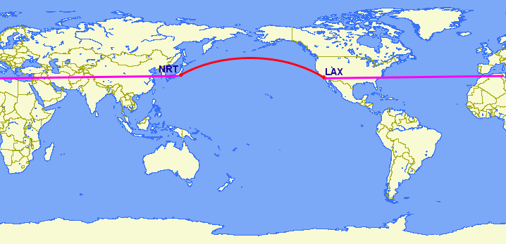

.. _geography:

第17章: ジオグラフィー型
=====================

通常座標データを扱うときは、「地理座標(geographics)」あるいは「緯度・経度」を用います。

メルカトル図法やUTM（ユニバーサル横メルカトル）図法、StatePlane（米国で利用される座標系）とは異なり、地理座標は **デカルト（直角）座標系にはなりません** 。地理座標は平面上にプロットしたある点からの直線距離を表しません。さらに言うと、 **球座標系** が、赤道から両極までの角距離を表します。球座標系では点は中心からの距離（半径）とあらかじめ決めた子午線面からの回転角、極軸（中心から北極までのベクトルに相似）からの角度で決まります。

.. image:: ./geography/cartesian_spherical.jpg

地理座標をおおよその直角座標系とみなして空間的演算を行うこともできますが、距離・長さや面積の測定には意味のないものとなります。球座標系は **角の** 距離を測定するため、その単位は「度」となります。さらに、インデックスを用いたおおよその結果や交差・包含などの真偽のチェックはひどく間違った結果が返ってくることもあります。点と点の距離は地球の両極や日付変更線に近いエリアになるほど、その問題が大きくなってきます。

たとえば、ロサンゼルスとパリの座標は以下のとおりです。

 * Los Angeles: ``POINT(-118.4079 33.9434)``
 * Paris: ``POINT(2.3490 48.8533)``
 
下の例は、ロサンゼルスとパリの間の距離を、標準的なPostGISの直角座標系上の距離を算出する :command:`ST_Distance(geometry, geometry) `を用いて計算します。 なお、SRID4326は地理座標系の空間参照情報です。

.. code-block:: sql

  SELECT ST_Distance(
    ST_GeometryFromText('POINT(-118.4079 33.9434)', 4326), -- Los Angeles (LAX)
    ST_GeometryFromText('POINT(2.5559 49.0083)', 4326)     -- Paris (CDG)
    );

::

  121.898285970107
  
なるほど、121ですか！でも、その数字に何の意味が？

空間参照4326の単位は「度」です。よって、上の答えは121度です。でも（もう一度）、その数字に何の意味があるのでしょうか？

球面上では、1「平方度」の大きさは、赤道から離れるほど小さくなるように、その値は場所によって大きく変化します。地球上の経線（縦線）の互いの距離は極に近づくほど近くなっていきますよね。ですから、121度の距離は何も*意味しない*のです。ナンセンスな数字です。

意味のある数字を持った距離を計算するためには、地理座標を擬似的な直角座標系として扱うのではなくて、真の球座標系として扱わなければなりません。2点間の距離は真の球面上での経路（大圏の一部）で測定しなければなりません

バージョン1.5から、PostGISは ``geography`` 型によりこの機能を提供します。

.. note::

  空間データベースによっては、「地理座標を扱う」アプローチが異なります。
  
  * OracleはSRIDが地理座標系である場合自動的に地理的演算を行い、その差異をカバーしようとします。
  * SQL Serverは2つの空間型、すなわち直角座標系に対しては"STGeometry"、地理座標系に対しては"STGeographiy"を使用します。
  * Informix SpatialはInformixに対しては純粋に直角座標系の拡張ですが、Informix Geodeticは純粋に地理座標系への拡張です。
  * SQL Serverと同様、PostGISは"geometry"と"geography"の2つの型を使用します。
  
``geometry`` 型の代わりに ``geography`` 型を使って、もう一度ロサンゼルスからパリまでの距離を測定しましょう。 :command:`ST_GeometryFromtext(text)` の代わりに、 :command:`ST_GeographyFromText(text)` を使います。

.. code-block:: sql

  SELECT ST_Distance(
    ST_GeographyFromText('POINT(-118.4079 33.9434)'), -- Los Angeles (LAX)
    ST_GeographyFromText('POINT(2.5559 49.0083)')     -- Paris (CDG)
    );

::

  9124665.26917268

大きな数字ですね！ geography型による計算の返り値はメートル単位となります。よって、この答えは9124kmです。

以前のバージョンのPostGISは非常に基本的な球面上の演算を、 :command:`ST_Distance_Spheroid(point, point, measurement)` 関数によってサポートしていました。しかし、 :command:`ST_Distance_Spheroid` は、かなりの制約があります。この関数は点情報のみのサポートであり、極や日付変更線をまたいでの演算に対してサポートしていません。

点ではないジオメトリーをサポートする必要性は、特にこのような疑問が持ち上がったときに明確になります。「ロサンゼルスからパリまでのフライトルートは、アイスランドからどれほど近いのだろうか」

.. image:: ./geography/lax_cdg.jpg

直角座標平面上での地理座標で計算すると（紫色の線）、勿論*非常に*間違った答えになってしまいます。大圏ルート（赤色の線）を使うと、正しい答えが得られます。 ``geography`` を使ってLAX-CDGルートをラインストリングに変換して、アイスランドのある点からそのルートまでの距離を計算すれば、正しい答え（もう一度言いますが）が、メートル単位で得られるのです。

.. code-block:: sql

  SELECT ST_Distance(
    ST_GeographyFromText('LINESTRING(-118.4079 33.9434, 2.5559 49.0083)'), -- LAX-CDG
    ST_GeographyFromText('POINT(-21.8628 64.1286)')                        -- アイスランド  
  );

::

  531773.757079116
  
上記のように、アイスランドからLAX-CDGフライトルートへの最も近い距離はおよそ532kmです。
  
地理座標をハンドリングする際に直角座標的アプローチを行うと、日付変更線をまたぐような図形に対しては完全に破綻します。ロサンゼルスから東京までの最短の大圏ルートは太平洋を横断します。一方、最短の直交座標上のルートは、大西洋とインド洋を通過します。

.. code-block:: sql

   SELECT ST_Distance(
     ST_GeometryFromText('Point(-118.4079 33.9434)'),  -- LAX
     ST_GeometryFromText('Point(139.733 35.567)'))     -- NRT (東京/成田)
       AS geometry_distance, 
   ST_Distance(
     ST_GeographyFromText('Point(-118.4079 33.9434)'), -- LAX
     ST_GeographyFromText('Point(139.733 35.567)'))    -- NRT (東京/成田) 
       AS geography_distance; 
    
::

   geometry_distance | geography_distance 
  -------------------+--------------------
    258.146005837336 |   8833954.76996256

geography型の利用
---------------

geometry型のデータをgeographyテーブルにロードするためには、ジオメトリーはまずEPSG:4326（経度/緯度）に変換され、さらにgeography型に変換される必要があります。 :command:`ST_Transform(geometry,srid)` 関数がジオメトリーの座標を変換し、 :command:`Geography(geometry)` 関数は、geometry型からgeography型に「キャスト」します。

.. code-block:: sql

  CREATE TABLE nyc_subway_stations_geog AS
  SELECT 
    Geography(ST_Transform(the_geom,4326)) AS geog, 
    name, 
    routes
  FROM nyc_subway_stations;
   
geographyテーブルに空間インデックスを作成する方法は、geometry型と全く同じです。

.. code-block:: sql

  CREATE INDEX nyc_subway_stations_geog_gix 
  ON nyc_subway_stations_geog USING GIST (geog);

両者の差は表立っては見えないのですが、geography型のインデックスは正確に両極や日付変更線をカバーするクエリーを扱える一方で、geometry型は扱えません。

geography型に対応するネイティブな関数はほんの少しだけですが、以下の通りです。
 
 * :command:`ST_AsText(geography)` returns ``text``
 * :command:`ST_GeographyFromText(text)` returns ``geography``
 * :command:`ST_AsBinary(geography)` returns ``bytea``
 * :command:`ST_GeogFromWKB(bytea)` returns ``geography``
 * :command:`ST_AsSVG(geography)` returns ``text``
 * :command:`ST_AsGML(geography)` returns ``text``
 * :command:`ST_AsKML(geography)` returns ``text``
 * :command:`ST_AsGeoJson(geography)` returns ``text``
 * :command:`ST_Distance(geography, geography)` returns ``double``
 * :command:`ST_DWithin(geography, geography, float8)` returns ``boolean``
 * :command:`ST_Area(geography)` returns ``double``
 * :command:`ST_Length(geography)` returns ``double``
 * :command:`ST_Covers(geography, geography)` returns ``boolean``
 * :command:`ST_CoveredBy(geography, geography)` returns ``boolean``
 * :command:`ST_Intersects(geography, geography)` returns ``boolean``
 * :command:`ST_Buffer(geography, float8)` returns ``geography`` [#Casting_note]_
 * :command:`ST_Intersection(geography, geography)` returns ``geography`` [#Casting_note]_
 
geographyテーブルの作成
--------------------------
 
新たにgeography型のカラムを作成するSQLは、geometryテーブルを作成する場合と非常によく似ています。しかし、geography型はテーブルを作成する際に直接ジオメトリーの図形タイプを決めることができます。たとえば、

.. code-block:: sql

  CREATE TABLE airports (
    code VARCHAR(3),
    geog GEOGRAPHY(Point)
  );
  
  INSERT INTO airports VALUES ('LAX', 'POINT(-118.4079 33.9434)');
  INSERT INTO airports VALUES ('CDG', 'POINT(2.5559 49.0083)');
  INSERT INTO airports VALUES ('REK', 'POINT(-21.8628 64.1286)');
  
上記のテーブル定義では、 ``GEOGRAPHY(Point)`` で、空港データをポイントとして定義しています。新しいgeography型のフィールドは、 ``geometry_columns`` テーブルに登録されません。その代わり、このようなフィールドは ``geography_columns`` と呼ばれる新しいビューに格納されます。このビューは、 :command:`AddGeom...` のような関数を使うことなく自動的にアップデートされます。

.. code-block:: sql

  SELECT * FROM geography_columns;
  
::

           f_table_name         | f_geography_column | srid |   type   
 -------------------------------+--------------------+------+----------
  nyc_subway_stations_geography | geog               |    0 | Geometry
  airports                      | geog               | 4326 | Point
  
.. note::

  ``CREATE`` 文内での図形タイプの特定やSRIDの指定、 ``geometry_columns`` メタデータ情報の自動的なアップデートは、 ``geography`` 型でプロトタイプとして使われている機能であり、 ``geometry`` 型に対してはPostGIS2.0での対応を予定しています。
  

geometry型へのキャスト
-------------------

geography型の基本的な関数が多くのユースケースに対応できる一方で、geometry型しかサポートしていない、ほかの関数へのアクセスが必要なケースも出てくることも何度かあると思います。幸い、オブジェクトについてはgeography型とgeometry型の間の相互変換ができます。

PostgreSQLのキャストを行う際の作法は、 ``::typename`` をキャストしたい値の後ろにアペンドすることです。したがって、 ``2::text`` は、数字の2から文字列の'2'に変換します。また、 ``'POINT(0 0)'::geometry`` は、ポイントのテキスト表現から、ジオメトリーとしての点に変換します。

:command:`ST_X(point)` 関数は、geometry型のみサポートします。では、geography型の場合は、どのようにすればX座標を読み取れるでしょうか？

.. code-block:: sql

  SELECT code, ST_X(geog::geometry) AS longitude FROM airports;

::

  code | longitude 
 ------+-----------
  LAX  | -118.4079 
  CDG  |    2.5559
  REK  |  -21.8628

geography型の値に ``::geometry`` をアペンドすることで、オブジェクトをSRID4326の空間参照系を持つジオメトリーに変換できます。このことから、自分たちの好きなままにジオメトリー関数を使うことができます。しかし、このときオブジェクトはgeometry型であり、座標系は球座標系ではなく直角座標系に変換されることに気をつけてください。
 
geographyを使う理由、使わない理由
-----------------------

地理座標は、普遍的に座標として受け入れられるものです - 誰しも、緯度・経度が何を意味するのかは理解していますが、UTM座標が何を意味するのかについては、ほとんどの人が知りません。ですので、常にgeography型を使ったらどうでしょう。

 * 第一に、既に書いたように、直接的にgeography型をサポートする関数は（今のところ）非常に少ないです。geography型のもつ制約に対処するのに、多くの時間が割かれる場合もあるでしょう。
 * 第二に、球面上の計算は直角座標上での計算よりはるかに計算コストが高いものです。たとえば、直角座標系での距離の計算公式（ピタゴラス）はsqrt()1つを呼ぶだけです。球面上での距離を求める公式（半正矢）はsqrt()を2度、arctan()を1度、sin()を4度、さらに2つのcos()を呼びます。三角関数は計算コストが高いのですが、球面上での計算はそのほとんどを含んでいます。
 
結論？

もし持っているデータが地理的にコンパクト（州、郡、市の範囲内にあるようなデータ）ならば、 ``geometry`` 型を直角座標系上で使えば、そのデータは意味のあるものになります。http://spatialreference.orgサイトをご覧になり、あなたの地域をタイプし利用可能な地理参照情報を検索してください。

一方で、もし地理的に離れ離れになっている（世界のほとんどをカバーするような）データセットで、距離を測定する必要があるときは、 ``geography`` 型を使いましょう。 ``geography`` を使ってアプリケーションの複雑さから救われることは、他のどんなパフォーマンス上の問題を相殺します。さらに、 ``geometry`` 型にキャストすることで、ほとんどの関数的な制約も相殺します。

関数一覧
-------------

`ST_Distance(geometry, geometry) <http://postgis.net/docs/ST_Distance.html>`_: ジオメトリー型に対しては、2次元の直角座標系（空間参照情報による）での2つのジオメトリー間の最小距離を、その座標系での単位で返します。geography型は、デフォルトでは2つのジオメトリー間の球面上での最小距離をメートル単位で返します。

`ST_GeographyFromText(text) <http://postgis.net/docs/ST_GeographyFromText.html>`_: Well-Known Text(WKT)で記述された図形情報、または拡張されたWKTテキストから、geography型の値を返します。

`ST_Transform(geometry, srid) <http://postgis.net/docs/ST_Transform.html>`_: 数値型のパラメータで指定されたSRID参照情報で座標が変換されたジオメトリーを返します。

`ST_X(point) <http://postgis.net/docs/ST_X.html>`_: ポイントのX座標を返します。利用できない場合はNULLを返します。入力値はポイントでなければなりません。

.. rubric:: Footnotes

.. [#Casting_note] バッファと交差に関する関数は、実際はまずgeometry型にキャストされるラッパー関数であり、球座標系でネイティブに実行されるものではありません。その結果、非常に大きすぎて綺麗に平面上に変換できないような図形に対しては、正しい値を返さない場合もあります。

   たとえば、 :command:`ST_Buffer(geography,distance)` 関数は、geography型の図形を「最適」な座標系に変換し、その後地理座標に変換し直します。もし「最適」な座標系が見つからない場合は（図形が大きすぎて）、この操作は失敗し、おかしな形のバッファを返すことがあります。

