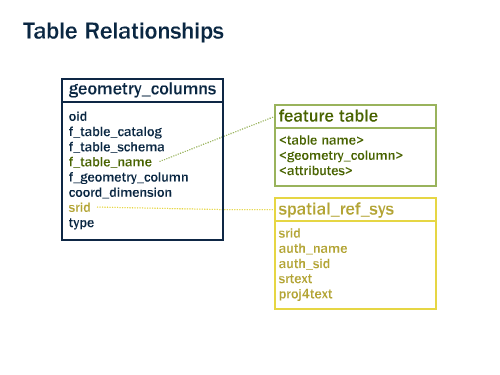
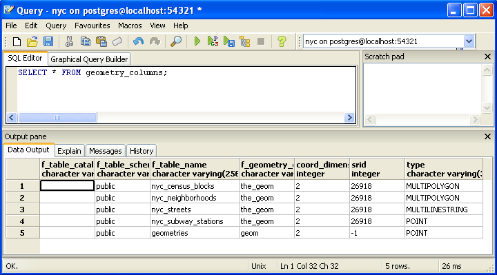
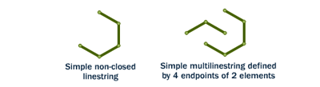
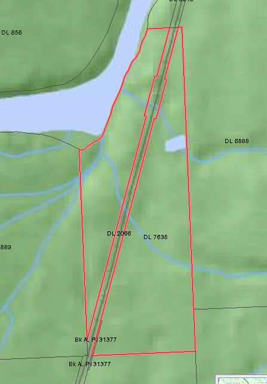
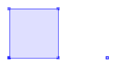
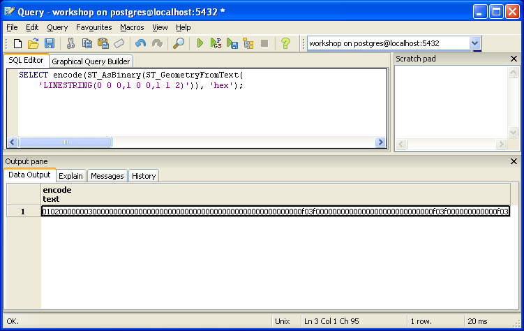
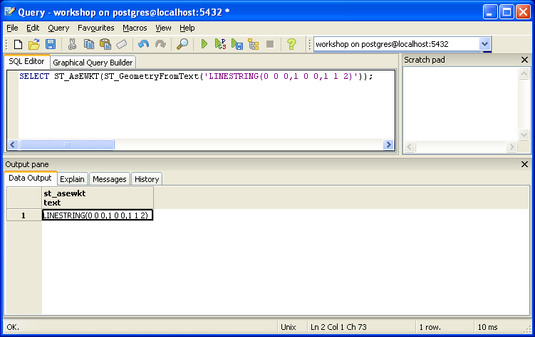
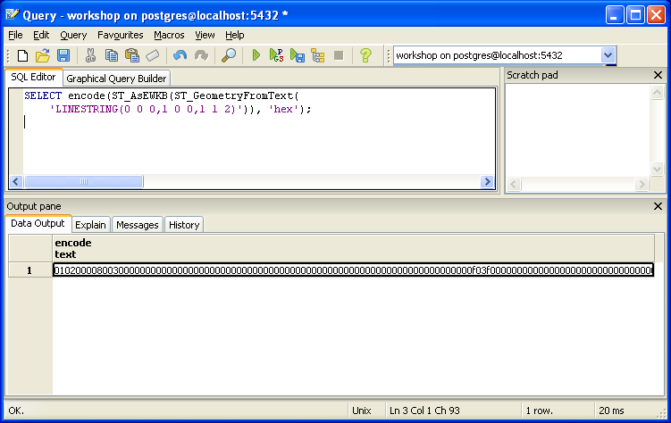

.. _geometries:

第8章: ジオメトリ
=====================

序論
------------

:ref:`第4章 <loading_data>` では、さまざまなデータをロードしました。このデータを使ってみる前に、簡単な例をみてみましょう。pgAdminで、もう一度 **nyc** データベースを選択して、SQLクエリツールを開いてください。下記のSQL文をpgAdminのSQLエディタウィンドウに張り付け（デフォルトで表示されいるテキストは全て消してしまってから）、実行してください。

.. code-block:: sql

  CREATE TABLE geometries (name varchar, geom geometry);
  
  INSERT INTO geometries VALUES 
    ('Point', 'POINT(0 0)'),
    ('Linestring', 'LINESTRING(0 0, 1 1, 2 1, 2 2)'),
    ('Polygon', 'POLYGON((0 0, 1 0, 1 1, 0 1, 0 0))'),
    ('PolygonWithHole', 'POLYGON((0 0, 10 0, 10 10, 0 10, 0 0),(1 1, 1 2, 2 2, 2 1, 1 1))'),
    ('Collection', 'GEOMETRYCOLLECTION(POINT(2 0),POLYGON((0 0, 1 0, 1 1, 0 1, 0 0)))');
    
  SELECT Populate_Geometry_Columns();
  
  SELECT name, ST_AsText(geom) FROM geometries;

.. image:: ./geometries/start01.png

上記のSQLにより、 テーブル (**geometries**) CREATE (作成)し、5つのジオメトリ: ポイント、ライン、ポリゴン、ドーナツポリゴン、コレクション を INSERT（挿入）されます。すると、挿入したデータが SELECT（選択）されて出力ペインに表示されます。

メタデータテーブル
---------------

Simple Features for SQL (:term:`SFSQL`) 仕様に基づいて、PostGISは、データベース中のジオメトリの型を追跡、報告できる2つのテーブルを用意しています。

* １つ目のテーブルは、 ``spatial_ref_sys`` であり、データベース中で利用できるすべての空間参照情報を定義しています。詳しくは後ほど説明します。
* ２つ目のテーブルは、 ``geometry_columns`` であり、すべての "フィーチャ" (地理的属性を持つオブジェクトとして定義される)とこれらの基本的詳細を提供します。

導入部分の例の中で、 :command:`Populate_Geometry_Columns()` 関数は、ジオメトリを含んだデータベース中の全てのフィールドを検索し、参照情報を ``geometry_columns`` テーブルに含めるようアップデートを行います。

では、データベース中にできあがった ``geometry_columns`` を見てみることにしましょう。下記のコマンドをクエリーツールを先ほど同様に張り付けてください。

.. code-block:: sql

  SELECT * FROM geometry_columns;

* ``f_table_catalog`` 、 ``f_table_schema`` 、 ``f_table_name`` は、与えられたジオメトリを含む、有効なフィーチャテーブル名を提供します。PostgreSQLではカタログを利用しないので、 ``f_table_catalog`` は空であることが多いです。
* ``f_geometry_column`` は、フィールド（複数のジオメトリフィールドを持つフィーチャテーブルを扱うためのものであり、それぞれ1レコードづつとなる）を含むジオメトリのフィールド名です。
* ``coord_dimension`` および ``srid`` は、それぞれ、ジオメトリの次数(2次、3次、4次)を定義、および、 ``spatial_ref_sys`` テーブルを参照する空間参照系の定義をするものです。
* ``type`` フィールドは、以下に表わすジオメトリの型を定義するフィールドであり、これまでにPointとLinestringを例として見てきました。

このテーブルに対して問い合わせを行うことで、GISクライアントおよびライブラリはデータの検索を行う際にどのように行えばよいかが分かり、また、各ジオメトリについていちいち精査を行わなくても加工や表示を行うことができます。

現実世界のオブジェクトの表現
-------------------------------

PostGISの開発基準の元々の指標となっていたSimple Features for SQL (:term:`SFSQL`)の仕様は、現実に存在しているオブジェクトをどのように表現するかを定義付けました。途切れなのない形状を決まった解像度でデジタイジングすることにより、オブジェクトをまずまずの質で表現することはできます。SFSQLは、2次元の表現しかできません。PostGISは、3次元あるいは4次元の表現ができるように拡張され、また、極最近では、SQL-Multimedia Part 3 (:term:`SQL/MM`) 仕様で、公式にその表現が定義されました。

ワークショップ中の例で用いるテーブルは、異なるジオメトリ型が混在しています。ジオメトリのメタデータを読み込む関数を用いて、各オブジェクトの一般情報を得ることができます。
Our example table contains a mixture of different geometry types. We can collect general information about each object using functions that read the geometry metadata.

 * :command:`ST_GeometryType(geometry)` ジオメトリ型を返します。
 * :command:`ST_NDims(geometry)` 次数を返します。
 * :command:`ST_SRID(geometry)` ジオメトリの空間参照系のコード定義（SRID）を返します。

.. code-block:: sql

  SELECT name, ST_GeometryType(geom), ST_NDims(geom), ST_SRID(geom)
    FROM geometries;

::

       name       |    st_geometrytype    | st_ndims | st_srid 
 -----------------+-----------------------+----------+---------
  Point           | ST_Point              |        2 |      -1
  Polygon         | ST_Polygon            |        2 |      -1
  PolygonWithHole | ST_Polygon            |        2 |      -1
  Collection      | ST_GeometryCollection |        2 |      -1
  Linestring      | ST_LineString         |        2 |      -1

ポイント
~~~~~~

 **ポイント** は、地球上のある一点を表現するものです。このポイントは、単一の座標（2次元、3次元、4次元を含む）で表わされます。ポイントは、目的の縮尺においては形状や大きさといったものの正確な値が重要ではない場合に使われます。例えば、とある州の地図においては、各市がポリゴンとして表わされている一方で、世界地図の上では、このような市はポイントとして表現されるでしょう。

.. code-block:: sql

  SELECT ST_AsText(geom) 
    FROM geometries
    WHERE name = 'Point';

::

  POINT(0 0)

ポイントを扱う関数としては以下のようなものがあります。

 * :command:`ST_X(geometry)` X座標を返します。
 * :command:`ST_Y(geometry)` Y座標を返します。

従って、あるポイントから座標を得るには以下のようにします。

.. code-block:: sql

  SELECT ST_X(geom), ST_Y(geom)
    FROM geometries
    WHERE name = 'Point';

ニューヨーク市の地下鉄駅 (``nyc_subway_stations``) のテーブルは、ポイントとして格納されています。以下のSQL文は一つのポイントに紐づくジオメトリを(:command:`ST_AsText` として)返します。

.. code-block:: sql

  SELECT name, ST_AsText(the_geom)
    FROM nyc_subway_stations
    LIMIT 1;

ラインストリング
~~~~~~~~~~~

**ラインストリング** は、ある地点からある地点までを結ぶものです。2点もしくはそれ以上の点を一定の順序で並べたものとなります。道路や川はラインストリングとして表わされる典型です。もし、最初と最後が同じ点であるならば、**閉じた** ラインストリングということができます。それ自身が交差したり接触していないならば、**単純な**ラインストリングということができます。ラインストリングは、**閉じた** ものもあり、 **単純な** ものの両方があります。

ニューヨークの道路網 (``nyc_streets``) を先ほどロードしました。このデータは名称や種別といった詳細を含んでいます。現実の世界での道は、一本の道であっても、異なる属性を持つ道路の線分をそれぞれ表わす、多くのラインストリングで構成されていることでしょう。

下記のSQL文は一つのラインストリングに紐づくジオメトリを(:command:`ST_AsText` として)返します。

.. code-block:: sql

  SELECT ST_AsText(geom) 
    FROM geometries
    WHERE name = 'Linestring';
  
::

  LINESTRING(0 0, 1 1, 2 1, 2 2)

ラインストリングを扱う特殊な空間関数をいくつか紹介します。

 * :command:`ST_Length(geometry)` ラインストリングの長さを返します。
 * :command:`ST_StartPoint(geometry)` 始点をポイントとして返します。
 * :command:`ST_EndPoint(geometry)` 終点をポイントとして返します。
 * :command:`ST_NPoints(geometry)` ラインストリングの座標の数を返します。

というわけで、ラインストリングの長さは、

.. code-block:: sql

  SELECT ST_Length(geom) 
    FROM geometries
    WHERE name = 'Linestring';

::

  3.41421356237309

となります。

ポリゴン
~~~~~~~~

.. image:: ./introduction/polygons.png
  :align: center

ポリゴンは面積をもった範囲を表現するものです。ポリゴン外周は一つのリング（環）で表わされます。このリングは先ほどの説明のように、閉じている、かつ、単純なラインストリングです。ポリゴン内の穴（これがあるポリゴンをドーナツポリゴンと言います）も、リングで表現することができます。

ポリゴンは、その大きさと形状を詳細に表わす必要がある場合に用います。市区町村界、公園、建物の外郭、水域などはすべて、表示縮尺が適当であれば、一般にポリゴンで表わされます。道路や河川もポリゴンとして表示する場合があります。

下記のSQL文は一つのラインストリングに紐づくジオメトリを(:command:`ST_AsText` として)返却します。

.. code-block:: sql

  SELECT ST_AsText(geom) 
    FROM geometries
    WHERE name LIKE 'Polygon%';

.. note::

  ``WHERE`` 句において ``=`` よりは ``LIKE`` を用いてマッチング演算を行うことが多いです。 ``*`` をワイルドカードとして用いてパターンマッチングを行うことがあるかと思いますが、SQLでは、 ``LIKE`` とともに ``%`` を使用します。

::

 POLYGON((0 0, 1 0, 1 1, 0 1, 0 0))
 POLYGON((0 0, 10 0, 10 10, 0 10, 0 0),(1 1, 1 2, 2 2, 2 1, 1 1))

１つ目のポリゴンは１つのリングからなります。２つ目のものは内部に"穴空き"があります。グラフィックシステムの多くは"ポリゴン"の概念を持っていますが、GISシステムは明確に穴空きを持つことが許されるという点が他とは違っています。

.. image:: ./screenshots/polygons.png

ポリゴンを扱う空間関数をいくつかあげます。

 * :command:`ST_Area(geometry)` ポリゴンの面積を返します。
 * :command:`ST_NRings(geometry)` いくつリングを含んでいるかを返します。（たいていは1ですが、それ以上の場合は穴空きがあることを意味します。）
 * :command:`ST_ExteriorRing(geometry)` 外郭をラインストリングとして返します。
 * :command:`ST_InteriorRingN(geometry,n)` 内部のポリゴン（＝穴空き部分）の外郭をラインストリングとして返します。
 * :command:`ST_Perimeter(geometry)` すべてのリングの長さを返します。

面積算出関数を用いて、ポリゴンの面積を算出することができます。

.. code-block:: sql

  SELECT name, ST_Area(geom) 
    FROM geometries
    WHERE name LIKE 'Polygon%';

::

  Polygon            1
  PolygonWithHole    99

穴が空いているポリゴンの場合は、外側のポリゴンの面積から穴空き部分の面積を引いたものとなります。

コレクション
~~~~~~~~~~~

単純なジオメトリを集合体にグループ化する、4つのコレクション型があります。

 * **MultiPoint**, ポイントのコレクションです。
 * **MultiLineString**, ラインストリングのコレクションです。
 * **MultiPolygon**, ポリゴンのコレクションです。
 * **GeometryCollection**, 異なる種類のジオメトリ（そのほかのコレクションも含みます）で構成されるコレクションです。

コレクションは、また違う観点での考え方をするものであり、一般的な描画ソフトウェアよりは、GISソフトウェアでよく用いられます。実世界の地物を空間オブジェクトとしてダイレクトにモデリングする際に有用です。たとえば、道路で分断された区画をどのようにモデリングしますか？ **マルチポリゴン** であれば、道路の両サイドを1つのオブジェクト単位で扱うことができます。

以下のコレクション例はポリゴンとポイントを含んでいます:

.. code-block:: sql

  SELECT name, ST_AsText(geom) 
    FROM geometries
    WHERE name = 'Collection';

::

  GEOMETRYCOLLECTION(POINT(2 0),POLYGON((0 0, 1 0, 1 1, 0 1, 0 0)))

いくつかの特定の空間関数はコレクションに対して動作します:

 * :command:`ST_NumGeometries(geometry)` コレクションが持つジオメトリの数を返します。
 * :command:`ST_GeometryN(geometry,n)` 指定した部分を返します。
 * :command:`ST_Area(geometry)` すべての多角形部分の合計面積を返します。
 * :command:`ST_Length(geometry)` すべての線形部分の全長を返します。

ジオメトリの入出力
-------------------------

データベース内では、ジオメトリはPostGISプログラムによってのみ利用される形式でディスクに格納されています。外部プログラムが有用なジオメトリを登録・抽出するためには、他のアプリケーションで扱える形式に変換する必要があります。ありがたいことに、PostGISは多くのフォーマットでジオメトリを扱うことができます。

 * Well-known text (:term:`WKT`)
 
   * :command:`ST_GeomFromText(text)` ``geometry``型を返します。
   * :command:`ST_AsText(geometry)` ``text``型を返します。
   * :command:`ST_AsEWKT(geometry)` ``text``型を返します。
   
 * Well-known binary (:term:`WKB`)
 
   * :command:`ST_GeomFromWKB(bytea)` ``geometry``型を返します。
   * :command:`ST_AsBinary(geometry)` ``bytea``型を返します。
   * :command:`ST_AsEWKB(geometry)` ``bytea``型を返します。
   
 * Geographic Mark-up Language (:term:`GML`)
 
   * :command:`ST_GeomFromGML(text)` ``geometry``型を返します。
   * :command:`ST_AsGML(geometry)` ``text``型を返します。
   
 * Keyhole Mark-up Language (:term:`KML`)
 
   * :command:`ST_GeomFromKML(text)` ``geometry``型を返します。
   * :command:`ST_AsKML(geometry)` ``text``型を返します。
   
 * :term:`GeoJSON`
 
   * :command:`ST_AsGeoJSON(geometry)` ``text``型を返します。
   
 * Scalable Vector Graphics (:term:`SVG`)
 
   * :command:`ST_AsSVG(geometry)` ``text``型を返します。

次に示すSQLクエリーは:term:`WKB`表現の例です（印刷のためバイナリー出力をASCII形式に変換するためには、 :command:`encode()`を呼びだします。）

.. code-block:: sql

  SELECT encode(
    ST_AsBinary(ST_GeometryFromText('LINESTRING(0 0 0,1 0 0,1 1 2)')), 
    'hex');

このワークショップでは、混乱をさけるために引き続きWKTを使います。しかし、たとえばGISアプリケーションでのデータ閲覧、WEBサービスへのデータ送信、リモートでのデータ処理などといった実際の作業では、通常、WKBフォーマットを用います。

WKTとWKBは :term:`SFSQL` で定義されておりますので、3次元または4次元のジオメトリは扱いません。そのためPostGISではWell Known Textの拡張形（EWKT）とWell Known Binaryの拡張形（EWKB）フォーマットが定義されています。これらのフォーマットは、WKTやWKBと同様の形でありながら、3次元以上のデータを表現することができます。

以下に、WKTで表現する3Dラインストリングの例を示します。

.. code-block:: sql

  SELECT ST_AsEWKT(ST_GeometryFromText('LINESTRING(0 0 0,1 0 0,1 1 2)'));

.. code-block:: sql

  SELECT encode(ST_AsEWKB(ST_GeometryFromText(
      'LINESTRING(0 0 0,1 0 0,1 1 2)')), 'hex');

PostGISは多様な形式（WKT、WKB、GML、KML、JSON、SVG）を出力するのみならず、4つの形式（WKT、WKT、GML、KML）の消費者でもあります。多くのアプリケーションはWKTまたはWKBの生成関数を利用しますが、他もまた動作します。以下に、GMLからJSONを出力する例を挙げます:

.. code-block:: sql

  SELECT ST_AsGeoJSON(ST_GeomFromGML('<gml:Point><gml:coordinates>1,1</gml:coordinates></gml:Point>'));

.. image:: ./geometries/represent-07.png

関数リスト
-------------

`Populate_Geometry_Columns <http://postgis.net/docs/Populate_Geometry_Columns.html>`_: ジオメトリカラムが適切な空間的制約を持ち、geometry_columnsテーブルに存在していることを確実にします。

`ST_Area <http://postgis.net/docs/ST_Area.html>`_: ポリゴンまたはマルチポリゴンの場合、面積を返します。"ジオメトリ"型の場合はSRIDの単位で、"ジオグラフィー"型の場合は平方メートル単位で返します。

`ST_AsText <http://postgis.net/docs/ST_AsText.html>`_: SRIDメタデータをつけずに、ジオメトリ/ジオグラフィーのWKT表現を返します。

`ST_AsBinary <http://postgis.net/docs/ST_AsBinary.html>`_: SRIDメタデータをつけずに、ジオメトリ/ジオグラフィーのWKB表現を返します。

`ST_EndPoint <http://postgis.net/docs/ST_EndPoint.html>`_: ラインストリングジオメトリの最後の点をポイントで返します。

`ST_AsEWKB <http://postgis.net/docs/ST_AsEWKB.html>`_: SRIDメタデータがついたジオメトリのWKB表現を返します。

`ST_AsEWKT <http://postgis.net/docs/ST_AsEWKT.html>`_: SRIDメタデータがついたジオメトリのWKT表現を返します。

`ST_AsGeoJSON <http://postgis.net/docs/ST_AsGeoJSON.html>`_: ジオメトリをGeoJSON要素で返します。

`ST_AsGML <http://postgis.net/docs/ST_AsGML.html>`_: ジオメトリを、バージョン2または3のGMLとして返します。

`ST_AsKML <http://postgis.net/docs/ST_AsKML.html>`_: KML要素としてジオメトリを返します。いくつかの形式がありますが、デフォルトはversion=2、precision=15です。

`ST_AsSVG <http://postgis.net/docs/ST_AsSVG.html>`_: 与えられたジオメトリまたはジオグラフィーオブジェクトの、SVGパスデータを返します。

`ST_ExteriorRing <http://postgis.net/docs/ST_ExteriorRing.html>`_: ポリゴンジオメトリの外側の輪をラインストリングで返します。ジオメトリがポリゴンではない場合はNULLを返します。マルチポリゴンの場合は動作しません。

`ST_GeometryN <http://postgis.net/docs/ST_GeometryN.html>`_: ジオメトリがジオメトリコレクション、マルチポイント、マルチラインストリング、マルチカーブまたはマルチポリゴンの場合、1始まりでN番目のジオメトリを返します。それ以外の場合はNULLを返します。

`ST_GeomFromGML <http://postgis.net/docs/ST_GeomFromGML.html>`_: ジオメトリのGML表現を入力値とし、PostGISのジオメトリオブジェクトを出力します。

`ST_GeomFromKML <http://postgis.net/docs/ST_GeomFromKML.html>`_: ジオメトリのKML表現を入力値とし、PostGISのジオメトリオブジェクトを出力します。

`ST_GeomFromText <http://postgis.net/docs/ST_GeomFromText.html>`_: WKT表現から、指定したST_Geometryを返します。

`ST_GeomFromWKB <http://postgis.net/docs/ST_GeomFromWKB.html>`_: WKBジオメトリ表現とオプションで与えられるSRIDから、ジオメトリのインスタンスを生成します。

`ST_GeometryType <http://postgis.net/docs/ST_GeometryType.html>`_: ST_Geometryのジオメトリ型を返します。

`ST_InteriorRingN <http://postgis.net/docs/ST_InteriorRingN.html>`_: ポリゴンのN番目の内側の輪を返します。ジオメトリがポリゴンでない場合や、Nが範囲外の場合はNULLを返します。

`ST_Length <http://postgis.net/docs/ST_Length.html>`_: ジオメトリがラインストリングまたはマルチラインストリングの場合に、2次元の長さを返します。単位は、ジオメトリは空間参照系の単位、ジオグラフィーの場合はメートルです（デフォルトの回転楕円体）

`ST_NDims <http://postgis.net/docs/ST_NDims.html>`_: ジオメトリの座標次元をsmall int型で返します。2、3、4のいずれかの値になります。

`ST_NPoints <http://postgis.net/docs/ST_NPoints.html>`_: ジオメトリに含まれるポイント（頂点）の数を返します。

`ST_NRings <http://postgis.net/docs/ST_NRings.html>`_: ジオメトリがポリゴンまたはマルチポリゴンの場合リングの数を返します。

`ST_NumGeometries <http://postgis.net/docs/ST_NumGeometries.html>`_: ジオメトリがジオメトリコレクション（またはマルチ*）の場合に、ジオメトリの数を返します。それ以外の場合はNULLを返します。

`ST_Perimeter <http://postgis.net/docs/ST_Perimeter.html>`_: ST_SurfaceまたはST_MultiSurfaceで得られた値（ポリゴン、マルチポリゴン）の境界線の長さを返します。

`ST_SRID <http://postgis.net/docs/ST_SRID.html>`_: spatial_ref_sysテーブルで定義されている、ST_GeometryのSRIDを返します。

`ST_StartPoint <http://postgis.net/docs/ST_StartPoint.html>`_: ラインストリングの最初の点をポイントで返します。

`ST_X <http://postgis.net/docs/ST_X.html>`_: ポイントのX座標を返しますが、利用不能の場合はNULLを返します。ポイントの入力が必須です。

`ST_Y <http://postgis.net/docs/ST_Y.html>`_: ポイントのY座標を返しますが、利用不能の場合はNULLを返します。ポイントの入力が必須です。 

