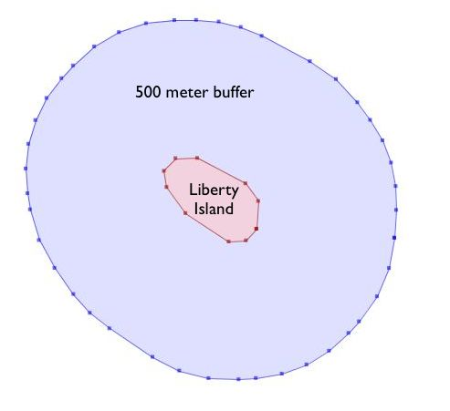
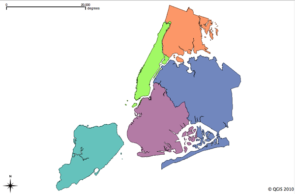

.. _geometry_returning:

第18章：ジオメトリ構築関数
===========================================

今まで見てきたすべての関数は、ジオメトリを「ありのまま」返します。

* オブジェクトの分析 (:command:`ST_Length(geometry)`, :command:`ST_Area(geometry)`)
* オブジェクトの直列化 (:command:`ST_AsText(geometry)`, :command:`ST_AsGML(geometry)`)
* オブジェクトの断片化 (:command:`ST_RingN(geometry,n)`)
* 真偽の試行 (:command:`ST_Contains(geometry,geometry)`, :command:`ST_Intersects(geometry,geometry)`)

「ジオメトリ構築関数」は入力値としてジオメトリを扱い、出力は新規シェープとなります。

ST_Centroid / ST_PointOnSurface
-------------------------------

空間的な処理を行うクエリを作成する際に共通して必要とされることは、ポリゴンのフィーチャをポイントで表現されたフィーチャに置き換えることです。これは、空間結合（ポリゴン／ポリゴン間の結合で説明）において、とても有用です。 :command:`ST_Intersects(geometry,geometry)` を二つのポリゴンレイヤに対して適用すると、重複して数えられてしまうことが多いためで、境界線上にあるポリゴンはその両者にインターセクトされます。ポイントに置き換えておくことで、両側ではなくてどちらか一方に入ります。

 * :command:`ST_Centroid(geometry)` は入力引数のほぼ重心の位置にあるポイントを返します。この処理はとても速いですが、思わぬところにポイントが落ちることがあります。返されたポイントが必ずしもフィーチャの内側にはないことがあるからです。入力のフィーチャが凸状（C字状の形を想像してください）であると、返される重心はこのフィーチャの内側にはならない場合があります。

 * :command:`ST_PointOnSurface(geometry)` は入力引数の内側であることが保証されたポイントを返します。これは、重心の演算よりもより多くの計算コストが必要です。

.. image:: ./geometry_returning/centroid.jpg

ST_Buffer
---------

バッファ演算はGISでの作業においては一般的で、PostGISにおいても利用できます。 :command:`ST_Buffer(geometry,distance)` は、ジオメトリとバッファ距離を指定して、入力ジオメトリからバッファ距離分離れた位置に境界をもつポリゴンを出力します。

.. image:: ./geometry_returning/st_buffer.png

たとえば、米国公園管理局がリバティ島の周囲に船舶交通の領域を指定しようとする際に、島の周囲に500メートルのバッファポリゴンを発生させることを想定します。リバティ島は ``nyc_census_blocks`` テーブルにあり、ひとつの調査区の範囲内に収まっていますので、該当箇所を簡単に抽出してバッファを発生させることができます。

.. code-block:: sql

  -- Make a new table with a Liberty Island 500m buffer zone
  CREATE TABLE libery_island_zone AS
  SELECT ST_Buffer(the_geom,500) AS the_geom 
  FROM nyc_census_blocks 
  WHERE blkid = '360610001009000';

  -- Update the geometry_columns table
  SELECT Populate_Geometry_Columns(); 
  

:command:`ST_Buffer` 関数は負の数で指定された距離を扱うことができ、入力したポリゴンに内包されるポリゴンを作ることができます。ラインやポイントに対しては、単に空のデータが返されます。

.. image:: ./geometry_returning/liberty_negative.jpg

ST_Intersection
---------------

別の古くから使われているGIS演算、すなわち「被せる（オーバーレイ）」は、二つの重なり合うポリゴン同士でインターセクトの計算を行い、新たなカバレッジを生成します。出力されるポリゴンをマージすることでいずれかの親ポリゴンのプロパティを保持することができます。

:command:`ST_Intersection(geometry A, geometry B)` 関数はお互いに共通している空間的な範囲（または線・点）を返します。引数に共通する位置がない場合は、この関数は空のジオメトリを返します。

.. code-block:: sql

  -- What is the area these two circles have in common?
  -- Using ST_Buffer to make the circles!
  
  SELECT ST_AsText(ST_Intersection(
    ST_Buffer('POINT(0 0)', 2),
    ST_Buffer('POINT(3 0)', 2)
  ));

.. image:: ./geometry_returning/intersection.jpg

ST_Union
--------

既出の例では、ジオメトリをインターセクトし、入力した両者の境界線を持つジオメトリを新規で作成しました。 :command:`ST_Union` は反対の処理をします。入力したジオメトリから共通する境界線を削除します。 :command:`ST_Union` 関数には書式が2種類あります。

 * :command:`ST_Union(geometry, geometry)`: 2つジオメトリを指定する2引数型では、マージして一つにする処理結果が返されます。たとえば、前のセクションで既出の二つの円の例では、和集合をとり、交点を置き換えると以下のようになります。

   .. code-block:: sql

     -- What is the total area these two circles cover?
     -- Using ST_Buffer to make the circles!
 
     SELECT ST_AsText(ST_Union(
       ST_Buffer('POINT(0 0)', 2),
       ST_Buffer('POINT(3 0)', 2)
     ));
  
   .. image:: ./geometry_returning/union.jpg

 * :command:`ST_Union([geometry])`: ジオメトリの組をまとめて表す集積型では、ジオメトリ全体をマージしたものが返されます。この書式でのST_Unionにおいて、「 ``GROUP BY`` 」SQL宣言が使用すると、元のジオメトリを小さなセットに分けてマージさせることができます。負荷の大きい処理も対応できます。

集積型で表現した :command:`ST_Union` の例では、 ``nyc_census_blocks`` テーブルについて考慮しておく必要があります。調査の地理情報は、より大きな範囲の地理情報を小さな範囲の地理情報から作成できるように、緻密に構築されています。そのため、調査経路図をそれぞれの調査区からマージすることで作成することができます（後ほど「調査経路テーブルの作成」で行います）。そして、調査区で分割された州の範囲をマージすることで、州界の位置図を作成することができます。
マージを実行できるのは、ユニークキー「 ``blkid`` 」により上位レベルのジオグラフィに関する情報が埋め込まれているからです。すでに例に使用したリバティ島のキーの一部を示します。

::

  360610001009000 = 36 061 00100 9000
  
  36     = State of New York
  061    = New York County (Manhattan)
  000100 = Census Tract
  9      = Census Block Group
  000    = Census Block

「 ``blkid`` 」の最初の5桁（すべて同じ値）を使用することで、すべてのジオメトリをマージして州界の位置図を作成することができます。

.. code-block:: sql

  -- Create a nyc_census_counties table by merging census blocks
  CREATE TABLE nyc_census_counties AS
  SELECT 
    ST_Union(the_geom) AS the_geom, 
    SubStr(blkid,1,5) AS countyid
  FROM nyc_census_blocks
  GROUP BY countyid;
  
  -- Update the geometry_columns table
  SELECT Populate_Geometry_Columns();
  

表示範囲内の確認作業（エリアテスト）を行うことで、和集合（ユニオン）演算によりいずれのジオメトリも失われていないことが確認されます。まずはじめに、各調査区を個別に演算します。次に、調査州idでグループ化して合計値をとります。

.. code-block:: sql

  SELECT SubStr(blkid,1,5) AS countyid, Sum(ST_Area(the_geom)) AS area
  FROM nyc_census_blocks 
  GROUP BY countyid;

::

  countyid |       area       
 ----------+------------------
  36005    | 109807439.720947
  36047    | 184906575.839355
  36061    | 58973521.6225586
  36081    | 283764734.207275
  36085    | 149806077.958252

その上で、「county」テーブルから新たに作成されたそれぞれの州ポリゴンの面積を計算します。

.. code-block:: sql

  SELECT countyid, ST_Area(the_geom) AS area
  FROM nyc_census_counties;

::

  countyid |       area       
 ----------+------------------
  36005    | 109807439.720947
  36047    | 184906575.839355
  36061    | 58973521.6225586
  36081    | 283764734.207275
  36085    | 149806077.958252

同じ値を得ることができました！調査区からニューヨーク市の州テーブルを構築することに成功しました。

関数一覧
-------------

`ST_AsText(text) <http://postgis.net/docs/ST_AsText.html>`_: ジオメトリまたはジオグラフィをWell-Known Text (WKT)表記で返します。SRIDメタデータは表示されません。

`ST_Buffer(geometry, distance) <http://postgis.net/docs/ST_Buffer.html>`_: ジオメトリに対しては、ジオメトリからの距離が指定された距離と同じか短い範囲で構成されているジオメトリを返します。ジオメトリは、指定されたジオメトリの空間参照系で計算されます。ジオグラフィーに対しては、平面に変換されます。

`ST_Intersection(geometry A, geometry B) <http://postgis.net/docs/ST_Intersection.html>`_: geomAとgeomBに共通している部分のジオメトリを返します。ジオグラフィーは、ジオメトリにいったん変換されてから、WGS84に変換し戻されます。

`ST_Union() <http://postgis.net/docs/ST_Union.html>`_: ジオメトリのユニオン演算された後のポイントを示すジオメトリが返されます。

`substring(string [from int] [for int]) <http://www.postgresql.org/docs/8.1/static/functions-string.html>`_: PostgreSQLの文字列に対する関数で、文字列の一部が一致するかを判定するSQLの標準的な表記実行可能です。

`sum(expression) <http://www.postgresql.org/docs/8.2/static/functions-aggregate.html#FUNCTIONS-AGGREGATE-TABLE>`_: PostgreSQLの集合関数で、レコードセットの合計値を返します。
