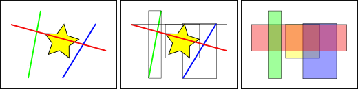
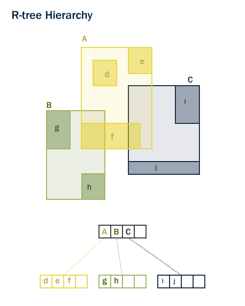

.. _indexing:

第14章：空間インデックスの付与
============================

空間インデックスが空間データベースの３つの特徴のひとつであることは説明しました。インデックスによって大きなデータセットの取り扱いが可能となります。インデックスなしでは、どんな検索処理においても必ずすべてのレコードに対して、線形検索が必要となります。
インデックスは、目的のデータまですばやくたどりつくことができる検索木として再整理することで、検索を高速化します。

空間インデックスの仕組みはPostGISのすばらしい技術のひとつです。既出の例では、空間結合において、テーブル全体を互いに比較することが必要でした。この方法はとてもコストがかかります。１万レコードある２つのテーブルを結合するには、インデックスなしでは、１億の比較演算が必要です。インデックスがあれば、２万程度の比較演算に抑えられることが期待できます。

「nyc_census_blocks」テーブルを読み込むと「pgShapeLoader」が自動的に「 ``nyc_census_blocks_the_geom_gist`` 」という空間インデックスを作成します。
処理能力の上で、インデックスがいかに重要かを示すために、「 ``nyc_census_blocks`` 」を空間インデックス **なし** で検索してみましょう。

はじめにインデックスを削除します。

.. code-block:: sql

  DROP INDEX nyc_census_blocks_the_geom_gist;
  
.. note::

「 ``DROP INDEX`` 」コマンドは、データベースから存在しているインデックスを取り除くことができます。詳細は、 `PostgreSQLの解説 <http://www.postgresql.org/docs/7.4/interactive/sql-dropindex.html>`_ を参照してください。

処理時間をみるために、pgAdminのクエリウィンドウの右下に注目して下記を実行してください。このクエリは、各国勢調査細分区を検索して、ブロード通りの入り口を特定するものです。

.. code-block:: sql

  SELECT blocks.blkid
  FROM nyc_census_blocks blocks
  JOIN nyc_subway_stations subways
  ON ST_Contains(blocks.the_geom, subways.the_geom)
  WHERE subways.name = 'Broad St';
  
::

       blkid      
 -----------------
  360610007003006

「 ``nyc_census_blocks`` 」テーブルはレコード数は少ない（数千レコード程度）ですので、インデックス無しであっても **55ミリ秒** ですみました。次に空間インデックスを追加して元に戻し、同じクエリを実行してみましょう。

.. code-block:: sql

  CREATE INDEX nyc_census_blocks_the_geom_gist ON nyc_census_blocks USING GIST (the_geom);

.. note::「 ``USING GIST`` 」節は、PostgreSQLにインデックスを構築するときに汎用検索木（GIST）を使用することを指定します。インデックス構築時に「 ``ERROR: index row requires 11340 bytes, maximum size is 8191`` 」のようなエラーが帰ってきた場合は、「USING GIST」節が無視されて実行されているかもしれません。
筆者の環境では、 **9ミリ秒** でした。テーブルが大きくなればなるほど、インデックスによる高速化の効果は大きくなるでしょう。

空間インデックスのしくみ
------------------------

標準的なデータベースのインデックスにおいては、列の値が階層木を構築することでインデックス化されています。このしくみでは、ジオメトリをもつ地物そのものをインデックス化することができないので、空間インデックスは、これとは多少異なります。すなわち、地物の最大範囲仕切られた矩形（以下バウンディングボックス）を利用します。

上図では、黄色の星と交わるのは、複数の線分があるうちの **ひとつ** 、赤線だけです。しかし、この線形のバウンディングボックスが交わるのは、 **ふたつ** 、赤と青の矩形です。

「黄色の星と交わるのは、どの線か？」という問いにデータベースが効率的に反応できるようにするためには、インデックス（高速に動作する）を使用して、「どの矩形が黄色の矩形と交わるか」という問いにまず反応し、その次に「黄色の星と交わるのは、どの線か？」を計算するのは、はじめの問いの答えに対してのみ行うようにします。

テーブルが大きくなると、おおよそのインデックスで評価した後に、正確な計算を行う、この２段構えのしくみによって、クエリの回答を引き出すのに必要な計算を大幅に少なくすることができます。

PostGISにおいてもOracle Spatialにおいても、同じ「R木」[#RTree]_ と呼ばれる空間インデックスの構造を持っています。R木はデータを矩形に分け、それをさらに細かく分けた矩形、さらに細かく…と分けていきます。様々な空間的な密度や地物の大きさをもつデータに対して、自動的にインデックス構造を調整する仕組みを持っています。

インデックスのみのクエリ
------------------

PostGISで一般的に使用される関数（ :command:`ST_Contains`, :command:`ST_Intersects`, :command:`ST_DWithin` 等）は、自動的にフィルタ選択されたインデックスを通して処理されます。しかし、一部の関数（たとえば、 :command:`ST_Relate` ）は、フィルタ選択されたインデックスを通して処理されません。
インデックスを使用して（フィルタリング処理なし）、バウンディングボックスによる検索を行うには、「 :command:`&&` 」演算子を使用します。ジオメトリに対して「 :command:`&&` 」演算子を使用すると、バウンディングボックスが重なるか接するものという意味になり、ちょうど数値に対する「 :command:`=` 」演算子が値が同じであるものという意味と同等になります。

「ウェスト村」の人口に対して、インデックスのみのクエリとより厳密なクエリを比較してみましょう。「 :command:`&&` 」を使用すると、クエリは下記のようになります。

.. code-block:: sql

  SELECT Sum(popn_total) 
  FROM nyc_neighborhoods neighborhoods
  JOIN nyc_census_blocks blocks
  ON neighborhoods.the_geom && blocks.the_geom
  WHERE neighborhoods.name = 'West Village';
  
::

  50325

より厳密に :command:`ST_Intersects` 関数を使用して、同じ処理を行いましょう。

.. code-block:: sql

  SELECT Sum(popn_total) 
  FROM nyc_neighborhoods neighborhoods
  JOIN nyc_census_blocks blocks
  ON ST_Intersects(neighborhoods.the_geom, blocks.the_geom)
  WHERE neighborhoods.name = 'West Village';
  
::

  27141

先ほどよりも小さな答えが返ってきました。はじめのクエリでは、「neighborhood」のバウンディングボックスと交わるところをすべて足し合わせています。2番目のクエリは、「neighborhood」自体と交わるところのみを足しています。

分析する
---------

PostgreSQLクエリプランナーは、クエリを評価して、インデックスを使用するか否かを賢く使い分けます。逆に言えば、インデックスによる検索が常に高速だとは言い切れません。検索処理によって、テーブルの各レコードに戻ることを想定すると、各レコードの値を取得するために、インデックスの木を辿ることは、テーブル全体を頭から1行ずつ読み込んで行くことよりも動作は遅くなります。

どのような状況下で使用されるか（テーブルのほんの一部分をよむか、テーブルの多くの箇所を読み込むか）を判断するため、PostgreSQLは、各インデックステーブルの列にデータの配列状況を統計情報として保持しています。初期状態では、PostgreSQLは通常の方法で統計情報を取得します。しかしながら、短期間のうちにテーブルの内容を大きく書き換えた場合は、この統計情報は、最新状態を反映したものではなくなります。
テーブルの内容と統計情報とがあっていることを確認するために、大量のデータの読み込み、または削除をテーブルに対して行ったあと、「``ANALYZE``」コマンドを実行するのがよいでしょう。これによりインデックス列すべてから統計情報を集めてくることができます。
「``ANALYZE``」コマンドにより、PostgreSQLにテーブルをたどり、そのないぶにある統計情報を更新することができます。この統計情報はクエリ計画の見積もりに使用されます。（クエリ計画については後述）

.. code-block:: sql

   ANALYZE nyc_census_blocks;

空き領域の解放
---------

PostgreSQLをより効率的に使用するために単にインデックスを構築するだけでは不十分かもしれません。新しいインデックスが作成されたときや、大量のUPDATE文、INSERT文、DELETE文がテーブルに対して実行されたあとに、任意の時点で、「``VACUUM``」を実行するべきです。「``VACUUM``」コマンドはPostgreSQLにレコードの更新や削除によって使用されていない場所を探させます。
空き領域の解放処理は、データベースを動作させる上でとても重要であるため、PostgreSQLでは、「autovacuum」オプションが用意されています。
初期設定では有効になっているため、autovacuumはテーブルに対して空き領域の解放処理（場所の回復）と分析（統計情報の更新）の両方を指定した活動レベルにあるときに実行します。この処理は、処理の対象（トランザクションの発生）となる機会の多いテーブルには、欠くことのできないものであるため、インデックスの追加や大量のデータの読み込みをした後に、autovacuumが行われるまで待つのは得策ではありません。大量のバッチ処理（更新）が行われたときには、手動で「VACUUM」を実行するのがよいでしょう。

データベースに対する空き領域の確保と分析は、必要に応じて個別に行うことができます。「``VACUUM``」コマンドはデータベースの統計情報を更新しません。同様に「ANALYZE」コマンドは使用されていないテーブルの列を回復しません。両コマンドは、データベース全体に対して行うこともできますし、テーブルを個別にも行え、列ごとに行うこともできます。

.. code-block:: sql

   VACUUM ANALYZE nyc_census_blocks;

関数一覧
-------------

`geometry_a && geometry_b <http://postgis.net/docs/manual-2.0/ST_Geometry_Overlap.html>`_: AのバウンディングボックスがBのものに重なる場合に「真」を返します。

`geometry_a = geometry_b <http://postgis.net/docs/manual-2.0/ST_Geometry_EQ.html>`_: :AのバウンディングボックスがBのものと同じである場合に「真」を返します。

`ST_Intersects(geometry_a, geometry_b) <http://postgis.net/docs/manual-2.0/ST_Intersects.html>`_: ジオメトリまたはジオグラフィが空間的に交差している（一部でも重なっている）場合に「真」を返します。そうでなければ（重なっていない）、「偽」を返します。

.. rubric:: Footnotes

.. [#RTree] http://postgis.org/support/rtree.pdf

