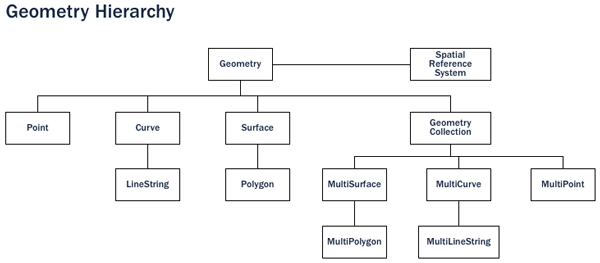

.. _introduction:

第1章: 序論
***********************

空間データベースとは
===========================

PostGISは空間データベースです。Oracle Spatial、SQL Server 2008もまた空間データベースです。しかし、通常のデータベースを空間データベースにするということはどういうことなのでしょうか？

簡単に答えるとするならば. . .

**空間データベースストアはデータベース中の他のオブジェクトと同様に空間オブジェクトを扱う**

ということになります。

空間データベースの展開を簡単に示すとともに、データ型、インデックス、関数という、データベースと *空間* データを関連付ける3つの側面について概説すると以下のようになります。

#. **空間データ型** は、ポイント、ライン、ポリゴンのようなシェープを指します。
#. 多次元 **空間インデックス** は、空間演算を効率よく実行するために使用します。
#. **空間関数** は、 :term:`SQL` 中で用いられ、空間属性および空間リレーションに対する問い合わせを実行するためのものです。

空間データ型、インデックス、関数の組み合わせることにより、パフォーマンスと解析を最適化する柔軟な構造をつくることができます。

はじめに
----------------

初期の :term:`GIS` の実装において、全ての空間データは一定のファイルに保存され、空間 :term:`GIS` ソフトウェアがそのデータを解釈、操作しなければなりませんでした。これらの古い世代の管理システムは、必要なデータが全て自分の手の届く範囲にあるという環境下のユーザーの要望を満たすように設計されていました。これらは、プロプリエタリ、かつ、空間データを扱うために特別に作られた自己完結型システムシステムでした。

次の世代の空間システムでは、リレーショナルデータベースのデータ（通常は"属性"もしくは空間的でない部分）で格納できるようになったものもありましたが、やはりダイレクトに一本化できるほど柔軟ではありませんでした。

**空間的特性をファーストクラスオブジェクトとして扱い始めたときに初めて、真の空間データベースが誕生したのです。**  

空間データベースは、オブジェクトリレーショナルデータベースと空間データを完全に統合したものです。視点をGIS中心に置いていたのを、データベースを中心に変えたのです。

.. image:: ./introduction/beginning.png

.. 注釈:: 空間データベース管理システムは地理学の分野以外にも使用されています。空間データベースは、人体の構造、大規模集積回路、分子構造、電磁場などに関連したデータを管理するのに用いられています。

空間データ型
------------------

通常のデータベースは、文字列型、数値型、日付型を持っています。空間データベースは、**地理的地物** を表現するための（空間）型を付加します。これらの空間データ型は抽象型であり、バウンダリーや次元といった空間的構造をカプセル化します。多くの点で、空間データ型は単純にシェープとして理解できると言うことができます。

空間データ型は型階層で構成されています。各派生型は、その親の型の構造（属性）とふるまい（メソッドもしくはファンクション）を継承します。

空間インデックスとバウンディングボックス
----------------------------------

通常のデータベースは "アクセスメソッド" を提供します。これは、データの一群にランダムかつ高速にアクセスする仕組みである **インデックス** としてよく知られています。標準型（数値型、文字列型、日付型）に対し、インデックスを張る場合、通常 `B木 <http://ja.wikipedia.org/wiki/B%E6%9C%A8>`_ インデックスを用います。B木の階層は、データを階層木に投入するために自然順を用いてデータの振り分けを行います。

数値、文字列、日付の自然順は、いずれの値も以下/以上/等しいで容易に決定することができます。しかし、ポリゴンは重なり合っていたり、一方の内部に含まれていたり、2次元もしくはそれ以上の空間に配置されていたりと、B木では効率的にインデックス化することができません。本当の意味での空間データベースは、"どのオブジェクトがこのバウンディングボックスの範囲にあるか" という問いに対し答えが出せる "空間インデックス" を提供するものです。

**バウンディングボックスは** 与えられた地物を含む最小の矩形です。

.. image:: ./introduction/boundingbox.png
   :align: center

"AはB内部にあるか"を求める場合、ポリゴンにおいて非常に計算集約的ですが矩形の場合は特に高速である、という理由から、バウンディングボックスが用いられます。非常に複雑なポリゴンやラインストリングでさえ、単純にバウンディングボックスとして表現することができます。

"使える"インデックスであるためには高速に結果を返す必要があります。よって、空間インデックスは正確な結果ではなく、B木のように大まかな結果を返します。"どの線がこのポリゴン内部にあるか"という問いは、"どの線がこのポリゴンのバウンディングボックス内部に含まれるバウンディングボックスを持つか"という問いとして、空間インデックスにより解釈されます。

実際の空間インデックスは、様々なデータベースで幅広く実装されています。最も一般的なものは、 `R木 <http://ja.wikipedia.org/wiki/R%E6%9C%A8>`_ (PostGISで使われています) ですが、 `四分木 <http://ja.wikipedia.org/wiki/%E5%9B%9B%E5%88%86%E6%9C%A8>`_ 、 および、空間データベース同士の結合には `グリッドによる空間インデックス <http://ja.wikipedia.org/wiki/%E7%A9%BA%E9%96%93%E3%82%A4%E3%83%B3%E3%83%87%E3%83%83%E3%82%AF%E3%82%B9>`_ が用いられることもあります。

空間関数
-----------------

クエリ内でデータを扱うために、通常のデータベースでは、文字列を結合したり、文字列でハッシュ演算を行ったり、数学的計算を行ったり、日付から情報を抽出するといった、**関数** を提供されています。空間データベースでは、地理的要素の分析、空間的関連性、ジオメトリを扱うための関数群を提供します。これらの空間関数はいかなる空間オブジェクトに対しても基本的要素として機能します。

大半の空間関数は以下の5つに分類することができます。
The majority of all spatial functions can be grouped into one of the following five categories:

#. **変換**: ジオメトリ間および外部データへの *変換* 関数
#. **管理**: 空間テーブルとPostGISの情報の *管理* 関数
#. **検索**: 属性およびジオメトリの計算結果の *検索* 関数
#. **比較**: 2つのジオメトリを空間リレーションという側面で *比較* する関数
#. **生成**: あるジオメトリから新しいジオメトリを *生成* する関数

関数一覧は膨大なものになりますが、よく使われる関数セットは :term:`OGC` :term:`SFSQL` により定義され、PostGISにより（他の便利な関数とともに）実装されています。

PostGISとは？
================

PostGISは、 `PostgreSQL <http://www.postgresql.org/>`_ というデータベース管理システムを、空間型、空間インデックス、空間関数という3つの特性のサポートを加えることによって、空間データベースへと変えるものです。PostGISはPostgreSQLに基づいて構築されているので、実装でのオープンスタンダードと同様、重要な "エンタープライズ" 特性を自動的に継承しています。

しかし、PostgreSQLとは？
-----------------------

PostgreSQLは、強力なオブジェクトリレーショナルデータベース管理システム(ORDBMS)です。BSD系のライセンス下でリリースされているフリーかつオープンソースのソフトウェアです。他の多くのオープンソースプログラムと同様、PostgreSQLは単一の企業によって運営されているわけではなく、代わりに、世界中の開発者と企業を結ぶコミュニティーによって開発されています。

PostgreSQLは当初から、実行時に新しいデータ型、関数、メソッドを追加するという拡張機能を念頭に置いて設計されました。これにより、PostGIS拡張は、開発チームを別にして開発することができるわけですが、未だにPostgreSQLデータベースのコア部分と非常に高い関連性を持っています。

なぜPostgreSQLを選んだか？
~~~~~~~~~~~~~~~~~~~~~~

オープンソースデータベースをよく知る人々からよく聞かれるのが、"なぜPostGISをMySQL上で構築しなかったのか？" です。

PostgreSQLには以下のような特徴があります。

  * 確かな信頼性とデフォルトでのトランザクション整合性(ACID)
  * SQLへの準拠(SQL92の完全サポート)
  * 結合可能な拡張型および拡張関数を持っていること
  * コミュニティ指向型の開発モデル
  * カラムのサイズに制限がない(タプルをTOAST可能である)ことにより、大きなサイズのGISオブジェクトを扱うことができること
  * R木インデックスが使えるGiSTインデックスを持つこと
  * カスタム関数の追加が容易であること

総じて、PostgreSQLにより、新しい空間型の追加が容易となる開発工程を経ることができると言えます。プロプリエタリの世界で拡張が容易なのは、Illustra (現在は Informix Universal Server)のみです。これは偶然ではありません。Illustraは1980年代からの初版のPostgreSQLのベースとなったコードを焼き直してプロプリエタリプログラムにしたものです。

PostgreSQLに型を追加する工程はシンプルであるため、そこから着手することは理にかなっていると言えます。MySQLが、バージョン4.1から基本的な空間型をリリースしたとき、PostGISチームはそのコードを見て、そしてまた実際に使ってみて、改めてPostgreSQLを使用しようという決意を強めました。

シェープファイルではどうか？
-------------------

`シェープファイル <http://ja.wikipedia.org/wiki/%E3%82%B7%E3%82%A7%E3%83%BC%E3%83%97%E3%83%95%E3%82%A1%E3%82%A4%E3%83%AB>`_ (および他のファイルフォーマット)は、GISソフトウェアが最初に作られてから以後、空間データの保存および取扱う際の標準的な手段でした。しかし、これらの"一定の"ファイルには以下のような欠点があります。

* **ファイルの場合、読み書きのできる空間情報用ソフトウェアが必要となります。** SQLはファイルではないので、ランダムなデータアクセスと分析を行うことができます。これがファイルとなると、データにアクセスしたり分析するためのコードを自前で記述することになります。
* **複数のユーザーによる同時アクセスにより破損することあります。** 一つのファイルに対し同時に書き込みがされてもデータが破壊されないよう、外部コードを記述することができます。よって、問題が解決するとともにパフォーマンス面でも改善がなされる頃には、データベースシステムの大半を書きあげたことになるでしょう。単純に標準的データベースを使ったほうがよいのではないでしょうか。
* **複雑な問い合わせに対する結果を取得するには複雑なソフトウェアが必要です。** SQLなら一文で表現できる複雑で特殊な問い合わせ（空間結合や空間集合の形成など）も、ファイルを扱うプログラムでは何百行もの特殊なコードが必要となります。

PostGISユーザーの多くは、複数のアプリケーションがデータにアクセスするようなシステムを構築しています。そのため、標準的SQLでアクセスできることで、開発と設置作業が容易になります。なかには膨大なデータをファイル（サイズが大きいので複数のファイルに分かれているかもしれません）として扱うユーザーもいますが、データベースならば単一の大きなテーブルとして持つことができます。

総じて、複数のユーザーによるアクセスをサポートすること、複雑な任意問い合わせ、膨大なデータセットを扱う際のパフォーマンスという点を考慮すると、空間データはファイルをベースにしたシステムとは歴然とした差があると言えます。

PostGISの略歴
--------------------------

2001年3月、 `Refractions Research <http://www.refractions.net/>`_ がPostGISの最初のバージョンをリリースしました。PostGIS 0.1 には、オブジェクト、インデックス、および、わずかに関数がありました。そのため、保存と検索には向いていましたが、分析には不向きでした。

関数が増えていくに従って、どのように作り上げていくかという原則の必要性が明白になりました。OGCによる "Simple Features for SQL" (:term:`SFSQL`) の規格によって、命名規則と要件のためのガイドラインおよび構成の元となるものがもたらされました。

PostGISによってシンプルな分析と空間結合がサポートされたことにより、これを用いた  `Mapserver <http://mapserver.org/>`_ は、データベースでデータの可視化を実現する最初の外部アプリケーションとなりました。

その後の数年間に、PostGISの関数の数は増加の一途をたどりましたが、実用性はまだまだ限られていました。特殊な関数（例. ST_Intersects(), ST_Buffer(), ST_Union()）の多くは、コーディングが大変でした。スクラッチ開発でそれらを書くとなると数年を要するものとされていました。

幸いにして、次のプロジェクトでは、"Geometry Engine, Open Source" 、 `GEOS <http://trac.osgeo.org/geos>`_ が登場しました。GEOSのライブラリは、 :term:`SFSQL` の規格の実装に必要なアルゴリズムを提供しました。GEOSをリンクすることで、PostGISはバージョン0.8から :term:`SFSQL` を完全にサポートするようになりました。

PostGISのデータ容量の増加に伴い、別の問題が生じてきました。ジオメトリを保存するために使われるリプレゼンテーション（表現方法）がやや非効率的であることがわかったのです。ポイントや短いラインといったサイズの小さいオブジェクトのリプレゼンテーションのオーバーヘッドは最大でも300%です。パフォーマンス的な理由から、サイズを小さくするにはリプレゼンテーションの使用が必要です。メタデータヘッダと次数の縮小により、オーバーヘッドを大幅に減らすことができます。PostGIS 1.0 では、この高速で軽量な新しいリプレゼンテーションがデフォルトになりました。

最近のPostGISの更新では、標準準拠する部分を増やしていくこと、曲線のジオメトリのサポート、ISO :term:`SQL/MM` 標準で規定された関数シグネチャに力を注いできました。パフォーマンスに対しても注力し続けたことで、PostGIS 1.4 はジオメトリのテストルーチンのスピードが飛躍的に速くなりました。

PostGISの利用者
-----------------

ケーススタディーの全リストは、 `PostGIS ケーススタディー <http://postgis.net/casestudies/>`_ をご覧ください。

Institut Geographique National, France
~~~~~~~~~~~~~~~~~~~~~~~~~~~~~~~~~~~~~~

IGNは、フランスの国立地図作成機関であり、高解像度の国土地形図である "BDUni"を保存するためにPostGISを使用しています。BDUni は1億以上の地物を保有しており、100人を超える現場スタッフにより観測データを確認して、新規マッピングデータをデータベースへ毎日追加する作業を行っている一人のスタッフによって維持管理されています。IGNの設備では更新プロセスでの一貫性を保証するデータベーストランザクションシステム、および、システム障害時に動作可能時間を継続するために `ウォームスタンバイシステム <http://developer.postgresql.org/pgdocs/postgres/warm-standby.html>`_ が使われています。

GlobeXplorer
~~~~~~~~~~~~

GlobeXplorerは、ペタバイト単位の衛星および空中写真にオンラインでアクセスできるWebベースのサービスです。GlobeXplorerはPostGISを画像カタログを関連付けるメタデータを管理するためにPostGISを使用しているので、画像に対してクエリー投げる際には、まず最初に、関連する画像の位置を求めるためにPostGISカタログに対し検索をかけ、保存された場所から画像を取り出し、それらをクライアントに返却します。システム構築の際に、GlobeXplorerは他の空間データベースも試用してみましたが、コストパフォーマンスが優れているために、最終的にはPostGISに落ち着きました。

PostGISをサポートしているアプリケーション
----------------------------------

PostGISは広く使われる空間データベースとなり、また、PostGISを用いてデータの保存および取り出しをサポートするサードパティープログラムも増加してきています。 `Tools that Support Postgis <http://trac.osgeo.org/postgis/wiki/UsersWikiToolsSupportPostgis>`_ には、オープンソースもプロプライエタリ（商用）ソフトウェアも、また、サーバーおよびデスクトップシステムも含まれています。

以下の表にPostGISを利用しているソフトウェアをいくつか紹介します。

+-------------------------------------------------+----------------------------------------------+
| Open/Free                                       | Closed/Proprietary                           |
+=================================================+==============================================+
|                                                 |                                              |   
| * Loading/Extracting                            | * Loading/Extracting                         |   
|                                                 |                                              |     
|   * Shp2Pgsql                                   |   * Safe FME Desktop Translator/Converter    |      
|   * ogr2ogr                                     |                                              |        
|   * Dxf2PostGIS                                 |                                              |          
|                                                 | * Web-Based                                  |         
| * Web-Based                                     |                                              |             
|                                                 |   * Ionic Red Spider (now ERDAS)             |              
|   * Mapserver                                   |   * Cadcorp GeognoSIS                        |            
|   * GeoServer (Java-based WFS / WMS -server )   |   * Iwan Mapserver                           |     
|   * SharpMap SDK - for ASP.NET 2.0              |   * MapDotNet Server                         |      
|   * MapGuide Open Source (using FDO)            |   * MapGuide Enterprise (using FDO)          |   
|                                                 |   * ESRI ArcGIS Server 9.3+                  |         
| * Desktop                                       |                                              |           
|                                                 | * Desktop                                    |               
|   * uDig                                        |                                              |           
|   * QGIS                                        |   * Cadcorp SIS                              |      
|   * mezoGIS                                     |   * Microimages TNTmips GIS                  |         
|   * OpenJUMP                                    |   * ESRI ArcGIS 9.3+                         |           
|   * OpenEV                                      |   * Manifold                                 |   
|   * SharpMap SDK for Microsoft.NET 2.0          |   * GeoConcept                               |       
|   * ZigGIS for ArcGIS/ArcObjects.NET            |   * MapInfo (v10)                            |           
|   * GvSIG                                       |   * AutoCAD Map 3D (using FDO)               |   
|   * GRASS                                       |                                              |           
|                                                 |                                              |             
+-------------------------------------------------+----------------------------------------------+

