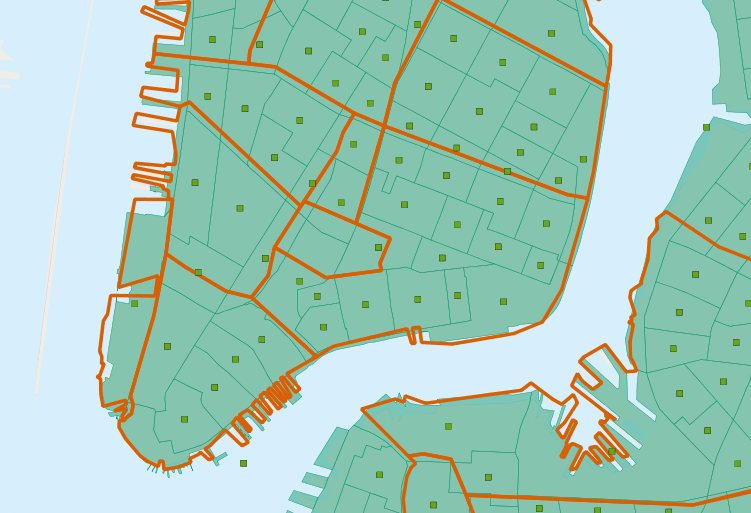
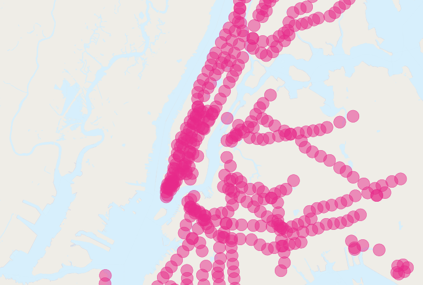

.. _joins_advanced:

第19章: 高度な空間結合
==============================

１つ前の章において :command:`ST_Centroid(geometry)` 関数と :command:`ST_Union([geometry])` 関数、そして簡単な実用例を扱いました。このセクションでは、これらの関数を使い、より複雑な処理を行います。

.. _creatingtractstable:

国勢統計区テーブルの作成
------------------------------

ワークショップの「 ``\data\`` 」ディレクトリにある「 ``nyc_census_sociodata.sql`` 」には、属性データは含まれていますが、ジオメトリは含まれていません。このテーブルにはニューヨークに関する収入や教育達成といった興味深い社会経済学的なデータが含まれています。問題は、このデータが国勢統計区単位でまとめられており、国勢統計区の空間データがないことです。

このセッションでは、以下のことを行います。
 * 「 ``nyc_census_sociodata.sql`` 」テーブルを読み込みます。
 * 国勢統計区の空間テーブルを作成します。
 * 属性データを空間テーブルに結合します。
 * 結合して作成されたデータを使用して、分析をいくつか行います。

「nyc_census_sociodata.sql」テーブルの読み込み
~~~~~~~~~~~~~~~~~~~~~~~~~~~~~~~~

 #. PgAdminのSQLクエリ・ウィンドウを開きます。
 #. 「ファイル（File）＞開く（Open）」メニューを選択し、 ``nyc_census_sociodata.sql`` ファイルまで辿ります。
 #. 「クエリの実行（Run Query）」ボタンを押下します。
 #. PgAdminの「更新（Refresh）」ボタンを押下しますと、テーブル一覧に ``nyc_census_sociodata`` テーブルが含まれていることが確認できます。

国勢統計区の空間テーブルの作成
~~~~~~~~~~~~~~~~~~~~~~~~~~~~~~~~

前章でみてきたように、国勢調査細分区から「blkid」キーの文字列を部分的に使用して集約することで、上位レベルのジオメトリを作成することができます。国勢統計区を作成するために、「blkid」の最初の11文字をグループ化して集約する必要があります。

  ::

    360610001009000 = 36 061 00100 9000

    36     = State of New York 
    061    = New York County (Manhattan)
    000100 = Census Tract
    9      = Census Block Group
    000    = Census Block

:command:`ST_Union` （集積型）を使用して、新たにテーブルを作成します。

.. code-block:: sql
   
   -- Make the tracts table
   CREATE TABLE nyc_census_tract_geoms AS
   SELECT 
     ST_Union(the_geom) AS the_geom, 
     SubStr(blkid,1,11) AS tractid
   FROM nyc_census_blocks
   GROUP BY tractid;
     
   -- Index the tractid
   CREATE INDEX nyc_census_tract_geoms_tractid_idx ON nyc_census_tract_geoms (tractid);
     
   -- Update the geometry_columns table
   SELECT Populate_Geometry_Columns();

属性データの空間テーブルへの結合
~~~~~~~~~~~~~~~~~~~~~~~~~~~~~~~~~~~~~~~

標準的な属性結合処理を行い、経路の属性テーブルを経路のジオメトリに結合します。

.. code-block:: sql
  
  -- Make the tracts table
  CREATE TABLE nyc_census_tracts AS
  SELECT 
    g.the_geom,
    a.*
  FROM nyc_census_tract_geoms g
  JOIN nyc_census_sociodata a
  ON g.tractid = a.tractid;
    
  -- Index the geometries
  CREATE INDEX nyc_census_tract_gidx ON nyc_census_tracts USING GIST (the_geom);
    
  -- Update the geometry_columns table
  SELECT Populate_Geometry_Columns();

.. _interestingquestion:

問いへの回答
~~~~~~~~~~~~~~~~~~~~~~~~~~~~~~

知りたかった答えがわかります。「ニューヨーク市街区において、学位を取得した人口の割合で並べ替え、上位10位を一覧表示しなさい。」

.. code-block:: sql
  
  SELECT 
    Round(100.0 * Sum(t.edu_graduate_dipl) / Sum(t.edu_total), 1) AS graduate_pct, 
    n.name, n.boroname 
  FROM nyc_neighborhoods n 
  JOIN nyc_census_tracts t 
  ON ST_Intersects(n.the_geom, t.the_geom) 
  WHERE t.edu_total > 0
  GROUP BY n.name, n.boroname
  ORDER BY graduate_pct DESC
  LIMIT 10;

注目している統計値を合計し、その値で最後に割ります。0で割ろうとするとエラーになるため、人口が0である国勢統計区は外しておきます。

::
  
   graduate_pct |       name        | boroname  
  --------------+-------------------+-----------
           40.4 | Carnegie Hill     | Manhattan
           40.2 | Flatbush          | Brooklyn
           34.8 | Battery Park      | Manhattan
           33.9 | North Sutton Area | Manhattan
           33.4 | Upper West Side   | Manhattan
           33.3 | Upper East Side   | Manhattan
           32.0 | Tribeca           | Manhattan
           31.8 | Greenwich Village | Manhattan
           29.8 | West Village      | Manhattan
           29.7 | Central Park      | Manhattan
    
  
.. _polypolyjoins:

ポリゴン／ポリゴン間の結合
---------------------

「問いへの回答」で使用しているクエリでは、どの国勢統計区ポリゴンかを特定し、各街区で集計結果のいずれにあてがうために、 :command:`ST_Intersects(geometry_a, geometry_b)` 関数を使います。すなわち次の問いが引き出されます。二つの街区の境界線上に国勢統計区が重なった場合は、どうなるか？この場合、両方に分割され、その両方に対して集計が行われます。

重複して計数されるこの種の問題を避けるために、２つの対処方法があります。

 * 簡便な方法として、各国勢統計区が一つの集計区域に重なっていることを確認する方法（ :command:`ST_Centroid(geometry)` を使います）。
 * 高度な方法として、境界線をまたぐ国勢統計区をその位置で分割する方法（ :command:`ST_Intersection(geometry,geometry)` を使います。

以下に簡便な方法を使い、大学院教育に関するクエリで重複して計数されないようにする例を示します。

.. code-block:: sql

  SELECT 
    Round(100.0 * Sum(t.edu_graduate_dipl) / Sum(t.edu_total), 1) AS graduate_pct, 
    n.name, n.boroname 
  FROM nyc_neighborhoods n 
  JOIN nyc_census_tracts t 
  ON ST_Contains(n.the_geom, ST_Centroid(t.the_geom)) 
  WHERE t.edu_total > 0
  GROUP BY n.name, n.boroname
  ORDER BY graduate_pct DESC
  LIMIT 10;

このクエリは、 :command:`ST_Centroid` 関数が各国勢統計区に対して処理を実行するため、処理により多くの時間が必要になります。

::

   graduate_pct |       name        | boroname  
  --------------+-------------------+-----------
           49.2 | Carnegie Hill     | Manhattan
           39.5 | Battery Park      | Manhattan
           34.3 | Upper East Side   | Manhattan
           33.6 | Upper West Side   | Manhattan
           32.5 | Greenwich Village | Manhattan
           32.2 | Tribeca           | Manhattan
           31.3 | North Sutton Area | Manhattan
           30.8 | West Village      | Manhattan
           30.1 | Downtown          | Brooklyn
           28.4 | Cobble Hill       | Brooklyn

重複して計数され内容にしたため、結果が異なります。

.. _largeradiusjoins:

半径を大きく設定した場合の結合
---------------------------

「地下鉄の駅の近く（500メートル以内）にいる通勤時間の短い人の数と、地下鉄の駅から遠く離れていて通勤時間の長い人の数はどのくらい異なるか？」というクエリを試しに作ります。

しかしながら、この問いは重複して計数される問題にぶつかります。複数の地下鉄の駅から500メートル以内にいる人が多数出てきます。ニューヨークの人口と比較してみましょう。

.. code-block:: sql

  SELECT Sum(popn_total)
  FROM nyc_census_blocks;
  
::

  8008278

ニューヨークの地下鉄の駅から500メートル以内にいる人の数と一緒に計数すると

.. code-block:: sql

  SELECT Sum(popn_total)
  FROM nyc_census_blocks census
  JOIN nyc_subway_stations subway
  ON ST_DWithin(census.the_geom, subway.the_geom, 500);
  
::

  10556898

地下鉄の駅の近くにいる人が、実際にそこにいる人よりも多くいることになっています。明らかに単純に作成したSQLが重複して計数してしまうエラーを含んでいることがわかります。地下鉄の駅からバッファ処理した図を見れば、問題点がはっきりします。

集計する部分のクエリに入る前に、国勢調査細分区が重なっていないことを確認することで解決できます。この処理を行うためには、集計クエリ内で入れ子になるように、重なっていない区を見つけるサブクエリを分けておき、出力結果を得ます。

.. code-block:: sql

  SELECT Sum(popn_total)
  FROM (
    SELECT DISTINCT ON (blkid) popn_total
    FROM nyc_census_blocks census
    JOIN nyc_subway_stations subway
    ON ST_DWithin(census.the_geom, subway.the_geom, 500)
  ) AS distinct_blocks;
  
::

  4953599

よりよい答えが得られました。半数より少し多くの人が地下鉄から500メートル以内（徒歩5分から7分）にいることがわかりました。

