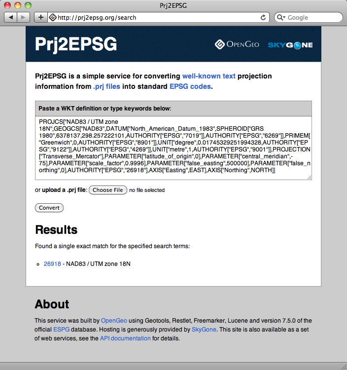

.. _loading_data:

第4章: 空間データのロード
===============================

PostGISは、数々のライブラリとアプリケーションにサポートされているので、データのロードするための多数のオプションを有します。この章では、主に、PostGISのシェープファイルローディングツールを使用した入力方法について述べます。

ダッシュボードに戻って、まず、PostGISセクションの **Import shapefiles** をクリックします。すると、次図の通り、シェープファイルをインポートするためのpgShapeLoaderが起動します。

   .. image:: ./screenshots/pgshapeloader_01.png

#. 次に、 *Shape File* で選択画面を開き、ディレクトリ `\\postgisintro\\data` のシェープファイル `nyc_census_blocks.shp` を選択します。

#. *PostGIS Connection*セクションの空欄に、次の通り入力し、**Test Connection...**ボタンをクリックします。

   .. list-table::

      * - **Username**
        - ``postgres``
      * - **Password**
        - ``postgres``
      * - **Server Host**
        - ``localhost`` ``54321``
      * - **Database**
        - ``nyc``

  .. note:: 
  
     ポート番号 **54321** を設定することは非常に重要です。OpenGeo PostGISは、5432のデフォルトのPostgreSQLポート番号では無くて54321ポートで動作します。
 
#. *Configuration*の空欄の入力方法は次の通りです。

   .. list-table::

      * - **Destination Schema**
        - ``public``
      * - **SRID**
        - ``26918``
      * - **Destination Table**
        - ``nyc_census_blocks``
      * - **Geometry Column**
        - ``the_geom``

#. 次図の通り **Options** ボタンをクリックし、"Load data using COPY rather than INSERT"を選択します。これにより、データロードプロセスを少し早く出来ます。

   .. image:: ./screenshots/pgshapeloader_02.png

#. 最後に、 **Import** ボタンをクリックし、インポートプロセスを見ます。私たちのテストセットの中でもっとも大きいファイルなので、ロードするのに数分かかります。

#. データディレクトリの他の下のシェープファイルも同様にしてロードします。勿論、入力出力ファイル名は違いますが、他の空欄は上と同じに入力します。

   * ``nyc_streets.shp``
   * ``nyc_neighborhoods.shp``
   * ``nyc_subway_stations.shp``
 
#. 全てのファイルがロードされたら、ツリービューを更新するために"Refresh"ボタンをクリックします。ツリーの **Tables** セクションの4つのテーブルが更新されたことを確認してください。

   .. image:: ./screenshots/refresh.png
 
 
シェープファイルとは？
------------------------

「シェープファイルっていったい何？」と自問自答されるかも分かりませんが、シェープファイルの拡張子は普通、 ``.shp``, ``.shx``, ``.dbf`` で、拡張子の前は同一の名称（nyc_census_blocks）となっています。実際、シェープファイルはshp拡張子に関連しています。しかし、シェープファイルは他の拡張子のファイルがないと配布に関し不完全なものです。

Mandatory files:

  * ``.shp`` ― shape format; the feature geometry itself（地物のフィーチャ）
  * ``.shx`` ―€shape index format; a positional index of the feature geometry （地物のフィーチャの場所でのインデックスファイル）
  * ``.dbf`` ―€attribute format; columnar attributes for each shape, in dBase III（dBase IIIフォーマット（訳注：現在はⅣだと思います。)の属性テーブル
    
オプションファイルには次のものがあります。

  * ``.prj`` ―€よく知られたテキストフォーマットを使用し、投影法を説明した座標系と投影法の情報からなるファイル。

PostGISでシェープファイルを解析するためにはシェープファイルをSQLコマンドのシリーズに変換する必要があります。pgShapeLoaderが走ることにより、シェープファイルは、PostgreSQLが理解できるテーブルに変換されます。

SRID 26918？とは何？
-----------------------------

大部分のインポートプロセスは、分かりやすいものですが、経験をつんだGIS専門家でさえ **SRID** では誤ちを犯すことがあります。

"SRID"は「空間的な参照識別子」を表します。それは私たちのデータの測地系と投影法のすべてのパラメタを定義します。地図投影法(かなり複雑である場合がある)のすべての情報を1つの数として集約するので、SRIDは便利です。

オンラインデータベース、または次に示すコマンドで直接的にPostGISの中で ``spatial_ref_sys`` テーブルに「問い合わせ」をすることによって、ワークショップ地図投影法の定義を見ることができます。

  http://spatialreference.org/ref/epsg/26918/

あるいは、直接PostGISの ``spatial_ref_sys`` テーブルを参照することもできます。

.. code-block:: sql

  SELECT srtext FROM spatial_ref_sys WHERE srid = 26918;
  
.. note::

   PostGISの ``spatial_ref_sys`` テーブルは、データベースに知られているすべての空間参照システムを定義するOGC標準テーブルです。PostGISに含まれている3000以上の空間参照システムと記述のリストのデータは、それらの間で変換されるかまたは再投影される必要がありました。

両方のケースで、 **26918** 空間参照システムの原文の表現を明確を期すために以下に示します。

::

  PROJCS["NAD83 / UTM zone 18N",
    GEOGCS["NAD83",
      DATUM["North_American_Datum_1983",
        SPHEROID["GRS 1980",6378137,298.257222101,AUTHORITY["EPSG","7019"]],
        AUTHORITY["EPSG","6269"]],
      PRIMEM["Greenwich",0,AUTHORITY["EPSG","8901"]],
      UNIT["degree",0.01745329251994328,AUTHORITY["EPSG","9122"]],
      AUTHORITY["EPSG","4269"]],
    UNIT["metre",1,AUTHORITY["EPSG","9001"]],
    PROJECTION["Transverse_Mercator"],
    PARAMETER["latitude_of_origin",0],
    PARAMETER["central_meridian",-75],
    PARAMETER["scale_factor",0.9996],
    PARAMETER["false_easting",500000],
    PARAMETER["false_northing",0],
    AUTHORITY["EPSG","26918"],
    AXIS["Easting",EAST],
    AXIS["Northing",NORTH]]

もし、データディレクトリの ``nyc_neighborhoods.prj`` ファイルを開けば、同じ定義がされていることが分かるでしょう。

PostGISでは初心者でさえ自分のデータに対して、指定すべきSRIDを知っています。prjファイルにこのことは書かれています。しかし、どのようにしてprjファイルからSRID番号に翻訳するのでしょうか?

やさしい答えは、コンピュータを使うことです。 ``.prj`` ファイルのコンテンツを http://prj2epsg.org に入力してください。これによりあなたの投影法の定義に最もふさわしい数または数のリストを得るでしょう。ここには全ての地図投影法があるわけでありませんが、prj2epsgデータベースの中のスタンダードナンバーはここに含まれています。

ニューヨーク市などの地方政府機関から提供されるデータは、"state plane" または "UTM" で普通は投影されています。われわれの投影法は、UTMゾーン18北、つまりEPSG:26918です。

課題：既存のデータベースを空間的に使用可能にする
----------------------------------------------------

pgAdmin中の ``postgis_template`` を使用してデータベースを作成する方法を既に学びました。しかしながら、ソースからインストールしたり、または既存のデータベースにPostGISを機能的に付加しようとするとき、PostGISテンプレートから新たなデータベースを作成するのは、いつも適切であるというわけではありません。

この章のあなたのタスクは、事実の後にデータベースを作成して、PostGISタイプと機能を加えることです。 `postgis.sql` ファイルと `spatial_ref_sys.sql` ファイルで必要とされるSQLスクリプトはPostgreSQL がインストールされたディレクトリ中の`contrib`ファイルにあります。 ガイダンスとしては、ソース[#PostGIS_Install]からのインストール・PostGISドキュメントを参照してください。

.. note::

   コマンド・ラインからデータベースを作成する時は、忘れずにユーザ名とポートナンバーを含めてください。

課題：uDigを使用してデータを見る
-----------------------------------

`uDig <http://udig.refractions.org>`_ は、 (ユーザーフレンドリーなデスクトップインターネットGIS)はデータをすばやく見ることが出来るデスクトップGISビューア/エディタです。フラットな（DBではない）シェープファイルとPostGISデータベースを含む種々のデータフォーマットを見ることが出来ます。そのグラフィカルなインターフェースにより、あなたのデータ、簡単なテストと速いスタイリングと同様、データの簡単な探索が可能となります。

このソフトウェアをPostGISデータベースに接続して使用してください。このアプリケーションは ``software`` に含まれています。

.. rubric:: Footnotes

.. [#PostGIS_Install] "Chapter 2.5. Installation" PostGIS Documentation. May 2010 <http://postgis.net/docs/manual-2.0/postgis_installation.html>

