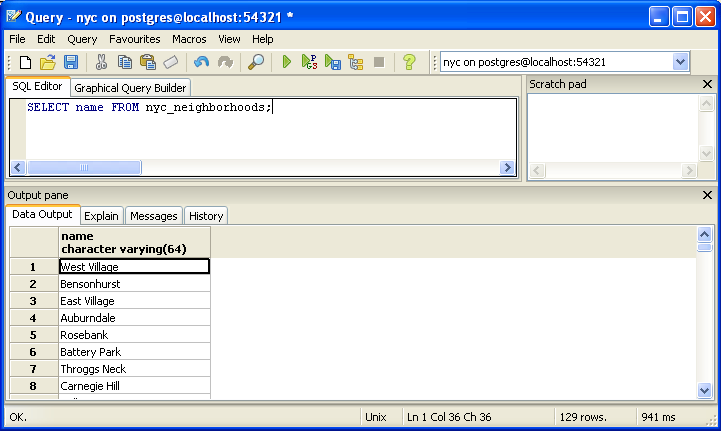

.. _simple_sql:

第6章: シンプルなSQL
=====================

:term:`SQL` ("Structured Query Language"の略)は、リレーショナルデータベースへの問い合わせやデータの更新を行うための言語です。このSQLですが、最初にデータベースを作成したときにみなさん既に見ています。

.. code-block:: sql

   SELECT postgis_full_version();

しかし、これはデータベースへの問い合わせではありません。私たちのデータベースにはデータがもう入っています。早速、このデータを使って問い合わせをしてみましょう。
例えば、こんな問い合わせです。

ニューヨーク市のすべての地区名をあげてください。

まず、pgAdminのSQLボタンをクリックしてSQLの問い合わせウィンドウを開いてください。

続いて以下の問い合わせ（SQL）を入力してください。

.. code-block:: sql

  SELECT name FROM nyc_neighborhoods;
  
そして、 **Execute Query** ボタン（緑の三角）をクリックしてください。
  
.. image:: ./screenshots/pgadmin_08.png  

この問い合わせは、ほんの数ミリ秒で終わり、129個の結果が返ってきます。

しかし、実際には何が起こっているのかよくわかりません。SQLを理解するために、SQLの４つの動作について勉強しましょう。

 * ``SELECT``, 問い合わせの結果を返します
 * ``INSERT``, テーブルに新しいデータを追加します
 * ``UPDATE``, テーブルのデータを更新します
 * ``DELETE``, テーブルからデータを削除します
 

``SELECT``は、空間情報を使ったSQLでも一番よく使うことになるでしょう。

SELECT による問い合わせ
--------------

SELECT文での問い合わせは、通常以下のような形になります。

  SELECT some_columns FROM some_data_source WHERE some_condition;
  
.. note::

    ``SELECT`` 文のパラメータ一覧は、PostgreSQLのドキュメント `documentation  <http://www.postgresql.org/docs/8.1/interactive/sql-select.html>` をご参照ください。

``some_columns`` は、フィールド名かそれらを関数に代入したものです。 ``some_data_source`` は、ひとつのテーブルか、複数のテーブルをキーや条件で結合したテーブルのことです。 ``some_condition`` は、「結果の数を制限する」など、問い合わせの条件を表します。

  ブルックリン区（Brooklyn）にある地区名は何でしょうか？

``nyc_neighborhoods`` テーブルにこの条件をあてはめてみましょう。このテーブルにはニューヨークのすべての地区名が入っています。しかし、私たちが欲しいのはブルックリン区内の地区名のみです。

.. code-block:: sql

  SELECT name 
    FROM nyc_neighborhoods 
    WHERE boroname = 'Brooklyn';

この問い合わせは、ほんの数ミリ秒で終わり、23個の結果が返ってきます。

さて、こういった結果に対して関数を使う必要がある場合があります。たとえばこんな感じです。

  ブルックリン区（Brooklyn）にある地区名のそれぞれの文字数はいくつでしょうか？

幸いなことに、PostgreSQLには文字列の長さを返す関数があります。 :command:`char_length(string)` 

.. code-block:: sql

  SELECT char_length(name) 
    FROM nyc_neighborhoods 
    WHERE boroname = 'Brooklyn';

また一方で、個々の値ではなく、結果全てに対する統計量を知りたくなるケースもあります。たとえば、地区名の文字数の平均値といった値です。このように複数の値をまとめてひとつの結果にする関数を"集約"関数といいます。

PostgreSQLは、いくつかの集約関数を持っています。たとえば平均値を計算する :command:`avg()` 関数や標準偏差を計算する :command:`stddev()` 関数です。

  ブルックリン区（Brooklyn）にある地区名のそれぞれの文字数の平均値と標準偏差はいくつでしょうか？

.. code-block:: sql

  SELECT avg(char_length(name)), stddev(char_length(name)) 
    FROM nyc_neighborhoods 
    WHERE boroname = 'Brooklyn';
  
::

           avg         |       stddev       
  ---------------------+--------------------
   11.7391304347826087 | 3.9105613559407395

この例で示した集約関数では、すべてのブルックリンの地区名に対して計算され、１つの結果となってい。もし、そうではなく、特定のグループ単位での集約結果が欲しい場合はどうでしょうか。この場合、 ``GROUP BY`` 句を使います。集約関数では、``GROUP BY``句を追加して、１つもしくは複数のグループ単位で結果を得ることが出来ます。

　ニューヨーク市内の地区名のそれぞれの文字数の平均値と標準偏差を各区毎に出してください？

.. code-block:: sql

  SELECT boroname, avg(char_length(name)), stddev(char_length(name)) 
    FROM nyc_neighborhoods 
    GROUP BY boroname;
 
それぞれの結果がどの区に含まれるかがわかるように、 ``boroname`` フィールドを出力結果項目に追加しています。
このように集約の問い合わせでは、(a)グループ単位での出力、(b)集約関数の出力、のどちらかを出力することができます。
  
::

     boroname    |         avg         |       stddev       
  ---------------+---------------------+--------------------
   Brooklyn      | 11.7391304347826087 | 3.9105613559407395
   Manhattan     | 11.8214285714285714 | 4.3123729948325257
   The Bronx     | 12.0416666666666667 | 3.6651017740975152
   Queens        | 11.6666666666666667 | 5.0057438272815975
   Staten Island | 12.2916666666666667 | 5.2043390480959474
  
関数一覧
-------------

`avg(expression) <http://www.postgresql.org/docs/current/static/functions-aggregate.html#FUNCTIONS-AGGREGATE-TABLE>`_: PostgreSQL集約関数：数値フィールドの平均値を返します

`char_length(string) <http://www.postgresql.org/docs/current/static/functions-string.html>`_: PostgreSQL文字列関数：文字列の文字数を返します

`stddev(expression) <http://www.postgresql.org/docs/current/static/functions-aggregate.html#FUNCTIONS-AGGREGATE-STATISTICS-TABLE>`_: PostgreSQL集約関数：入力値の標準偏差を返します
