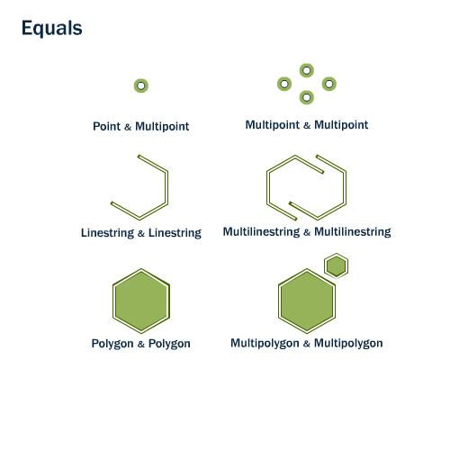
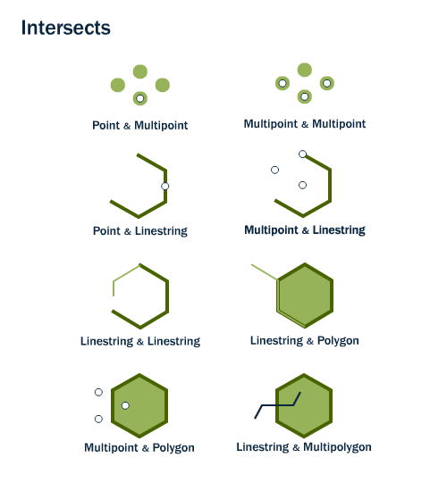
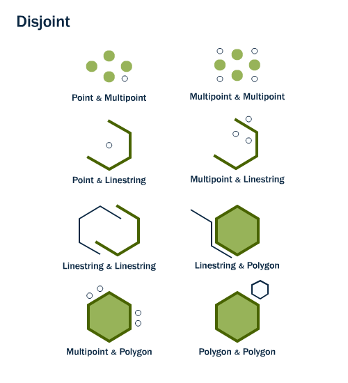
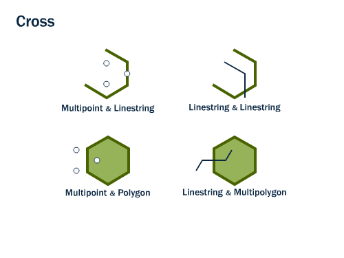
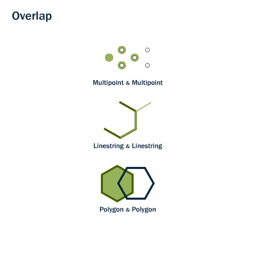
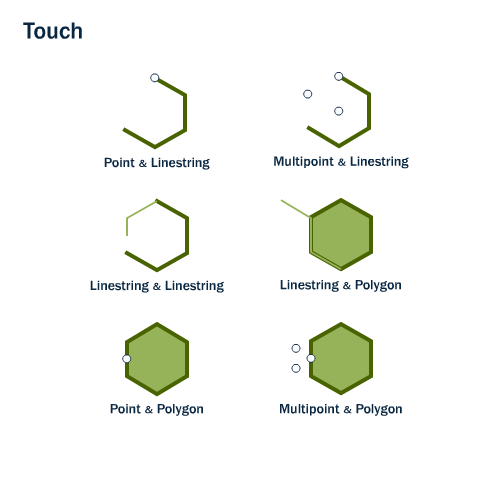
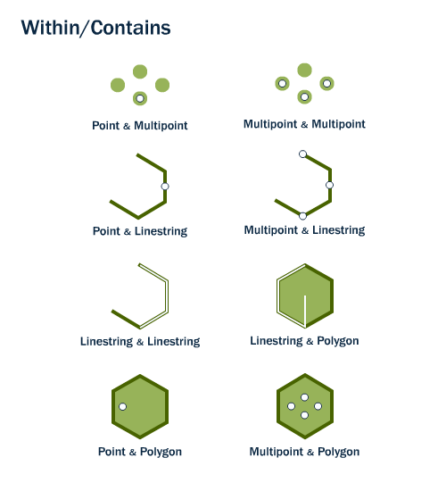

.. _spatial_relationships:

第10章: 空間演算
=================================

これまで、我々は :command:`ST_Area` , :command:`ST_Length` のように測定を行う、あるいは、 :command:`ST_GeomFromText` のようにジオメトリをシリアライズしたり、 :command:`ST_AsGML`  のように非シリアライズする空間演算のみを見てきました。一般的に、これらの関数はひとつのジオメトリに対してのみ作用します。

しかし、空間データベースというのは、ジオメトリを保管するだけではなく、 *複数のジオメトリ間* の比較を行えるからこそ、強力と言えるのです。

“ある公園に最も近い駐輪場はどこになるのか？”という疑問や、“地下鉄の路線と大通りとの交差する場所はどこか？”という問題は、駐輪場や大通り、地下鉄の路線に関するジオメトリのデータを比較することでのみ解くことが可能です。

OGC標準は、ジオメトリ同士を比較する手段として、以下のような関数を定義しています。

ST_Equals
---------
 
:command:`ST_Equals(geometry A, geometry B)` は、2つのジオメトリが空間的に等しいかどうかを評価します。

ST_Equalsは、2つの同じ型のジオメトリが等しいx-y座標を持つ、すなわち、第2引数の形状が第1引数と全く同一であるときにTRUEを返します。

手始めに、 ``nyc_subway_stations`` テーブルからある任意の点を取り出しましょう。ここでは'Broad通り'駅の場所を抽出します。

.. code-block:: sql

  SELECT name, the_geom, ST_AsText(the_geom)
  FROM nyc_subway_stations 
  WHERE name = 'Broad St';             

::

     name   |                      the_geom                      |      st_astext
  ----------+----------------------------------------------------+-----------------------
   Broad St | 0101000020266900000EEBD4CF27CF2141BC17D69516315141 | POINT(583571 4506714)
 
続いて、 :command:`ST_Equals` に今取り出したジオメトリを再び指定してみましょう:

.. code-block:: sql

  SELECT name 
  FROM nyc_subway_stations 
  WHERE ST_Equals(the_geom, '0101000020266900000EEBD4CF27CF2141BC17D69516315141');

::

   Broad St

.. 補足::

  抽出されたポイントのデータ(``0101000020266900000EEBD4CF27CF2141BC17D69516315141``)は我々が見ても何を意味しているのかは分かりません。しかし、これは確かに位置情報を示しているのです。等価性のテストを行うような場合は、正確な座標を使うことが必須となります。

ST_Intersects, ST_Disjoint, ST_Crosses and ST_Overlaps
------------------------------------------------------

:command:`ST_Intersects`, :command:`ST_Crosses`, and :command:`ST_Overlaps` は、ジオメトリ同士が交わっているかどうかを評価します。

:command:`ST_Intersects(geometry A, geometry B)` は、両者の交差部分が空でなければt(TRUE)を返します。ST_Intersectsは、ST_Disjointと完全に正反対の結果を返します。

:command:`ST_Disjoint(geometry A , geometry B)` は、ST_Intersectsと正反対のコマンドになります。もし2つのジオメトリが互いに素であればそれは交わりを持たないことを意味しますし、逆もまた真です。ただ実際には、ST_Disjointを実行するよりもST_Intersectsが偽であるかどうかを調べた方が効率的です。なぜなら、ST_Intersectsは空間インデックス化されますが、ST_Disjointはされないからです。

:command:`ST_Crosses(geometry A, geometry B)` は、multipoint/polygon, multipoint/linestring, linestring/linestring, linestring/polygon, linestring/multipolygon同士を比較した場合に、交差部分の次元が引数の次元の最大値よりも1だけ小さく、なおかつ交差部分が引数の両方の内部に含まれているとt(TRUE)を返します。

:command:`ST_Overlaps(geometry A, geometry B)` は、同じ次元のジオメトリ同士を比較し、その交差部分が両者とは異なるが同じ次元を持つ場合にt(TRUE)を返します。

先ほどの'Broad通り'駅をもとに、 :command:`ST_Intersects` を使って周辺情報を求めてみましょう:

.. code-block:: sql

  SELECT name, boroname 
  FROM nyc_neighborhoods
  WHERE ST_Intersects(the_geom, '0101000020266900000EEBD4CF27CF2141BC17D69516315141');

::

          name        | boroname  
  --------------------+-----------
   Financial District | Manhattan

ST_Touches
----------

:command:`ST_Touches` は、2つのジオメトリが内部で交差することなくその境界で接しているかどうかを評価します。 

:command:`ST_Touches(geometry A, geometry B)` は、ジオメトリの境界のどちらかが交差している、またはどちらかのジオメトリの内部がもう一方の境界と交差しているときにTRUEを返します。

ST_Within, ST_Contains
-------------------------

:command:`ST_Within`, :command:`ST_Contains` は、片方のジオメトリがもう一方に完全に含まれているかどうかを評価します。

    
:command:`ST_Within(geometry A , geometry B)` は、ジオメトリAが完全にジオメトリBの中に含まれているときにTRUEを返します。ST_WithinとST_Containsの結果は真逆になります。

:command:`ST_Contains(geometry A, geometry B)` は、ジオメトリBが完全にジオメトリAの中に含まれているときにTRUEを返します。

ST_Distance, ST_DWithin
--------------------------

GISを使っていると、"ある距離以内に含まれるすべての要素を調べたい"というケースにしばしば遭遇します。

:command:`ST_Distance(geometry A, geometry B)` は、2つのジオメトリ間の*最短の*距離を計算し、浮動小数形式で返します。この関数はオブジェクト間の距離を求める場合に有効です。

.. code-block:: sql

  SELECT ST_Distance(
    ST_GeometryFromText('POINT(0 5)'),
    ST_GeometryFromText('LINESTRING(-2 2, 2 2)'));

::

  3

:command:`ST_DWithin` は、2つのオブジェクト同士がある距離以内にあるかどうかを評価します。この関数は、「ある道路から500m以内のエリアにある木の本数」を求める場合などに利用できます。実際にエリアまで求める必要はなく、相互の距離を調べるだけで解答を得ることができるのです。

  .. figure:: ./spatial_relationships/st_dwithin.png
     :align: center
    
再びBroad通り駅を使って、駅周辺(10m以内)の道路を探してみましょう。

.. code-block:: sql

  SELECT name 
  FROM nyc_streets 
  WHERE ST_DWithin(
          the_geom, 
          '0101000020266900000EEBD4CF27CF2141BC17D69516315141', 
          10
        );

:: 

       name     
  --------------
     Wall St
     Broad St
     Nassau St

得られた結果を地図で確認してみます。Broad通り駅が、確かにWall, Broad, Nassauの3つの通りの交差点に位置していることが分かります。

.. image:: ./spatial_relationships/broad_st.jpg

関数一覧
-------------

`ST_Contains(geometry A, geometry B) <http://postgis.net/docs/manual-2.0/ST_Contains.html>`_: Bのどの部分もAの外に属しておらず、かつBの中の1点だけでもAの中に含まれていればTRUEを返します。

`ST_Crosses(geometry A, geometry B)  <http://postgis.net/docs/manual-2.0/ST_Crosses.html>`_: 指定したジオメトリ同士が、全てではなく一部だけを共有しているときにTRUEを返します。

`ST_Disjoint(geometry A , geometry B) <http://postgis.net/docs/manual-2.0/ST_Disjoint.html>`_: ジオメトリが空間的に交わりを持たない（すなわち、ジオメトリ同士が共有のエリアを持たない）場合にTRUEを返します。

`ST_Distance(geometry A, geometry B)  <http://postgis.net/docs/manual-2.0/ST_Distance.html>`_: 二次元デカルト座標系における2つのジオメトリ間の距離を、ジオメトリに使用されている単位で返します。

`ST_DWithin(geometry A, geometry B, radius) <http://postgis.net/docs/manual-2.0/ST_DWithin.html>`_: 両方のジオメトリが指定した距離以内であれば true を返します。

`ST_Equals(geometry A, geometry B) <http://postgis.net/docs/manual-2.0/ST_Equals.html>`_: 2つのジオメトリが幾何的に同一である場合にTRUEを返します。向きの違いは関係ありません。

`ST_Intersects(geometry A, geometry B) <http://postgis.net/docs/manual-2.0/ST_Intersects.html>`_: ジオメトリが空間的に交わっている（すなわち、ジオメトリの一部を共有している）場合にTRUEを返し、まったく交わりがない場合にFALSEを返します。

`ST_Overlaps(geometry A, geometry B) <http://postgis.net/docs/manual-2.0/ST_Overlaps.html>`_: ジオメトリ同士が共通のエリアを持ち、それが同じ次元である、また一方がもう片方に完全に含まれた状態ではないときにTRUEを返します。

`ST_Touches(geometry A, geometry B)  <http://postgis.net/docs/manual-2.0/ST_Touches.html>`_: ジオメトリ同士が少なくとも1点を共有し、しかもその内部では交わりを持たないときにTRUEを返します。

`ST_Within(geometry A , geometry B) <http://postgis.net/docs/manual-2.0/ST_Within.html>`_: ジオメトリAが完全にジオメトリBの内部に含まれるときにTRUEを返します。

