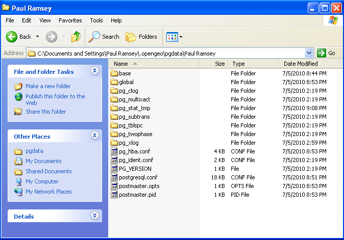
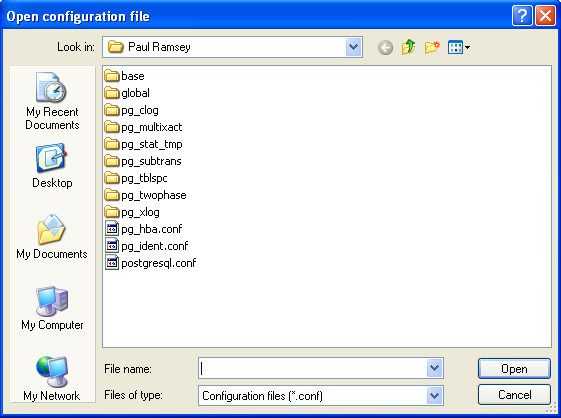
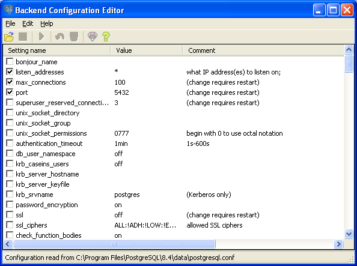
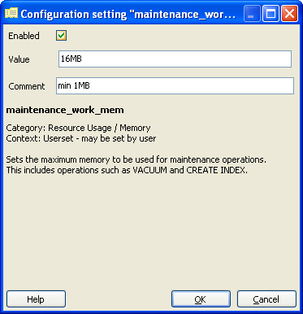
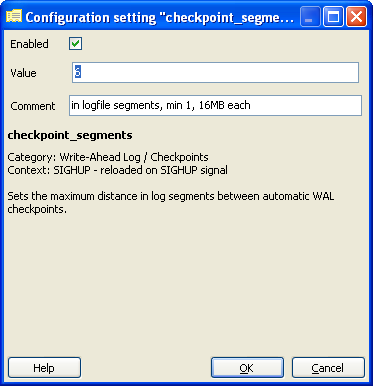
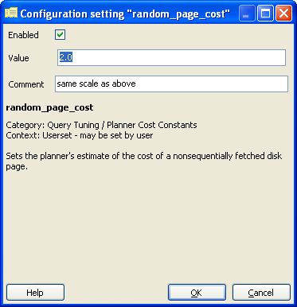
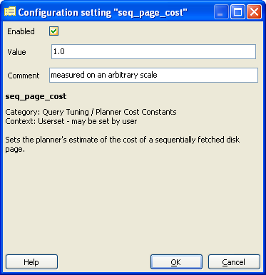

.. _tuning:

第21章: 空間データベースのためのPostgreSQLのチューニング
=========================================

PostgreSQLは多用途のデータベースシステムで、少ないリソースの環境や他のさまざまなアプリケーションと共有する環境でも、効果的に実行する能力があります。様々な環境で確実に動作するようにするため、デフォルトのコンフィギュレーションは保守的であって、高パフォーマンスの実運用データベースにとっては、非常に適切であるとまでは言えません。また、空間データベースは非空間データベースと比較して、異なる利用パターンを持ち、数が少なくサイズが大きいレコードになり、デフォルトのコンフィギュレーションでは、完全に適切とまでは言えません。

コンフィギュレーションパラメータは、全てがデータベースコンフィギュレーションファイル file:`C:\\Documents and Settings\\%USER\\.opengeo\\pgdata\\%USER` で編集可能です。このファイルは通常のテキストファイルで、メモ帳等のテキストエディタで編集可能です。変更はサーバを再起動させるまで有効になりません。

コンフィギュレーションの編集には、ビルトインの「バックエンド 構成 エディタ」を使うのが簡単です。pgAdminで、 *ファイル > postgresql.confを開く...* を選択します。ファイルの場所を尋ねてきますので、:file:`C:\\Documents and Settings\\%USER\\.opengeo\\pgdata\\%USER` に移動します。

このセクションでは、実運用可能な空間データベース用のコンフィギュレーションパラメータの調整について紹介します。サブセクションごとに、リストから適切なアイテムを探し、その行をダブルクリックしてコンフィギュレーションの編集を行います。推奨される値に *値* を変更して、忘れずにそのアイテムを*可能*にして、 **OK** をクリックして下さい。

.. ご注意:: これらの値は推奨までです。それぞれの環境で異なり、最適なコンフィギュレーションを決定するにはテストする必要があります。ただ、本節によって良好なスタートを切れることと思います。

shared_buffers
--------------

データベースサーバが使用する共有メモリバッファのメモリ総量です。このメモリは、バックエンドのプロセスで共有されます。名前の通りです。デフォルト値は、通常では実運用データベースにとって悲惨なぐらい少なくなっています。

  *デフォルト値*: typically 32MB

  *推奨値*: 75% of database memory (500MB)

.. image:: ./tuning/conf04.png

work_mem
--------

内部ソート操作やハッシュテーブルがディスク上のファイルに切り替わるまでに消費できるメモリの総量を定義します。この値は、それぞれの操作の利用可能メモリを定義するものです。複雑なクエリでは、ソートやハッシュが、いくつか並行に走ることがあり、また、接続されたセッションあたりひとつずつクエリを実行することができます。

この値を増やす前に、接続数と、考えられるクエリの複雑さを考えなければなりません。増加させる利点は、ORDER BY, DISTINCT節、マージやハッシュ・ジョイン、ハッシュベースの集計関数、ハッシュベースのサブクエリ処理といった処理がディスクへの書き込みを行わずに完了させられることです。

  *デフォルト値*: 1MB

  *推奨値*: 16MB

.. image:: ./tuning/conf05.png

maintenance_work_mem
--------------------

インデックスや外部キーの生成といった、メンテナンス操作に使用されるメモリの総量を定義します。メンテナンス操作は非常によく行われるもので、デフォルト値は許容しうるものです。このパラメータは、下で示すように、 :command:`CREATE INDEX` または :command:`VACUUM` 等を実行する前に、セッションごとに変更することができます。

  .. code-block:: sql

    SET maintenance_work_mem TO '128MB';
    VACUUM ANALYZE;
    SET maintenance_work_mem TO '16MB';

  *デフォルト値*: 16MB

  *推奨値*: 128MB

wal_buffers
-----------

ログ先行書き込み(WAL)データに使うメモリの総量を設定します。ログ先行書き込みは、データ統合に関する保証のための、高パフォーマンスなメカニズムです。変更コマンドごとの間に、変更の効果はまずWALファイルに書き込まれたあとで、ディスクにフラッシュされます。WALファイルがフラッシュされると、変更がデータファイル自体に書き込まれます。これによって、データファイルは最適かつ非同期な手法で書き込まれ、クラッシュ時に全てのデータ変更がWALから確実にリカバリできます。

このバッファのサイズは、単一の一般的なトランザクションでWALデータを十分に保持できるサイズが求められるだけです。デフォルト値はほとんどのデータにとって十分ですが、空間データではより大きくなる傾向にあります。よって、このパラメータの値を増やすことをお勧めします。

  *デフォルト値*: 64kB

  *推奨値*: 1MB

.. image:: ./tuning/conf07.png

checkpoint_segments
-------------------

自動WALチェックポイントを入れられるログファイルセグメントの最大数を設定します(通常は 16MB)。WALチェックポイントはWALトランザクションのシーケンス内にあるポイントです。WALトランザクションは、データファイルがチェックポイント前の全ての情報によって更新されることを保証するものです。これにより、クラッシュリカバリ処理で、最終チェックポイントレコードを見つけて、そこから続くログセグメントを適用してデータリカバリを完了することができます。

チェックポイント処理では、全てのダーティなデータページをディスクにフラッシュすることが求められるので、かなりのI/Oロードが発生します。上でも述べていますが、空間データは大きいので、非空間データでの最適化の通りにはいきません。この値を増やすことで、過度のチェックポイントを防ぎますが、クラッシュ時のサーバの再起動が遅くなります。

  *デフォルト値*: 3

  *推奨値*: 6

random_page_cost
----------------

ディスクからのランダムページアクセスのコストを表現する、単位の無い値です。この値は、シーケンシャルページアクセス等の、他のコストパラメータとの相対値です。この値に関する魔法の弾丸はありませんので、デフォルトは一般的に保守的です。この値は、セッション毎に ``SET random_page_cost TO 2.0`` を用いて設定することができます。

  *デフォルト値*: 4.0

  *推奨値*: 2.0

seq_page_cost
-------------

シーケンシャルページアクセスのコストを制御するパラメータです。この値は、一般的には調整しなければならないものではありませんが、この値と ``random_page_cost`` の差は、クエリプランナの選択に非常に影響を与えます。この値はセッション毎に設定できます。

  *デフォルト値*: 1.0

  *推奨値*: 1.0

Reload configuration
--------------------

これらの変更を行った後、変更を保存して、コンフィギュレーションを再読み込みして下さい。

 * pgAdmin上で server (``PostgreSQL 8.4 on localhost:54321``) を右クリックして、*切断*を選択すると完了します。
 * OpenGeoダッシュボード上の *Shutdown* をクリックして、 *Start* をクリックします。
 * 最後に、pgAdminでサーバへの再接続を行います(サーバを右クリックして *接続* を選択します)。
 
 
 
