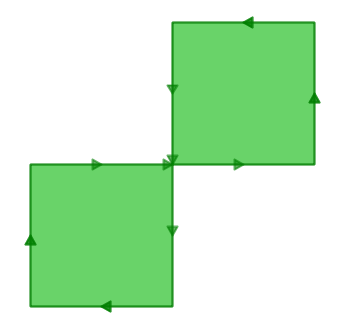
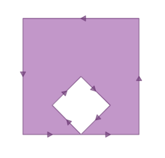

.. _validity:

第20章: 整合性
====================

"検索をするとどうして'TopologyException'エラーが発生するのですか？"という質問に対する解答の90%は"1個または複数の入力地物の内容が正しくない"ということです。この答えによって以下の疑問が生まれます:地物が正しくないということはどういうことなのか？その場合どのように対策をたてたらいいのか？ということです。

整合性とは何か？
----------------

ポリゴンでは整合性が最も重要です。この場合領域と構造についての整合性が定義されています。ラインはシンプルなので整合性がおかしくなることはありません。ポイントについても同様です。

いくつかのポリゴン整合性規則は自明なものと感じます。しかしその他のポリゴン整合性ルールは任意に定められたように思えます（実際それらは任意です）。

 * ポリゴンのリングは閉じていなければならない。
 * 穴を定義しているリングは外部境界のリングの内側になければならない。
 * リングは自分の要素で交差してはならない (これらはタッチも交差もしてはならない)。
 * リングは1点での接触以外は他のリングと接してはならない。

最後の2個のルールは任意ルールといえます。その他にも矛盾のないポリゴン整合性ルールはあります。しかし上記のルールはPostGISが従っている :term:`OGC` と :term:`SFSQL` の標準にしたがったルールです。

幾何演算のアルゴリズムは入力データの構造に依拠しているため地物の整合性ルールは重要です。データ構造の仮定無しでアルゴリズムを作ることは可能です。しかしそれらのプログラムの動作は遅いでしょう。何故ならばそれらのプログラムは最初に*入力地物とその構造を取り込むために解析作業を行わなければならない*からです。

以下は構造について問題にしなければならない例です。このポリゴンは構造が不正です:

::

  POLYGON((0 0, 0 1, 2 1, 2 2, 1 2, 1 0, 0 0));
  
この図を見ると不整合の内容がもう少しよくわかります:

外側のリングは8の字のようですが中央で自己交差しています。ここで留意すべきことはグラフィックルーティンがポリゴン塗りつぶしを正しく描画すると"領域"は２つの四角形として表され、総面積は２つの領域になることです。

それではこのポリゴンの面積をデータベースがどう考えるか見てみましょう:

.. code-block:: sql

  SELECT ST_Area(ST_GeometryFromText('POLYGON((0 0, 0 1, 1 1, 2 1, 2 2, 1 2, 1 1, 1 0, 0 0))'));
  
::

    st_area 
   ---------
          0

何が起こったのでしょう? 面積を計算するアルゴリズムはリングが自己交差することを想定していません。正常なリングはいつも1方向の境界線に囲まれた（内部の）領域を持ちます（one sideは片方のという意味ではなく同一方向のという意味です）。 しかしながら私たちの（不正な動作の)8の字は境界の領域がラインの右側に位置する部分と左側に位置する部分があります。 これによって面積の計算はそれぞれの部分がお互いの面積を相殺することを引き起こしています(片方の面積が1、もう片方の面積が-1になります) それゆえに"面積 0" が結果となります。

整合性の検出
------------------

前記の例で1個の私たちが知っていたポリゴンについて整合性が無いことを**知って**いました。どうしたら何百万ものジオメトリから不整合なものを検出することができるでしょうか? :command:`ST_IsValid(geometry)` の機能を使うとそれが可能です。 このコマンドを私たちの8の字に対して使えばすぐに整合性のチェック結果がわかります:

.. code-block:: sql

  SELECT ST_IsValid(ST_GeometryFromText('POLYGON((0 0, 0 1, 1 1, 2 1, 2 2, 1 2, 1 1, 1 0, 0 0))'));

:: 

  f

これで上記の地物が不整合であることがわかりました。 しかしこれだけでは何故不整合なのかわかりません。 :command:`ST_IsValidReason(geometry)` の機能を利用すると不整合の原因を見つけることができます:

.. code-block:: sql

  SELECT ST_IsValidReason(ST_GeometryFromText('POLYGON((0 0, 0 1, 1 1, 2 1, 2 2, 1 2, 1 1, 1 0, 0 0))'));

::

  Self-intersection[1 1]

注　不整合の理由 (self-intersection) に不整合の場所(coordinate (1 1))も付記されています。

:command:`ST_IsValid(geometry)` の機能を使うとテーブル内の地物の整合性もチェックできます:

.. code-block:: sql

  -- 全ての不整合なポリゴンとその問題を検索する
  SELECT name, boroname, ST_IsValidReason(the_geom)
  FROM nyc_neighborhoods
  WHERE NOT ST_IsValid(the_geom);

::

           name           |   boroname    |                     st_isvalidreason                      
 -------------------------+---------------+-----------------------------------------------------------
  Howard Beach            | Queens        | Self-intersection[597264.083368305 4499924.54228856]
  Corona                  | Queens        | Self-intersection[595483.058764138 4513817.95350787]
  Steinway                | Queens        | Self-intersection[593545.572199759 4514735.20870587]
  Red Hook                | Brooklyn      | Self-intersection[584306.820375986 4502360.51774956]

不整合の修復
--------------------

最初に悪いニュースですが:不整合なジオメトリを修復するための保証された方法は存在しません. 最悪の場合のシナリオは :command:`ST_IsValid(geometry)` の機能で不整合データを特定して、それらを別テーブルに移動した後にそのテーブルをエクスポートして外部で修復を行って下さい。

以下に不整合なジオメトリをダンプして外部の処理で修正するために別テーブルに出力するためのSQLを例示します。

.. code-block:: sql

  -- 不整合データ用サイドテーブル
  CREATE TABLE nyc_neighborhoods_invalid AS
  SELECT * FROM nyc_neighborhoods
  WHERE NOT ST_IsValid(the_geom);
  
  -- メインテーブルから不整合データを除去する
  DELETE FROM nyc_neighborhoods
  WHERE NOT ST_IsValid(the_geom);
  
不整合なジオメトリを表示して修復する素晴らしいツールがOpenJump (http://openjump.org) です。このツールは次のメニューに検証ルーティンを持っています。 **Tools->QA->Validate Selected Layers**

次に良いニュースです: 不整合のうちの大きな割合の部分が :command:`ST_Buffer` の機能を利用すると **データベースの内部で修復できます** 。

バッファトリックはバッファ作成方法の利点を利用したものです: バッファとして作成されたジオメトリは元のジオメトリからオフセット指定されたラインで構成される新規ジオメトリです。 もしオリジナルラインに対するオフセットを **無し** (ゼロ)で指定すると新しいジオメトリ元のジオメトリと同じ構成になるはずです。しかしこの生成作業は :term:`OGC` トポロジー規則にしたがって行われるので、このジオメトリは 整合性を持つはずです。

たとえば古典的な不整合である-- "バナナポリゴン" -- 1個のリングに囲まれた領域があるけれども、自身と接触しているために"穴"が残るけども実際には穴になっていない場合があります。

:: 

  POLYGON((0 0, 2 0, 1 1, 2 2, 3 1, 2 0, 4 0, 4 4, 0 4, 0 0))
  

ゼロオフセットのバッファをこのポリゴンに適用すると正しい :term:`OGC` ポリゴンが帰ってきます.このポリゴンは外側と内側のリングが1点で接触したものとして構成されます。

.. code-block:: sql

  SELECT ST_AsText(
           ST_Buffer(
             ST_GeometryFromText('POLYGON((0 0, 2 0, 1 1, 2 2, 3 1, 2 0, 4 0, 4 4, 0 4, 0 0))'),
             0.0
           )
         );

::

  POLYGON((0 0,0 4,4 4,4 0,2 0,0 0),(2 0,3 1,2 2,1 1,2 0))

.. note::

   "バナナポリゴン" (または "逆転したシェル") は :term:`OGC` 整合性付きジオメトリのトポロジモデルととESRIの内部モデルが相違している場合です。 ESRIモデルは複数のリングの接触は不整合とみなされます。この種の図形はバナナを先取りしています。OGCモデルはその逆です.。
  
